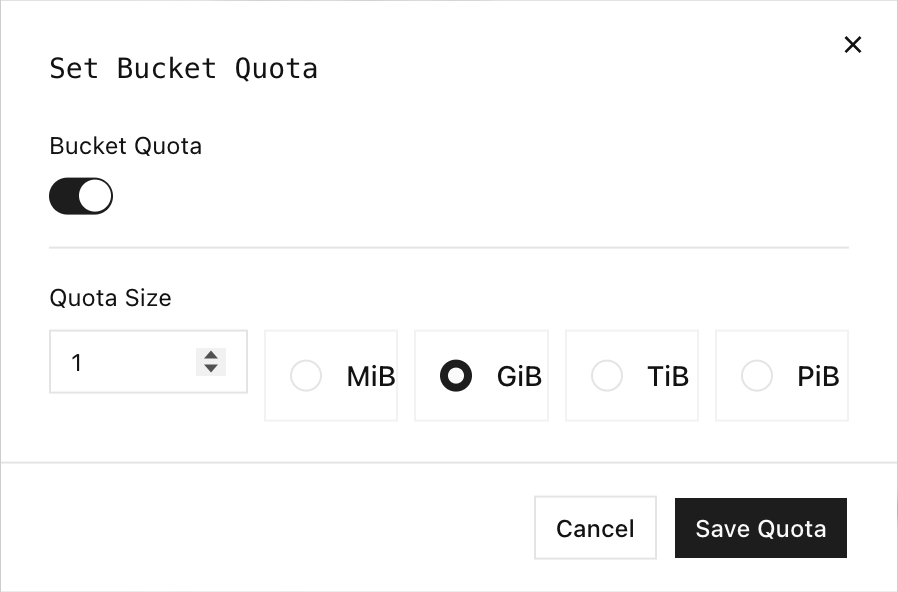

RustFS bucket quotas limit the total object data stored in an individual bucket. Use a quota to prevent one workload from consuming more than its assigned capacity while allowing other buckets to use the remaining storage.

## Overview

RustFS currently supports hard, byte-based quotas. Before accepting a write, RustFS compares the bucket's current usage plus the requested object size with the configured limit. A write that would exceed the limit is rejected with `InvalidRequest` and a `Bucket quota exceeded` message.

Quota checks cover these operations:

| Operation | Quota behavior |
| --- | --- |
| Upload an object | Rejects the upload when current usage plus the object size exceeds the limit. |
| Complete a multipart upload | Checks the completed object size before committing the upload. |
| Copy an object into the bucket | Checks the source object size against the destination bucket quota. |
| Delete an object | Always allowed so that you can recover capacity. |

The quota applies to object data, not the number of objects or request rate. A bucket without a configured limit is unlimited.

:::note[Replacement uploads]

The quota check reserves the full incoming object size against the bucket's current usage. Replacing an existing key can therefore require enough headroom for the complete replacement object.

:::

## Configure in the Console

1. Sign in to the RustFS Console and open **Browser**.
2. Find the bucket and select **Settings**.
3. Under **Capacity & Metadata**, find **Bucket Quota** and select **Edit**.
4. Enable **Bucket Quota**.
5. Enter the quota size and select **MiB**, **GiB**, **TiB**, or **PiB**.
6. Select **Save Quota**.



To remove the limit, open the dialog again, disable **Bucket Quota**, and save the change.

## Use rc

Configure an alias for your RustFS deployment:

```bash
rc alias set rustfs http://localhost:9000 \
	<your-access-key> <your-secret-key> \
	--region us-east-1 --bucket-lookup path
```

Replace `localhost` with the RustFS server address when `rc` runs on another host.

### Permissions

Quota operations require these policy actions:

| Operation | Required action |
| --- | --- |
| Set or clear a quota | `admin:SetBucketQuota` |
| Read quota configuration or statistics | `s3:GetBucketQuota` |
| Check whether a proposed operation fits | `s3:GetBucketQuota` |

The root credential has these permissions. For delegated administration, attach only the actions needed for the workflow.

### Set a quota

Set a 1 GiB hard quota. `rc` accepts byte values or units such as `1G`, `500M`, and `10KB`:

```bash
rc bucket quota set rustfs/my-bucket 1G
```

The response includes the configured limit and current usage:

```text
Bucket: my-bucket
Quota: 1 GiB
Usage: 0 B
Type:  HARD
```

### Read the quota

```bash
rc bucket quota info rustfs/my-bucket
```

Use `--json` when another tool needs to process the result:

```bash
rc bucket quota info rustfs/my-bucket --json
```

When no limit is configured, the human-readable output reports `Quota: unlimited`.

:::note[Configuration propagation]

A query issued immediately after setting or clearing a quota can briefly return the previous state. Query the quota again and confirm the expected value before starting the verification workflow.

:::

### Clear a quota

Remove the limit without deleting objects:

```bash
rc bucket quota clear rustfs/my-bucket
rc bucket quota info rustfs/my-bucket
```

The bucket becomes unlimited after the configuration change is applied.

## Advanced quota checks

`rc 0.1.29` does not expose commands for detailed usage statistics or advisory checks for proposed writes. Use the RustFS Admin API for these operations. Requests must use AWS Signature Version 4 with an active RustFS credential.

The examples use these shell variables:

```bash
export RUSTFS_ENDPOINT=http://localhost:9000
export RUSTFS_ACCESS_KEY=<your-access-key>
export RUSTFS_SECRET_KEY=<your-secret-key>
export BUCKET_NAME=my-bucket
```

:::warning[Protect credentials]

Environment variables are convenient for local testing but may be visible to processes running as the same operating-system user. Use your platform's secret manager or a restricted credentials file in production.

:::

### Read detailed usage statistics

Use the statistics endpoint to retrieve the limit, current usage, remaining bytes, and percentage used:

```bash
curl --fail-with-body \
	--aws-sigv4 "aws:amz:us-east-1:s3" \
	--user "${RUSTFS_ACCESS_KEY}:${RUSTFS_SECRET_KEY}" \
	"${RUSTFS_ENDPOINT}/rustfs/admin/v3/quota-stats/${BUCKET_NAME}"
```

```json
{
	"bucket": "my-bucket",
	"quota_limit": 1073741824,
	"current_usage": 1048576,
	"remaining_quota": 1072693248,
	"usage_percentage": 0.09765625
}
```

Usage values come from RustFS data-usage accounting. Allow time for that view to reflect very recent changes before using the statistics response for external billing or orchestration.

### Check a proposed upload

Check whether a 64 MiB upload would fit without writing an object:

```bash
curl --fail-with-body \
	--aws-sigv4 "aws:amz:us-east-1:s3" \
	--user "${RUSTFS_ACCESS_KEY}:${RUSTFS_SECRET_KEY}" \
	--request POST \
	--header "Content-Type: application/json" \
	--data '{"operation_type":"PUT","operation_size":67108864}' \
	"${RUSTFS_ENDPOINT}/rustfs/admin/v3/quota-check/${BUCKET_NAME}"
```

The `allowed` field reports the decision. This check is advisory: another write can consume capacity before the planned upload starts, so the actual upload remains authoritative.

## Verification

Set a small test quota, upload an object that fits, and then attempt to upload an object that exceeds the remaining capacity:

```bash
rc bucket quota set rustfs/my-bucket 1M

dd if=/dev/zero of=/tmp/quota-small.bin bs=1024 count=256
dd if=/dev/zero of=/tmp/quota-large.bin bs=1048576 count=2

rc object copy /tmp/quota-small.bin rustfs/my-bucket/hello.bin
rc object copy /tmp/quota-large.bin rustfs/my-bucket/too-large.bin
```

The 256 KiB object succeeds. The 2 MiB object exceeds the 1 MiB bucket quota, so `rc` exits with an error and RustFS does not create `too-large.bin`.

Delete the first object and clear the test quota:

```bash
rc object remove rustfs/my-bucket/hello.bin --force
rc bucket quota clear rustfs/my-bucket
rc bucket quota info rustfs/my-bucket
```

Confirm that the final query reports `Quota: unlimited`.

If quota enforcement cannot read or parse its internal configuration, RustFS logs `Bucket quota check degraded to allow` and permits the write. Monitor for this warning because it means quota enforcement is temporarily unavailable.

## Next steps

- [Create a bucket](./creation.md)
- [Manage lifecycle rules](../lifecycle-management.md)
- [Configure observability](/operations/observability)