RustFS is a high-performance object storage system compatible with the AWS S3 API. It features a concise, lightweight, scalable, and decentralized architecture.

Objects can be documents, videos, PDF files, or any other unstructured data. RustFS provides a scalable, flexible, and efficient solution for storing, accessing, and managing this data. Its compatibility with the AWS S3 API enables seamless integration with existing S3-based applications.

The following diagram illustrates the architecture:

```mermaid
flowchart LR
    APP[Applications] --> S3API(["S3 API"])

    subgraph DIST["Distributed RustFS"]
        direction TB
        subgraph N1["Node 1"]
            direction LR
            S3a[S3]
            subgraph OL1["Object Layer"]
                direction TB
                C1[Cache]
                K1[Compression]
                E1[Encryption]
                B1["Erasure Code · Bitrot"]
            end
            SL1["Storage Layer"]
            J1[("JBOD / FS disks")]
            S3a -->|Object API| OL1
            OL1 -->|Storage API| SL1
            SL1 <--> J1
        end
        subgraph N2["Node 2"]
            direction LR
            S3b[S3]
            subgraph OL2["Object Layer"]
                direction TB
                C2[Cache]
                K2[Compression]
                E2[Encryption]
                B2["Erasure Code · Bitrot"]
            end
            SL2["Storage Layer"]
            J2[("JBOD / FS disks")]
            S3b -->|Object API| OL2
            OL2 -->|Storage API| SL2
            SL2 <--> J2
        end
        NN["Node n ..."]
        N1 <-->|Internal RESTful API| N2
        N2 <-->|Internal RESTful API| NN
    end

    S3API --> N1
    S3API --> N2
    S3API --> NN

    classDef server fill:#dbeafe,stroke:#3b82f6,stroke-width:2px,color:#1e293b;
    classDef store fill:#dcfce7,stroke:#22c55e,stroke-width:2px,color:#1e293b;
    classDef svc fill:#eef2ff,stroke:#6366f1,stroke-width:2px,color:#1e293b;
    classDef muted fill:#f3f4f6,stroke:#9ca3af,stroke-width:2px,color:#1e293b;
    classDef accent fill:#fae8ff,stroke:#c026d3,stroke-width:2px,color:#1e293b;
    class APP,NN muted
    class S3API accent
    class S3a,S3b,SL1,SL2 server
    class C1,K1,E1,B1,C2,K2,E2,B2 svc
    class J1,J2 store
```

This diagram represents the basic architecture of RustFS. A distributed grid uses multiple nodes to execute a single task, connected via a network to enable communication.

## Consistency Design

In both distributed and single-machine modes, all read and write operations strictly follow the **read-after-write** consistency model.

## Key Concepts

**Object**: The fundamental unit of storage in RustFS, representing files, byte streams, or any unstructured data.

**Bucket**: A logical container for storing objects. Data is isolated between buckets. For clients, it functions similarly to a top-level directory.

**Drive**: The physical disk that stores data, passed as a parameter when RustFS starts. All object data in RustFS is stored on these drives.

**Set**: A group of drives. Distributed deployment automatically divides the cluster into one or more sets based on scale. Drives in each set are distributed across different locations. An object is stored within a single set. (Sometimes referred to as **Stripes**).

Consider the following when designing the architecture and deploying devices:

- One object is stored on one set.
- One cluster is divided into multiple sets.
- The number of drives in a set is fixed, defaulting to automatic calculation by the system based on cluster scale.
- Drives in a set should be distributed across different nodes as much as possible.

## Architectural Design

Traditional distributed storage architectures often rely on distinct Master nodes, Metadata nodes, and Data nodes. This complexity can make deployment challenging and introduces single points of failure—if metadata is lost, data integrity is at risk.

RustFS adopts a decentralized, peer-to-peer architecture where all nodes are equal. This design greatly simplifies deployment and eliminates metadata bottlenecks. A single command is sufficient to start the system.

RustFS draws inspiration from the elegant and scalable architecture of MinIO, adopting a similar design philosophy that prioritizes simplicity and reliability without compromising on features. We acknowledge MinIO's contribution to promoting the S3 protocol and setting a high standard for object storage architecture.
