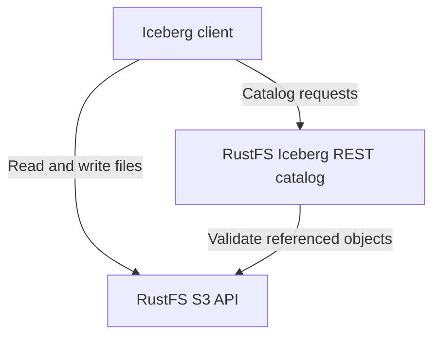

RustFS S3 Tables verwaltet **Apache Iceberg**-Tabellen über einen integrierten REST-Katalog. Tabellendaten, Manifeste und Iceberg-Metadaten bleiben als S3-Objekte in RustFS gespeichert. Diese Anleitung zeigt, wie Sie einen eigenen Tabellen-Bucket aktivieren, Clients verbinden und Berechtigungen sowie Wartungsgrenzen berücksichtigen.

:::note[Vorschaustatus und Versionsumfang]

S3 Tables ist eine Vorschaufunktion; die Client-Kompatibilität beschränkt sich auf die unten aufgeführten Abläufe. Diese Seite bezieht sich auf den RustFS-Commit [`7e0c6711`](https://github.com/rustfs/rustfs/commit/7e0c67111b97703d47e23719b0264a739c8acea8), geprüft am 8. September 2026. Prüfen Sie die [Supportmatrix](https://github.com/rustfs/rustfs/blob/7e0c67111b97703d47e23719b0264a739c8acea8/docs/architecture/s3-tables-support-matrix.md) und Ihre Version, bevor Sie weitere Katalogoperationen oder Clients einsetzen.

:::

## Funktionsweise

Ein Iceberg-Client nutzt den REST-Katalog, um Tabellen zu finden und Metadatenänderungen festzuschreiben. Tabellendateien liest und schreibt er über die S3-API. RustFS stellt beide Schnittstellen am S3-API-Port bereit.



| Ressource | Zweck |
| --- | --- |
| Tabellen-Bucket | Ein vorhandener S3-Bucket, der für den Katalog aktiviert wurde; sein Name ist der `warehouse`-Wert des Clients. |
| Namespace | Eine logische Gruppe von Tabellen innerhalb dieses Warehouse. |
| Tabelle | Ein Iceberg-Schema, Snapshots und ein vom Katalog verwalteter aktueller Metadatenpfad. |

Das Aktivieren eines Tabellen-Buckets registriert vorhandene Parquet-Dateien nicht automatisch als Iceberg-Tabellen. Erstellen oder registrieren Sie Tabellen über einen Iceberg-Client. Ohne Angabe von `location` weist RustFS einen Speicherort zu; ein benutzerdefinierter Speicherort muss im selben Bucket liegen. Clients sollten den zurückgegebenen Speicherort verwenden.

Das standardmäßige Katalog-Backend `object` speichert den Katalogzustand dauerhaft im RustFS-Objektspeicher. Ein Tabellen-Commit prüft seine Ausgangsmetadaten und referenzierten Objekte, bevor der Zeiger auf die aktuellen Metadaten bedingt aktualisiert wird. Bei einem Schreibkonflikt muss der Client die Tabelle neu laden und den Konflikt auflösen. Eine Transaktion umfasst genau eine Tabelle.

## Voraussetzungen

- Starten Sie eine RustFS-Bereitstellung mit den oben beschriebenen S3-Tables-Endpunkten. Siehe [Installation](/installation).
- Installieren Sie die [AWS CLI](/developer/examples/aws-cli) und `curl` ab Version 7.76 mit Unterstützung für `--aws-sigv4` und `--fail-with-body`.
- Erstellen Sie für diese Anleitung einen eigenen neuen Bucket. Das Beispiel verwendet `my-bucket`.
- Verwenden Sie ein vorhandenes Administratorkonto mit Zugriff auf Katalogoperationen und S3-Objekte. Die integrierte Richtlinie `consoleAdmin` deckt diese Anleitung ab; konfigurieren Sie enger begrenzte Richtlinien für Anwendungen.

Die Beispiele verwenden `http://localhost:9000`. Ersetzen Sie dies durch Ihren Server-Endpunkt und verwenden Sie außerhalb lokaler Tests [TLS](/integration/tls-configured) mit aktivierter Zertifikatsprüfung.

:::warning[Lebenszyklusverhalten von Tabellen-Buckets]

Tabellen-Buckets sind von der normalen Ablaufverarbeitung der Bucket-Lebenszyklusregeln ausgenommen. Wenn Sie diesen Modus für einen vorhandenen Bucket aktivieren, ändert sich die Anwendung seiner Ablaufregeln. Verwenden Sie Katalogwartungsfunktionen, die Iceberg-Referenzen berücksichtigen, um Snapshots ablaufen zu lassen und Tabellendateien zu bereinigen.

:::

## 1. Bucket erstellen

Legen Sie Endpunkt und Zugangsdaten für die Beispiel-Clients fest:

```bash
export RUSTFS_ENDPOINT="http://localhost:9000"
export AWS_ACCESS_KEY_ID="<your-access-key>"
export AWS_SECRET_ACCESS_KEY="<your-secret-key>"
export AWS_DEFAULT_REGION="us-east-1"
```

Erstellen Sie den eigenen Bucket:

```bash
aws --endpoint-url "$RUSTFS_ENDPOINT" s3api create-bucket --bucket my-bucket
```

Diese Beispiele verwenden einen Zugriffsschlüssel und einen geheimen Zugriffsschlüssel ohne temporäres Sitzungstoken. Behalten Sie dieselbe Shell-Umgebung für die folgenden Anfragen und die PyIceberg-Anleitung bei.

## 2. Tabellen-Bucket aktivieren

Senden Sie eine mit SigV4 signierte Anfrage mit leerem Body an den Tabellen-Bucket-Endpunkt:

```bash
curl --fail-with-body --silent --show-error \
	--aws-sigv4 "aws:amz:us-east-1:s3" \
	--user "$AWS_ACCESS_KEY_ID:$AWS_SECRET_ACCESS_KEY" \
	--header "x-amz-content-sha256: e3b0c44298fc1c149afbf4c8996fb92427ae41e4649b934ca495991b7852b855" \
	--request PUT "$RUSTFS_ENDPOINT/iceberg/v1/buckets/my-bucket"
```

Lesen Sie den Zustand mit denselben Zugangsdaten zurück:

```bash
curl --fail-with-body --silent --show-error \
	--aws-sigv4 "aws:amz:us-east-1:s3" \
	--user "$AWS_ACCESS_KEY_ID:$AWS_SECRET_ACCESS_KEY" \
	--header "x-amz-content-sha256: e3b0c44298fc1c149afbf4c8996fb92427ae41e4649b934ca495991b7852b855" \
	"$RUSTFS_ENDPOINT/iceberg/v1/buckets/my-bucket"
```

Beide Anfragen liefern bei Erfolg HTTP `200`. Prüfen Sie, ob die Antwort diese Werte enthält:

```json
{
	"table-bucket": "my-bucket",
	"enabled": true,
	"catalog-type": "iceberg-rest",
	"warehouse": "my-bucket",
	"catalog-entry-present": true
}
```

Dies ist ein Antwortauszug. Der zurückgegebene `catalog-uri` ist eine Bucket-spezifische Route; verwenden Sie für die Konfiguration eines Iceberg-REST-Clients den Basis-URI aus dem nächsten Abschnitt.

## 3. Iceberg-Client verbinden

Verwenden Sie für den RustFS-Beispielendpunkt folgende Einstellungen:

| Einstellung | Wert |
| --- | --- |
| REST-Katalog-URI | `http://localhost:9000/iceberg` |
| Warehouse und Präfix | `my-bucket` |
| REST-Authentifizierung | AWS Signature Version 4, Signaturdienst `s3` |
| Region | `us-east-1` |
| S3-Dateiendpunkt | `http://localhost:9000` mit pfadbasierter Adressierung |

Der Client ergänzt den Katalog-URI um `/v1`. Das Warehouse ist ein Bucket-Name, kein S3-URI oder AWS S3 Tables ARN. Konfigurieren Sie sowohl die REST-Anfragesignierung als auch den S3-Dateizugriff, auch wenn beide dasselbe Konto verwenden.

Wenn Sie bereits einen separaten Iceberg-REST-Katalog betreiben, beschreibt die [Apache-Iceberg-Integration](/developer/integration/big-data/iceberg) die Bereitstellung mit einem externen Katalog.

## Berechtigungen und Zugangsdaten

Zum Aktivieren eines Tabellen-Buckets ist `admin:SetTableBucket` erforderlich, zum Prüfen des Zustands `admin:GetTableBucket`. Die Katalogerkennung verwendet `admin:GetTableCatalog`. Namespace- und Tabellenoperationen besitzen eigene RustFS-Admin-Aktionen, darunter `admin:SetTableNamespace`, `admin:CreateTable`, `admin:GetTableMetadata` und `admin:CommitTable`.

Für das Lesen und Schreiben von Tabellendateien sind zusätzlich normale S3-Berechtigungen erforderlich. RustFS prüft Tabellenberechtigungen für Objektpfade im Warehouse: Lesen erfordert die entsprechende Autorisierung für `admin:GetTableMetadata`, Schreiben für `admin:SetTableMetadata`. Eine Berechtigung für Katalog-Commits allein erlaubt nicht die vorausgehenden S3-Dateischreibvorgänge. Konfigurieren Sie [IAM-Richtlinien](/security-compliance/iam/policies) für beide Schnittstellen.

Die Ausgabe von Zugangsdaten durch den Katalog ist standardmäßig deaktiviert. Bei aktivierter Funktion muss ein kompatibler Client `X-Iceberg-Access-Delegation: vended-credentials` aushandeln, und der Aufrufer benötigt die Berechtigung, Tabellenzugangsdaten anzufordern. Der erste Katalogzugriff erfordert weiterhin eine autorisierte Identität. Die verlinkte PyIceberg-Anleitung verwendet ausdrücklich konfigurierte Zugangsdaten.

## Wartung und Schutz vor Datenverlust

Das Löschen von Metadaten und die Hintergrundwartung sind standardmäßig deaktiviert. RustFS stellt explizite Operationen für Planung, Scheduler-Läufe und Worker-Läufe bereit; ein integrierter periodischer Wartungs-Scheduler wird nicht ausgeführt. Prüfen Sie einen Wartungsplan und die darin beibehaltenen Referenzen, bevor Sie Löschvorgänge aktivieren.

Beim Löschen einer Tabelle wird ihr Katalogeintrag entfernt, während die zugrunde liegenden Objekte erhalten bleiben. Führen Sie erforderliche Tabellenwartungen vor dem Entfernen aus dem Katalog durch; danach können Wartungsoperationen die Tabelle nicht mehr finden. Die Bereinigung verbliebener Objekte erfordert einen separaten Plan, der alle verbleibenden Referenzen berücksichtigt. Löschen Sie keine S3-Pfade rekursiv, auf die Snapshots oder andere Metadaten noch verweisen könnten.

Behalten Sie für diese Anleitung das Standard-Katalog-Backend bei. Der Wechsel einer vorhandenen Bereitstellung zu `durable-strong` erfordert das [Verfahren zur Katalogumstellung](https://github.com/rustfs/rustfs/blob/7e0c67111b97703d47e23719b0264a739c8acea8/docs/operations/s3-tables-cutover-runbook.md), einschließlich Migrationsvorprüfung und koordinierter Sperrung der schreibenden Clients.

## Client-Kompatibilität und Grenzen

Das Quellcode-Repository pflegt folgenden Validierungsumfang:

| Client | Validierungsumfang |
| --- | --- |
| PyIceberg | Automatisierte Prüfungen für Erstellen, Anhängen, erneutes Laden, Scannen und Katalogoperationen. |
| DuckDB Iceberg 1.5.5 | Automatisierte Prüfungen eines generischen REST-Katalogs für Lesen, Schreiben und Schemaänderungen an einzelnen Tabellen. |
| Spark | Eine optional aktivierbare Live-Testumgebung; prüfen Sie die konkret eingesetzten Spark- und Iceberg-Versionen. |
| Trino | Ein manueller Lesetest; Schreibkompatibilität wird nicht zugesichert. |

Die Iceberg-Formate v1 und v2 werden unterstützt; v2 ist der Standard. Gestuftes Erstellen von Tabellen, Datenbereinigung beim Löschen und Iceberg-Format v3 werden nicht unterstützt.

RustFS S3 Tables bietet weder eine SQL-Ausführungsengine noch atomare Transaktionen über mehrere Tabellen oder unabhängige regionsübergreifende Active-Active-Schreibzugriffe. Eine vollständige Kompatibilität mit der AWS-S3-Tables-Steuerungsebene wird nicht zugesichert. Prüfen Sie die [Supportmatrix](https://github.com/rustfs/rustfs/blob/7e0c67111b97703d47e23719b0264a739c8acea8/docs/architecture/s3-tables-support-matrix.md), bevor Sie eine andere Engine oder ein anbieterspezifisches Profil verwenden.

## Nächste Schritte

- Führen Sie die [PyIceberg-Anleitung](/developer/integration/big-data/pyiceberg) aus.
- Prüfen Sie die [IAM-Richtlinien](/security-compliance/iam/policies), bevor Sie Anwendungen Zugriff gewähren.
- Validieren Sie weitere Client-Versionen mit den [Client-Konformitätsprüfungen](https://github.com/rustfs/rustfs/blob/7e0c67111b97703d47e23719b0264a739c8acea8/scripts/table-catalog/README.md) des Repositorys.
