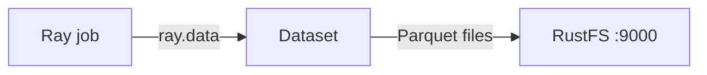
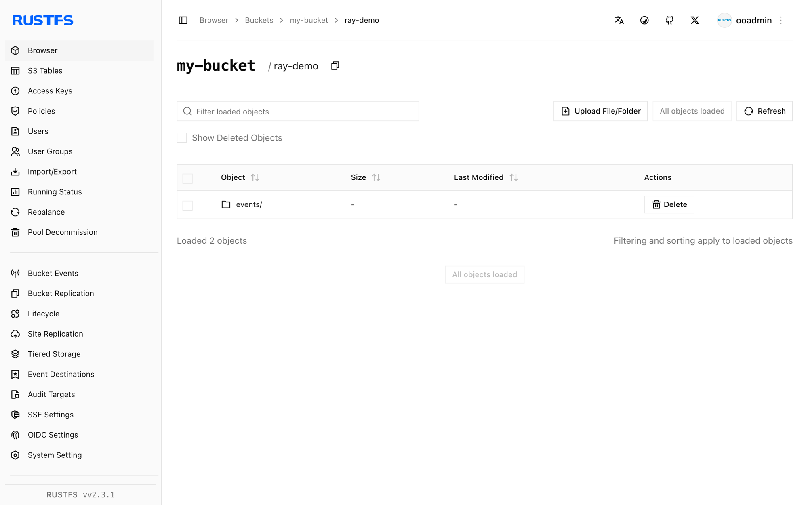

This guide connects [Ray](https://github.com/ray-project/ray) — the distributed AI and Python compute framework — to **RustFS** through Ray Data's S3 filesystem support. You will run a Ray job inside the official image, write a dataset as Parquet to a RustFS bucket, read it back, and verify the objects. The workflow was verified with `rayproject/ray:2.44.0-py311` (Ray 2.44, pyarrow filesystem) and `rustfs/rustfs-x86-musl:v2.3.1`.

You need Docker. This deployment is intended for local integration testing, not production.

## Architecture



Ray Data reads and writes datasets through pyarrow's `S3FileSystem`. Passing an `S3FileSystem` configured for RustFS redirects every dataset operation — Parquet, CSV, JSON — to the bucket.

## 1. Create the job file

Create the script, replacing all connection placeholders:

```python title="ray_s3.py"
import ray
ray.init(ignore_reinit_error=True)

import pandas as pd
from pyarrow.fs import S3FileSystem

fs = S3FileSystem(
    endpoint_override="http://<your-rustfs-endpoint>:9000",
    access_key="<your-access-key>",
    secret_key="<your-secret-key>",
    region="us-east-1",
)

df = pd.DataFrame({"id": range(5), "value": [x * 1.5 for x in range(5)]})
ds = ray.data.from_pandas(df)
ds.write_parquet("my-bucket/ray-demo/events/", filesystem=fs)

back = ray.data.read_parquet("my-bucket/ray-demo/events/", filesystem=fs).take_all()
print("rows:", len(back))
print("sample:", back[0])
ray.shutdown()
```

`endpoint_override` takes the full endpoint URL including the scheme. pyarrow's `S3FileSystem` uses path-style requests for custom endpoints, so no extra flag is needed. The same filesystem object works for `write_csv`, `read_json`, and the other Ray Data methods.

## 2. Run the job

Run the script in the Ray image on the same Docker network as RustFS:

```bash
docker run --rm --network oo-rustfs_default \
  -v "$PWD/ray_s3.py":/tmp/ray_s3.py \
  rayproject/ray:2.44.0-py311 python /tmp/ray_s3.py
```

```text
rows: 5
sample: {'id': 0, 'value': 0.0}
```

## 3. Verify objects in RustFS

List the dataset prefix:

```bash
rc ls rustfs/my-bucket/ray-demo/ -r
```

Ray Data wrote the dataset as a Parquet block:

```text
ray-demo/events/0_000000_000000.parquet
```



## 4. Stop or reset

Ray Data holds no state of its own. To delete the demo dataset:

```bash
rc rm rustfs/my-bucket/ray-demo/ --recursive --force
```

## Troubleshooting

### `Unable to connect to endpoint` or timeouts

Confirm `endpoint_override` includes the scheme and is reachable from the Ray container. Inside a Compose network the hostname is `rustfs`; from the host use `http://localhost:9000`.

### `Access Denied` on write

Confirm the access key and secret key are passed to `S3FileSystem` itself — Ray does not read the container's AWS environment variables through this code path.

## Next steps

- Review [S3 compatibility notes](/administration/protocols/s3) before adopting additional Ray operations.
- Create dedicated production credentials with [Access Key Management](/security-compliance/iam/access-token).
- Follow the [Ray Data documentation](https://docs.ray.io/en/latest/data/data.html) to chain transformations, training ingestion, and checkpointing on the same bucket.
