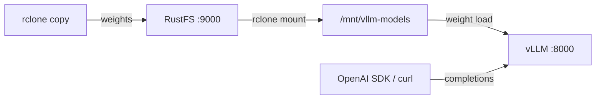
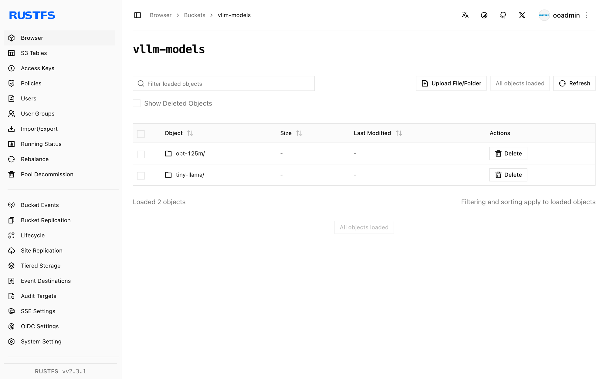

This guide connects [vLLM](https://github.com/vllm-project/vllm) — the high-throughput LLM inference engine — to **RustFS** as its model-weight store. You will upload a model into a RustFS bucket, expose the bucket to the vLLM host through an rclone mount, and serve the model with the OpenAI-compatible API. The workflow was verified with `vllm/vllm-openai-cpu` (vLLM 0.30.0) serving `facebook/opt-125m` from a RustFS bucket backed by `rustfs/rustfs-x86-musl:v2.3.1`, on a CPU-only host.

You need Docker and an rclone binary on the host that runs vLLM. This deployment is intended for local integration testing, not production.

## Architecture



The bucket is the single copy of the model. Hosts that serve the model mount the bucket read-only, so every node pulls weights from RustFS and no local model store exists to drift.

:::note[Why an rclone mount]

vLLM 0.30 loads `s3://` model paths through the RunAI model streamer, whose ranged reads currently fail against custom S3 endpoints such as RustFS (the loader errors with `File access error` on any non-zero offset). Mounting the bucket as a filesystem is the verified way to keep the weights in RustFS while vLLM reads them as local files.

:::

## 1. Upload the model to RustFS

Create the bucket and copy model weights into it, replacing all connection placeholders:

```ini title="rclone.conf"
[rustfs]
type = s3
provider = Other
access_key_id = <your-access-key>
secret_access_key = <your-secret-key>
endpoint = http://<your-rustfs-endpoint>:9000
region = us-east-1
```

```bash
rc mb rustfs/vllm-models
rclone copy ./opt-125m rustfs:vllm-models/opt-125m --transfers 4
```

Any Hugging Face layout works — `config.json`, the tokenizer files, and the weight files (`model.safetensors` or `pytorch_model.bin`). Keep one model per prefix so several models can share the bucket.

## 2. Mount the bucket on the vLLM host

On the machine that runs vLLM, mount the bucket read-only for clients with `--allow-other`:

```bash
mkdir -p /mnt/vllm-models
rclone mount rustfs:vllm-models /mnt/vllm-models \
  --allow-other --daemon
ls /mnt/vllm-models/opt-125m/
```

```text
config.json  merges.txt  model.safetensors  tokenizer.json  vocab.json
```

## 3. Run vLLM

Start the CPU image against the mounted weights:

```bash
docker run -d --name vllm -p 8000:8000 --shm-size=2g \
  -v /mnt/vllm-models:/models:ro \
  vllm/vllm-openai-cpu:latest \
  --model /models/opt-125m --served-model-name opt-125m \
  --dtype float32 --max-model-len 256 --gpu-memory-utilization 0.15
```

vLLM reads the weights through the mount — the container stays stateless and the model lives in RustFS. Wait for the server to come up:

```bash
curl -s http://localhost:8000/v1/models | head -c 200
```

```text
{"object":"list","data":[{"id":"opt-125m","object":"model","created":...,"root":"/models/opt-125m",...}]}
```

`--gpu-memory-utilization` controls the fraction of RAM reserved for the KV cache on the CPU backend; lower it on small hosts. `--dtype float32` matches what the CPU attention kernels support for this model.

## 4. Run inference

Send an OpenAI-compatible completion request:

```bash
curl -s http://localhost:8000/v1/completions \
  -H "Content-Type: application/json" \
  -d '{"model": "opt-125m", "prompt": "RustFS is", "max_tokens": 12, "temperature": 0}'
```

```json
{"id":"cmpl-...","object":"text_completion","model":"opt-125m",
 "choices":[{"index":0,"text":" a great tool for building your own server. It's a",
 "finish_reason":"length",...}]}
```

The request is standard OpenAI schema, so the Python client works unchanged:

```python
from openai import OpenAI

client = OpenAI(base_url="http://localhost:8000/v1", api_key="EMPTY")
print(client.completions.create(
    model="opt-125m", prompt="RustFS is", max_tokens=12, temperature=0,
).choices[0].text)
```



## 5. Stop or reset

To tear down the demo while keeping the bucket objects:

```bash
docker rm -f vllm
fusermount -u /mnt/vllm-models
```

To delete the stored model:

```bash
rclone purge rustfs:vllm-models
```

## Troubleshooting

### `Cannot find any model weights with /models/...`

The mount had a stale directory cache or the weight files never made it to the bucket. Re-run `rclone copy` and confirm the files through the mount with `ls` before starting vLLM. A short `--dir-cache-time` (for example `10s`) helps while you iterate.

### `Unsupported CPU attention configuration: head_dim=...`

vLLM's CPU kernels support a fixed set of head dimensions. Tiny test models such as `hf-internal-testing/tiny-random-*` use exotic shapes that fail at request time — use a real small model such as `facebook/opt-125m`.

### `Insufficient space in /dev/shm`

vLLM's CPU engine exchanges tensors through shared memory. Run the container with `--shm-size=2g` (or `--ipc=host`).

### Server exits with `Available memory on node 0 ... is less than desired CPU memory utilization`

The default KV-cache reservation is 90% of system RAM. Lower it with `--gpu-memory-utilization 0.15` (the flag applies to the CPU backend as a memory fraction despite its name).

## Next steps

- Review [S3 compatibility notes](/administration/protocols/s3) before adopting additional serving setups.
- Create dedicated production credentials with [Access Key Management](/security-compliance/iam/access-token).
- Follow the [vLLM documentation](https://docs.vllm.ai/en/latest/serving/openai_compatible_server.html) for chat templates, tensor parallelism, and quantized weights on top of the same bucket-backed model store.
