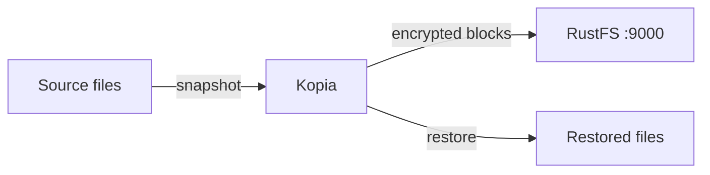
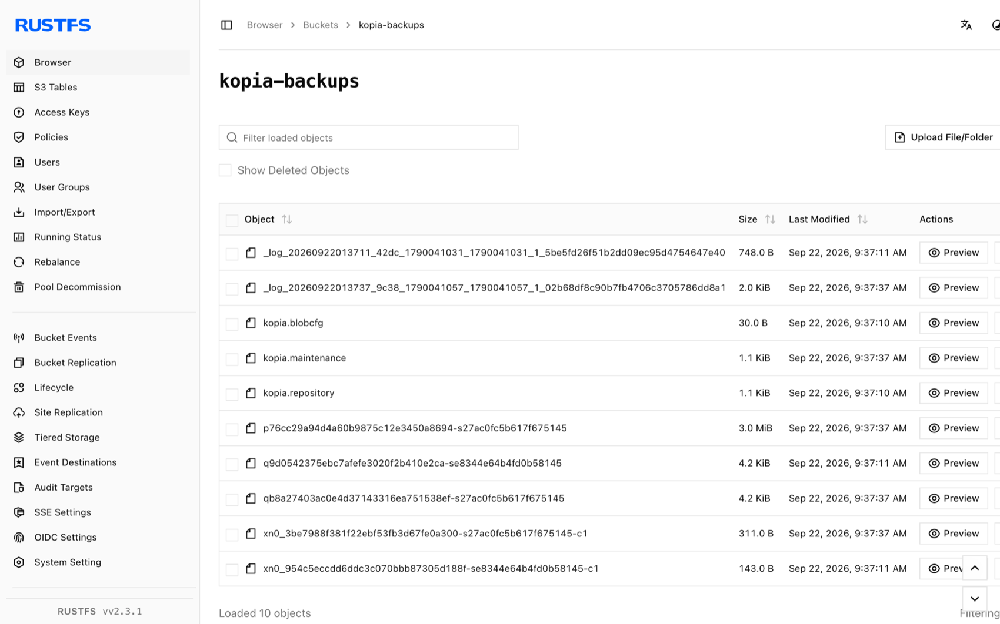

This guide connects [Kopia](https://github.com/kopia/kopia) — the open-source backup and restore tool — to **RustFS** as an S3 repository. You will create a repository in a RustFS bucket, take a snapshot of a directory, restore it into an empty directory, and compare checksums. The workflow was verified with `kopia/kopia:0.18.1` and `rustfs/rustfs-x86-musl:v2.3.1`.

You need Docker. This deployment is intended for local integration testing, not production.

## Architecture



Kopia stores the repository format files and deduplicated, encrypted content blocks in the bucket. Restores read the blocks back and reassemble the original files, so the checksum of every restored file must match the source.

## 1. Create the repository

Create the bucket first, then initialize the Kopia repository inside it. The endpoint is a bare `host:port` (no scheme); `--disable-tls` switches the client to plain HTTP:

```bash
rc alias set rustfs http://<your-rustfs-endpoint>:9000 <your-access-key> <your-secret-key>
rc mb rustfs/kopia-backups

docker run --rm --network oo-rustfs_default kopia/kopia:0.18.1 repository create s3 \
  --bucket kopia-backups \
  --access-key <your-access-key> \
  --secret-access-key <your-secret-key> \
  --endpoint <your-rustfs-endpoint>:9000 \
  --region us-east-1 \
  --disable-tls \
  --password <your-kopia-password> \
  --override-username demo --override-hostname workstation
```

Kopia validates the provider by reading and writing through the S3 API before it reports success.

## 2. Connect, snapshot, and restore

Run the following commands from the directory holding your `repository.config` (created by the previous step). Kopia reads the connection settings from that file, so the S3 flags are only needed once:

```bash
export KOPIA_PASSWORD=<your-kopia-password>
export KOPIA_CONFIG_PATH=/config/repository.config

alias kopia='docker run --rm --network oo-rustfs_default \
  -e KOPIA_PASSWORD -e KOPIA_CONFIG_PATH \
  -v "$PWD/config:/config" \
  -v "$PWD/source:/source:ro" \
  -v "$PWD/restore:/restore" kopia/kopia:0.18.1'

kopia repository connect s3 \
  --bucket kopia-backups \
  --access-key <your-access-key> \
  --secret-access-key <your-secret-key> \
  --endpoint <your-rustfs-endpoint>:9000 \
  --region us-east-1 --disable-tls \
  --override-username demo --override-hostname workstation

kopia snapshot create /source
kopia snapshot list
```

Restore the snapshot into an empty directory and compare checksums with the source. The snapshot ID is the `ka...` identifier printed by `snapshot list`:

```bash
kopia restore <snapshot-id> /restore

sha256sum source/blob.bin restore/blob.bin
```

```text
bec4530e2798465b...  source/blob.bin
bec4530e2798465b...  restore/blob.bin
```

## 3. Verify objects in RustFS

List the bucket:

```bash
rc ls rustfs/kopia-backups/ -r
```

The output shows the repository format files plus the packed content blocks written by the snapshot:

```text
kopia.blobcfg
kopia.repository
p0000.../...
```



## 4. Stop or reset

Kopia is a client-side tool and holds no running state. To delete the repository and all snapshots, remove the bucket:

```bash
rc rb rustfs/kopia-backups --force
```

## Troubleshooting

### `Endpoint url cannot have fully qualified paths`

The endpoint must be a bare `host:port` value without a scheme or path — Kopia builds the object URLs itself.

### `server gave HTTP response to HTTPS client`

Without `--disable-tls`, Kopia speaks HTTPS. RustFS without TLS needs the `--disable-tls` flag on both `repository create s3` and `repository connect s3`.

### `can't connect to storage` with a DNS error

The S3 client is using virtual-hosted addressing. Keep the endpoint as a bare `host:port` value; Kopia uses path-style requests for endpoints given in that form.

## Next steps

- Review [S3 compatibility notes](/administration/protocols/s3) before adopting additional Kopia operations.
- Create dedicated production credentials with [Access Key Management](/security-compliance/iam/access-token).
- Follow the [Kopia repository documentation](https://kopia.io/docs/repositories/) to add policies, retention, and scheduled snapshots.
