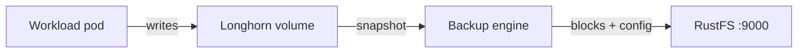
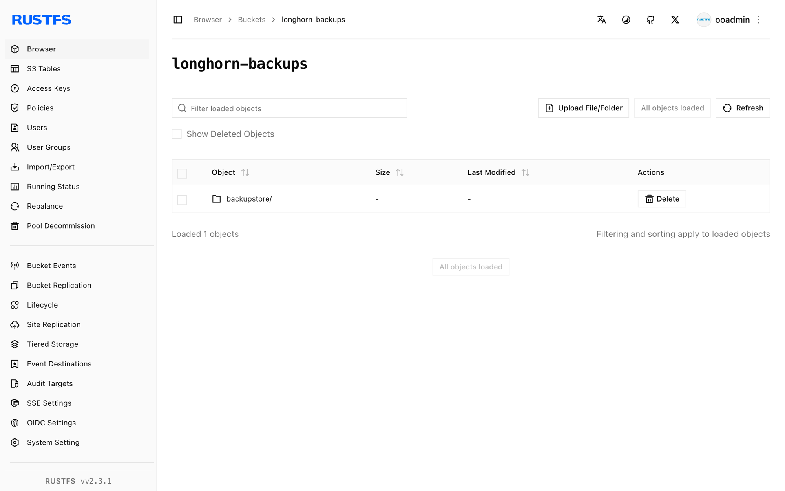

This guide connects [Longhorn](https://github.com/longhorn/longhorn) — the distributed block storage system for Kubernetes — to **RustFS** as its S3 backup target. You will configure the backup target, back up a volume that contains data, delete the volume, restore it from RustFS, and verify the data. The workflow was verified with Longhorn 1.9.0 on k3s (Kubernetes 1.30) and `rustfs/rustfs-x86-musl:v2.3.1`.

You need a Kubernetes cluster with Longhorn installed and `kubectl` access to it. This guide is intended for integration testing, not production.

## Architecture



Longhorn stores backups in the `backupstore/volumes/` prefix of the target bucket as content-addressed blocks plus a small volume configuration file. Restores read those objects back into a new volume on any node that can reach RustFS.

## 1. Create the backup bucket

Create a dedicated bucket with the [`rc` client](https://github.com/rustfs/cli), using your own endpoint and credentials:

```bash
rc alias set rustfs http://<your-rustfs-endpoint>:9000 <your-access-key> <your-secret-key>
rc mb rustfs/longhorn-backups
```

Longhorn does not create the bucket, so this step must complete before the first backup.

## 2. Configure the backup target

Store the RustFS credentials in a secret in the `longhorn-system` namespace. `AWS_ENDPOINTS` must be an endpoint every node can reach — use the node IP or an internal load balancer address, not a port forward from your workstation:

```bash
kubectl -n longhorn-system create secret generic rustfs-s3-secret \
  --from-literal=AWS_ACCESS_KEY_ID=<your-access-key> \
  --from-literal=AWS_SECRET_ACCESS_KEY=<your-secret-key> \
  --from-literal=AWS_ENDPOINTS=http://<your-rustfs-endpoint>:9000
```

Longhorn 1.9 manages backup targets through the `BackupTarget` resource. Patch the `default` target with the RustFS bucket:

```bash
kubectl -n longhorn-system patch backupTarget default --type merge -p '
spec:
  backupTargetURL: s3://longhorn-backups@us-east-1/
  credentialSecret: rustfs-s3-secret
  pollInterval: 5m'
```

The `@us-east-1` segment is the region annotation in the S3 URL format; it does not need to match a real deployment region.

Wait for the target to become available — it confirms that Longhorn reached the bucket through the secret:

```bash
kubectl -n longhorn-system get backupTarget default
```

```text
NAME      URL                                CREDENTIAL         AVAILABLE   LASTSYNCEDAT
default   s3://longhorn-backups@us-east-1/   rustfs-s3-secret   true        2026-09-21T08:36:55Z
```

## 3. Write data and create a backup

Create a test volume with data in it. The following manifest creates a 1 GiB PVC and a pod that writes a marker file:

```yaml title="demo.yaml"
apiVersion: v1
kind: PersistentVolumeClaim
metadata:
  name: demo-vol
spec:
  accessModes: [ReadWriteOnce]
  storageClassName: longhorn
  resources:
    requests:
      storage: 1Gi
---
apiVersion: v1
kind: Pod
metadata:
  name: demo-app
spec:
  volumes:
  - name: data
    persistentVolumeClaim:
      claimName: demo-vol
  containers:
  - name: app
    image: busybox:1.36
    command: ["sh", "-c", "echo 'longhorn rustfs demo' > /data/hello.txt && sleep 3600"]
    volumeMounts:
    - name: data
      mountPath: /data
```

Apply it and wait for the pod to run:

```bash
kubectl apply -f demo.yaml
kubectl get pod demo-app
```

Create a snapshot and back it up. You can do this in the Longhorn UI (Volume → Snapshot → Backup) or declaratively:

```bash
VOLUME=$(kubectl get pvc demo-vol -o jsonpath='{.spec.volumeName}')
kubectl -n longhorn-system apply -f - <<EOF
apiVersion: longhorn.io/v1beta2
kind: Snapshot
metadata:
  name: demo-snap
  namespace: longhorn-system
spec:
  volume: $VOLUME
EOF
```

Then create the `Backup` resource for that snapshot:

```bash
kubectl -n longhorn-system apply -f - <<EOF
apiVersion: longhorn.io/v1beta2
kind: Backup
metadata:
  name: demo-backup
  namespace: longhorn-system
spec:
  snapshotName: demo-snap
EOF
```

Wait for the backup to complete:

```bash
kubectl -n longhorn-system wait --for=jsonpath='{.status.state}'=Completed backup/demo-backup --timeout=300s
kubectl -n longhorn-system get backup demo-backup -o jsonpath='{.status.backupURL}'
```

## 4. Verify the backup in RustFS

List the bucket:

```bash
rc ls rustfs/longhorn-backups/ -r
```

The output should include the volume configuration and the content-addressed blocks:

```text
backupstore/volumes/08/62/pvc-b73aeb3a-1482-4146-a8c9-749954c5dd7d/backups/backup_backup-f52accbdf3984e3d.cfg
backupstore/volumes/08/62/pvc-b73aeb3a-1482-4146-a8c9-749954c5dd7d/blocks/15/22/15220b19...blk
```



## 5. Restore and verify the data

Create a new volume that restores from the backup, using the `backupURL` from step 3:

```bash
kubectl -n longhorn-system apply -f - <<EOF
apiVersion: longhorn.io/v1beta2
kind: Volume
metadata:
  name: demo-restored
  namespace: longhorn-system
spec:
  size: "1073741824"
  numberOfReplicas: 1
  fromBackup: "<backupURL-from-step-3>"
EOF
```

The restore runs when the volume is first attached. Create a PVC bound to the restored volume through a static PV, then mount it:

```bash
kubectl apply -f - <<EOF
apiVersion: v1
kind: PersistentVolume
metadata:
  name: demo-restored-pv
spec:
  capacity:
    storage: 1Gi
  accessModes: [ReadWriteOnce]
  claimRef:
    name: demo-restored
    namespace: default
  csi:
    driver: driver.longhorn.io
    volumeHandle: demo-restored
    fsType: ext4
  storageClassName: longhorn-static
---
apiVersion: v1
kind: PersistentVolumeClaim
metadata:
  name: demo-restored
spec:
  accessModes: [ReadWriteOnce]
  storageClassName: longhorn-static
  volumeName: demo-restored-pv
  resources:
    requests:
      storage: 1Gi
EOF
```

Mount the restored volume in a verification pod:

```bash
kubectl apply -f - <<EOF
apiVersion: v1
kind: Pod
metadata:
  name: restore-verify
spec:
  volumes:
  - name: data
    persistentVolumeClaim:
      claimName: demo-restored
  containers:
  - name: verify
    image: busybox:1.36
    command: ["sh", "-c", "cat /data/hello.txt && sleep 300"]
    volumeMounts:
    - name: data
      mountPath: /data
EOF
sleep 40
kubectl logs restore-verify
```

The output prints the marker file from step 3, proving that the data round-tripped through RustFS:

```text
longhorn rustfs demo
```

## 6. Clean up

Delete the test workloads and the restored volume:

```bash
kubectl delete pod restore-verify demo-app
kubectl delete pvc demo-restored demo-vol
kubectl -n longhorn-system delete volume/demo-restored
```

The backup in RustFS stays in place until you remove it from the Longhorn UI or the bucket.

## Troubleshooting

### `No available disk candidates to create a new replica`

Longhorn has no schedulable disk on the node. Verify that the node registered its default disk:

```bash
kubectl -n longhorn-system get nodes.longhorn.io -o jsonpath='{.items[0].status.diskStatus}'
```

If the map is empty, create `/var/lib/longhorn` on the node and register the disk:

```bash
kubectl -n longhorn-system patch nodes.longhorn.io <node-name> --type merge -p '
spec:
  disks:
    default:
      path: /var/lib/longhorn
      allowScheduling: true'
```

### `failed to create backup ... missing input parameter`

The backup ran before the default backup target was configured. Complete step 2, confirm `AVAILABLE` is `true`, and create the backup again.

### The backup target never becomes available

The secret must exist before the target syncs, and `AWS_ENDPOINTS` must be reachable from the nodes themselves. Check the `longhorn-manager` logs for S3 errors:

```bash
kubectl -n longhorn-system logs -l app=longhorn-manager | grep -i s3 | tail
```

## Next steps

- Review [S3 compatibility notes](/administration/protocols/s3) before adopting additional backup targets.
- Create dedicated production credentials with [Access Key Management](/security-compliance/iam/access-token).
- Follow the [Longhorn backup documentation](https://longhorn.io/docs/1.9.0/backups-and-restore/) to configure recurring backup jobs and scheduled snapshots.
