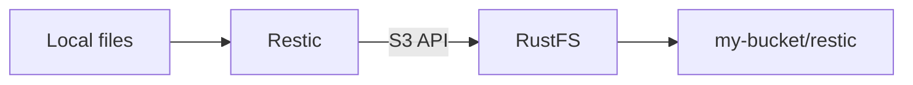

Restic ist ein Kommandozeilen-Backup-Tool, das Snapshots in einem Repository speichert. Diese Anleitung zeigt, wie Sie Restic auf RustFS ausrichten, ein lokales Verzeichnis sichern, einen Snapshot wiederherstellen und die gespeicherten Objekte in RustFS prüfen.

Sie benötigen eine laufende RustFS-Instanz, einen Bucket wie `my-bucket`, eine installierte Restic-Version, Zugriffsschlüssel für den Bucket und ein Passwort für das Restic-Repository.

:::note[Pfadbasierte Adressierung]

Die S3-Backend-Konfiguration von Restic sollte für RustFS pfadbasierte Adressierung verwenden. Diese Anleitung setzt `-o s3.bucket-lookup=path` und verwendet den Bucket-Namen in der Repository-URL.

:::

## Architektur



Restic schreibt Repository-Metadaten und Sicherungssnapshots über die S3 API in RustFS. Das Repository-Präfix in dieser Anleitung lautet `restic`, der Bucket `my-bucket`.

## 1. Bucket vorbereiten

Öffnen Sie die RustFS Console unter `http://localhost:9001` und erstellen Sie `my-bucket`, oder wählen Sie einen vorhandenen Bucket, der ausschließlich für Backups verwendet wird.


Verwenden Sie für jeden Backup-Job einen eigenen Bucket. Der Screenshot zeigt die Console in englischer Sprache und im hellen Design.

## 2. Restic-Repository initialisieren

Setzen Sie die Anmeldedaten, die Region, das Repository-Passwort und den Repository-Pfad:

```bash
export AWS_ACCESS_KEY_ID=<your-access-key>
export AWS_SECRET_ACCESS_KEY=<your-secret-key>
export AWS_DEFAULT_REGION=us-east-1
export RESTIC_PASSWORD=<your-restic-password>
export RESTIC_REPOSITORY=s3:http://localhost:9000/my-bucket/restic
```

Führen Sie `restic init` mit pfadbasierter Bucket-Auswahl aus:

```bash
restic -o s3.bucket-lookup=path init
```

Das Repository-Passwort schützt die Snapshot-Daten. Bewahren Sie es getrennt von den RustFS-Zugriffsschlüsseln auf.

## 3. Daten sichern

Erstellen Sie ein kleines Testverzeichnis und sichern Sie es:

```bash
mkdir -p ~/Documents/restic-demo
printf 'hello from RustFS\n' > ~/Documents/restic-demo/hello.txt
restic -o s3.bucket-lookup=path backup ~/Documents/restic-demo
```

Restic gibt nach Abschluss des Backups eine Snapshot-ID aus. Führen Sie den Befehl nach einer Dateianpassung erneut aus, um einen zweiten Snapshot zu erzeugen.

## 4. Snapshot wiederherstellen

Stellen Sie den neuesten Snapshot in ein separates Verzeichnis wieder her:

```bash
mkdir -p ~/Documents/restic-restore
restic -o s3.bucket-lookup=path restore latest --target ~/Documents/restic-restore
```

Sie können auch eine bestimmte Snapshot-ID wiederherstellen, wenn Sie eine ältere Version benötigen.

## 5. Repository in RustFS prüfen

Öffnen Sie `my-bucket` in der RustFS Console und prüfen Sie, ob Restic Repository-Objekte unter dem Präfix `restic/` erstellt hat.

Sie können zusätzlich die Repository-Prüfung ausführen:

```bash
restic -o s3.bucket-lookup=path check
```

## Nächste Schritte

- [CLI Client (rc)](/operations/rc) zum Erstellen von Buckets und Prüfen von Objekten über die Kommandozeile.
- [TLS Configuration](/integration/tls-configured), wenn Sie RustFS außerhalb eines vertrauenswürdigen Netzwerks bereitstellen.