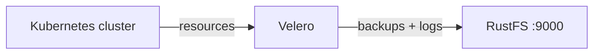
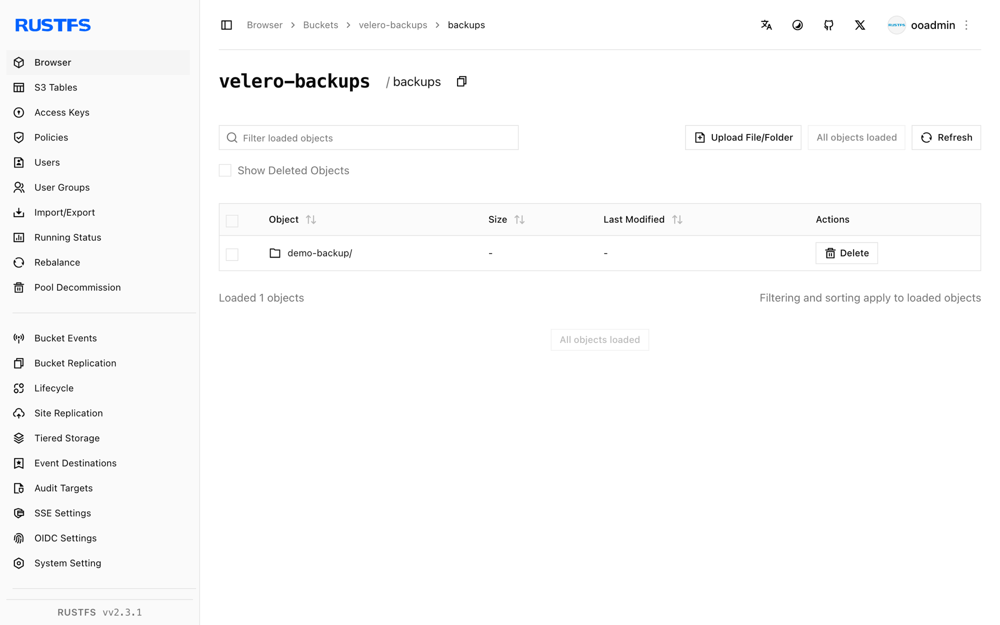

This guide connects [Velero](https://github.com/vmware-tanzu/velero) — the Kubernetes backup and restore tool — to **RustFS** as its object storage backend. You will install Velero into a Kubernetes cluster with a RustFS backup location, back up cluster resources, delete them, restore from the bucket, and verify the restored objects. The workflow was verified with Velero CLI 1.16.2, `velero-plugin-for-aws:v1.12.2` on k3s (Kubernetes 1.30), and `rustfs/rustfs-x86-musl:v2.3.1`.

You need a Kubernetes cluster with `kubectl` access and the Velero CLI. This guide is intended for integration testing, not production.

## Architecture



Velero serializes Kubernetes resources and (optionally) pod volume data into gzip archives under `backups/<name>/` in the bucket. Restores download those archives and recreate the resources in the cluster.

## 1. Create the backup bucket

Create a dedicated bucket — Velero does not create buckets:

```bash
rc alias set rustfs http://<your-rustfs-endpoint>:9000 <your-access-key> <your-secret-key>
rc mb rustfs/velero-backups
```

## 2. Install Velero

Write the credentials to a file and install the Velero server. The `s3Url` must be an endpoint reachable from the cluster pods themselves — use the node IP or an internal address, not a port forward from your workstation:

```bash
cat > velero-creds <<EOF
[default]
aws_access_key_id=<your-access-key>
aws_secret_access_key=<your-secret-key>
EOF

kubectl create namespace velero
kubectl create secret generic cloud-credentials \
  --namespace velero --from-file=cloud=velero-creds

velero install \
  --provider aws \
  --plugins velero/velero-plugin-for-aws:v1.12.2 \
  --bucket velero-backups \
  --backup-location-config region=us-east-1,s3ForcePathStyle="true",s3Url=http://<your-rustfs-endpoint>:9000 \
  --secret-file velero-creds \
  --use-volume-snapshots=false
```

Wait for the deployment to become ready and the backup location to turn `Available`:

```bash
kubectl -n velero get pods
velero backup-location get
```

```text
NAME      PROVIDER   BUCKET/PREFIX    PHASE      LAST VALIDATED   ACCESS MODE   DEFAULT
default   aws        velero-backups   Available  2026-09-22 ...   ReadWrite     true
```

## 3. Back up cluster resources

Create two demo resources and back up the whole default namespace scope:

```bash
kubectl create configmap demo-cm --from-literal=key=rustfs-velero-demo
kubectl create deployment nginx --image=nginx:1.27

velero backup create demo-backup --wait
velero backup get
```

The backup uploads the resource archives and logs to RustFS.

## 4. Verify the backup in RustFS

List the bucket:

```bash
rc ls rustfs/velero-backups/ -r
```

The backup archive set is stored under the `backups/` prefix:

```text
backups/demo-backup/demo-backup-resources.json.gz
backups/demo-backup/demo-backup-logs.gz
backups/demo-backup/demo-backup-itemoperations.json.gz
```



## 5. Restore and verify

Delete the demo resources and restore them from the backup. The restore reads the archives from RustFS and recreates the resources:

```bash
kubectl delete configmap demo-cm
kubectl delete deployment nginx

velero restore create --from-backup demo-backup --wait
```

Confirm the resources are back with their original content:

```bash
kubectl get configmap demo-cm -o jsonpath="{.data.key}"
kubectl get deployment nginx
```

```text
rustfs-velero-demo
NAME    READY   UP-TO-DATE   AVAILABLE   AGE
nginx   1/1     1            1           10s
```

## 6. Stop or reset

The backups stay in the `velero-backups` bucket and restore into any cluster that runs Velero against the same bucket. To remove the demo backup from RustFS:

```bash
velero backup delete demo-backup --confirm
rc rm rustfs/velero-backups/backups/ --recursive --force
```

## Troubleshooting

### The backup location stays `Unavailable`

The Velero pod cannot reach the `s3Url`. Endpoints on a Docker custom bridge network are not routable from Kubernetes pods — use the Docker host bridge IP (for example `http://172.17.0.1:9000` on a single-host cluster) or a node address. Patch the location and let Velero revalidate:

```bash
kubectl -n velero patch backupstoragelocation default --type merge -p \
  '{"spec":{"config":{"s3Url":"http://172.17.0.1:9000"}}}'
```

### The backup ends `PartiallyFailed` with a daemonset error

The error `daemonset pod not found in running state` means the node-agent pod (used for pod volume backups) was not running. It does not affect the cluster-resource archives. Wait for the agent or keep `--default-volumes-to-fs-backup` only when the agent is running.

### `FailedValidation` right after install

The first backup attempt runs against a location that has not validated yet. Wait for `velero backup-location get` to report `Available` before creating backups.

## Next steps

- Review [S3 compatibility notes](/administration/protocols/s3) before adopting additional Velero operations.
- Create dedicated production credentials with [Access Key Management](/security-compliance/iam/access-token).
- Follow the [Velero documentation](https://velero.io/docs/main/) to add schedules, volume snapshots, and cluster migration flows.
