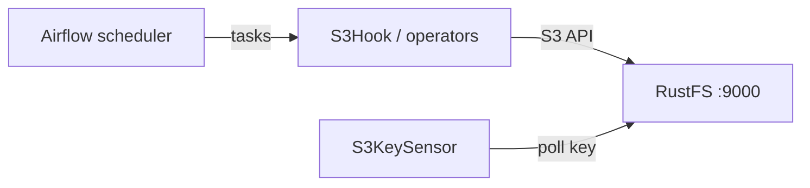
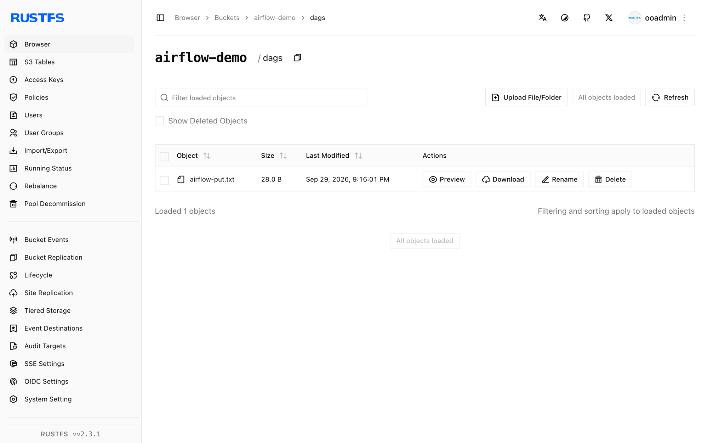

This guide connects [Apache Airflow](https://github.com/apache/airflow) — the workflow orchestration platform — to **RustFS** through the Amazon S3 provider's hooks, operators, and sensors. You will register a custom-endpoint connection, run a DAG that writes an object to a RustFS bucket, waits for a key with `S3KeySensor`, and reads the object back with `S3Hook`. The workflow was verified with `apache/airflow:3.3.2` (standalone, SequentialExecutor) and the `apache-airflow-providers-amazon` provider against `rustfs/rustfs-x86-musl:v2.3.1`.

You need Docker, or an existing Airflow installation. This deployment is intended for local integration testing, not production.

## Architecture



Every S3 interaction inside a DAG goes through the provider's S3 client, pointed at RustFS by the connection's `endpoint_url`. Operators, sensors, and hooks share the same connection object.

## 1. Run Airflow

Start a standalone instance with examples disabled, and create the demo bucket:

```bash
docker run -d --name airflow --network oo-rustfs_default -p 8080:8080 \
  -e AIRFLOW__CORE__LOAD_EXAMPLES=False \
  -v "$PWD/dags":/opt/airflow/dags \
  apache/airflow:3.3.2 standalone

rc mb rustfs/airflow-demo
```

The image ships with all providers preinstalled, including `apache-airflow-providers-amazon`.

## 2. Register the RustFS connection

The S3 provider reads its endpoint from the connection's extra field. Replace all connection placeholders:

```bash
docker exec airflow airflow connections add rustfs \
  --conn-type aws \
  --conn-extra '{"endpoint_url": "http://<your-rustfs-endpoint>:9000", "region_name": "us-east-1", "aws_access_key_id": "<your-access-key>", "aws_secret_access_key": "<your-secret-key>"}'
```

The keys `aws_access_key_id` and `aws_secret_access_key` inside `--conn-extra` supply credentials; `endpoint_url` redirects the boto3 client from AWS to RustFS.

## 3. Write the DAG

The DAG writes an object with an operator, waits for the key with a sensor, and reads it back with the hook:

```python title="rustfs_demo.py"
import datetime

from airflow.providers.amazon.aws.hooks.s3 import S3Hook
from airflow.providers.amazon.aws.operators.s3 import S3CreateObjectOperator
from airflow.providers.amazon.aws.sensors.s3 import S3KeySensor
from airflow.sdk import dag, task

@dag(
    schedule=None,
    start_date=datetime.datetime(2026, 1, 1),
    catchup=False,
    tags=["rustfs"],
)
def rustfs_demo():
    create = S3CreateObjectOperator(
        task_id="write_object",
        s3_bucket="airflow-demo",
        s3_key="dags/airflow-put.txt",
        data="written by airflow to rustfs",
        aws_conn_id="rustfs",
        replace=True,
    )

    wait = S3KeySensor(
        task_id="wait_for_object",
        bucket_key="dags/airflow-put.txt",
        bucket_name="airflow-demo",
        aws_conn_id="rustfs",
        timeout=120,
        poke_interval=10,
        mode="reschedule",
    )

    @task
    def read_object():
        hook = S3Hook(aws_conn_id="rustfs")
        body = hook.read_key(key="dags/airflow-put.txt", bucket_name="airflow-demo")
        print("read back:", body)
        assert body == "written by airflow to rustfs"

    create >> [wait, read_object()]

rustfs_demo()
```

Note the import paths: `S3CreateObjectOperator` lives in the `operators` module while `S3KeySensor` lives in the `sensors` module — importing both from one place fails.

## 4. Unpause and trigger

New DAGs start paused, and a trigger fired while paused stays queued forever. Unpause first, then trigger:

```bash
docker exec airflow airflow dags unpause rustfs_demo
docker exec airflow airflow dags trigger rustfs_demo
```

Watch the run finish:

```bash
docker exec airflow airflow dags list-runs rustfs_demo | head -3
```

```text
dag_id       run_id                                    state
rustfs_demo  manual__2026-09-29T13:15:57.332688+00:00  success
```

All three tasks succeed: `write_object`, `wait_for_object`, and `read_object`.

## 5. Verify objects in RustFS

List the bucket prefix:

```bash
rc ls rustfs/airflow-demo/ -r
rc cat rustfs/airflow-demo/dags/airflow-put.txt
```

```text
[2026-09-29 13:16:01]       28 B dags/airflow-put.txt
written by airflow to rustfs
```



## 6. Stop or reset

To tear down the demo while keeping the bucket objects:

```bash
docker rm -f airflow
```

To delete the stored data:

```bash
rc rm rustfs/airflow-demo/ --recursive --force
```

## Troubleshooting

### Dag runs stay `queued` after triggering

The DAG is paused. New DAGs are paused by default in Airflow 3, and runs triggered in that state never execute. Run `airflow dags unpause rustfs_demo`; queued runs then start on their own.

### `cannot import name 'S3KeySensor' from 'airflow.providers.amazon.aws.operators.s3'`

The sensor lives in a separate module: `from airflow.providers.amazon.aws.sensors.s3 import S3KeySensor`.

### Tasks fail with connection errors

The `endpoint_url` must be reachable from the Airflow container — use the Docker network hostname for RustFS, not `localhost`. Airflow 3 serves its health endpoint under `/api/v2/monitor/health` if you need to check component status.

## Next steps

- Review [S3 compatibility notes](/administration/protocols/s3) before adopting additional provider hooks.
- Create dedicated production credentials with [Access Key Management](/security-compliance/iam/access-token).
- Follow the [Amazon provider documentation](https://airflow.apache.org/docs/apache-airflow-providers-amazon/stable/index.html) for transfer operators such as `S3ToLocalFilesystemOperator` and `LocalFilesystemToS3Operator`.
