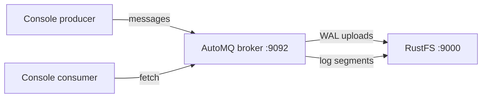
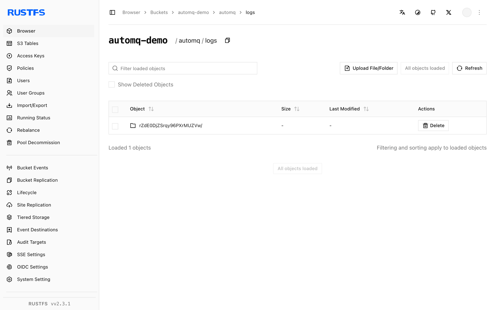

This guide connects [AutoMQ](https://github.com/AutoMQ/automq) — the cloud-native Kafka distribution that keeps its log storage in object storage — to **RustFS**. You will start a single-node AutoMQ broker in KRaft mode with its S3 log buckets pointed at RustFS, then produce and consume messages. The workflow was verified with AutoMQ 1.3.0 (Kafka 3.9.0 API) against `rustfs/rustfs-x86-musl:v2.3.1`.

You need Docker. This deployment is intended for local integration testing, not production.

## Architecture



AutoMQ decouples storage from brokers: the write-ahead log is buffered locally, then uploaded as immutable stream objects into the bucket. The broker keeps no local data directory beyond the WAL.

## 1. Run the broker

Start AutoMQ with the S3 buckets pointed at RustFS. Four details are mandatory: space-separated script arguments (`--key=value` makes the startup script loop forever), `JAVA_TOOL_OPTIONS` with `-XX:-UseContainerSupport` (the bundled JDK 17 crashes on cgroup v2 detection otherwise), the `server` combined role, and credentials via `KAFKA_S3_ACCESS_KEY`/`KAFKA_S3_SECRET_KEY` environment variables (the `--s3.access.key` script arguments are ignored):

```bash
docker run -d --name automq --hostname automq --network oo-rustfs_default -p 9092:9092 \
  -e JAVA_TOOL_OPTIONS="-XX:-UseContainerSupport" \
  -e KAFKA_HEAP_OPTS="-Xms512m -Xmx512m -XX:MetaspaceSize=96m -XX:MaxDirectMemorySize=512M" \
  -e KAFKA_S3_ACCESS_KEY=<your-access-key> \
  -e KAFKA_S3_SECRET_KEY=<your-secret-key> \
  -v /opt/automq-data:/data/kafka \
  automqinc/automq:1.3.0 /opt/automq/scripts/start.sh up \
  --process.roles server \
  --node.id 0 \
  --controller.quorum.voters 0@automq:9093 \
  --s3.region us-east-1 \
  --s3.bucket automq-demo \
  --s3.endpoint http://rustfs:9000
```

The broker binds its listener to the container IP. For the console tools, address it by that IP (the hostname `automq` also works from inside the container).

## 2. Create a topic and produce

```bash
AIP=<automq-container-ip>
docker exec automq sh -c "cd /opt/automq/kafka && \
  ./bin/kafka-topics.sh --bootstrap-server $AIP:9092 --create --topic rustfs-automq --partitions 1 --replication-factor 1"

docker exec automq sh -c "cd /opt/automq/kafka && \
  printf 'mq-msg-one\nmq-msg-two\nmq-msg-three\n' | \
  ./bin/kafka-console-producer.sh --bootstrap-server $AIP:9092 --topic rustfs-automq"
```

## 3. Consume the messages

```bash
docker exec automq sh -c "cd /opt/automq/kafka && \
  ./bin/kafka-console-consumer.sh --bootstrap-server $AIP:9092 \
  --topic rustfs-automq --from-beginning --max-messages 3 --timeout-ms 30000"
```

```text
mq-msg-one
mq-msg-two
mq-msg-three
Processed a total of 3 messages
```

## 4. Verify objects in RustFS

List the bucket — AutoMQ writes its log streams and metrics as objects:

```bash
rc ls rustfs/automq-demo/ -r
```

```text
automq/logs/rZdE0DjZSrqy96PXrMUZVw/0/2026100700/fcd3fc76-... 
automq/logs/rZdE0DjZSrqy96PXrMUZVw/0/2026100701/52877dc7-...
automq/metrics/rZdE0DjZSrqy96PXrMUZVw/0/2026100701/4733e680-...
```

The log stream objects hold the topic data — the broker keeps only the WAL locally, so scaling brokers up or down does not move data.



## 5. Stop or reset

```bash
docker rm -f automq
rc rm rustfs/automq-demo/ --recursive --force
```

## Troubleshooting

### Startup script prints `setup_value:` lines forever at 100% CPU

The argument parser only accepts the space-separated form (`--s3.bucket x`, not `--s3.bucket=x`). The `=` form makes the parser loop forever.

### `java.lang.NullPointerException ... CgroupInfo.getMountPoint()`

The bundled JDK 17 fails cgroup v2 detection in this image. Set `JAVA_TOOL_OPTIONS="-XX:-UseContainerSupport"`.

### `unknown process role broker,controller`

AutoMQ 1.3.0's script expects the combined role to be spelled `server`.

### Broker starts but clients get `Connection to node -1 could not be established`

The listener binds to the container IP (`hostname -I`). Address the broker by that IP or by the hostname `automq` from inside the same Docker network — `localhost` only works for tools running inside the broker container itself.

### `List objects failed, cost: 120000+ ms`

AutoMQ uses virtual-host addressing by default and falls into a retry loop against IP endpoints. Force path-style buckets by overriding the bucket URLs with `KAFKA_CFG_S3_DATA_BUCKETS`/`KAFKA_CFG_S3_OPS_BUCKETS` set to `0@s3://<bucket>?region=us-east-1&endpoint=http://rustfs:9000&pathStyle=true&authType=static`, and pass credentials via `KAFKA_S3_ACCESS_KEY`/`KAFKA_S3_SECRET_KEY`.

## Next steps

- Compare with the [Kafka](/developer/integration/big-data/kafka) guide when you prefer connect-based S3 integration on stock Kafka.
- Create dedicated production credentials with [Access Key Management](/security-compliance/iam/access-token).
- Follow the [AutoMQ documentation](https://docs.automq.com/) for multi-node clusters and WAL parameter tuning on the same bucket.
