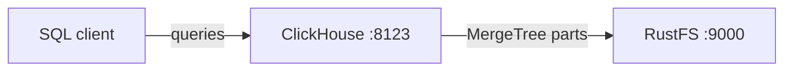
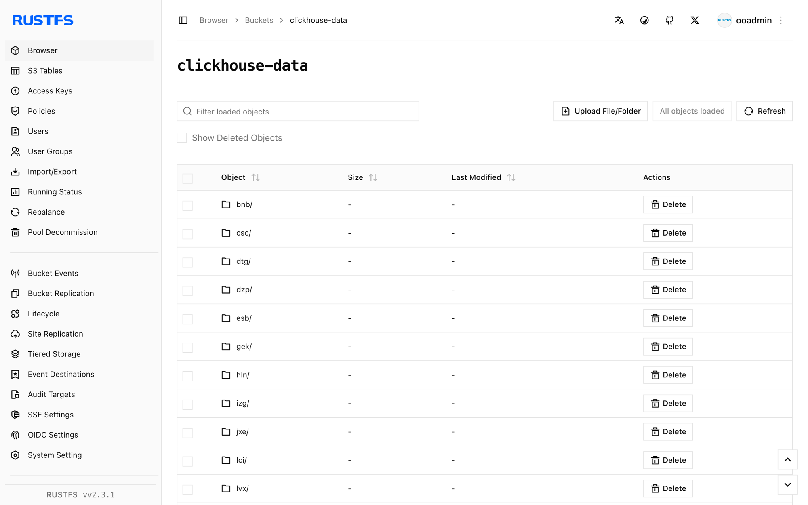

This guide connects [ClickHouse](https://github.com/ClickHouse/ClickHouse) — the real-time OLAP database — to **RustFS** through ClickHouse's S3 disk storage policy. You will start a ClickHouse server with Docker, create a MergeTree table that stores its parts on RustFS, insert rows, and verify that the table data lives in the bucket. The workflow was verified with `clickhouse/clickhouse-server:25.8` and `rustfs/rustfs-x86-musl:v2.3.1`.

You need Docker. This deployment is intended for local integration testing, not production.

## Architecture



The `rustfs` disk is a ClickHouse S3 disk pointed at the `clickhouse-data` bucket. Tables created with the matching storage policy write their parts — data, index, and checksum files — to the bucket instead of the local filesystem.

## 1. Create the project files

Create the bucket first — ClickHouse does not create buckets:

```bash
rc alias set rustfs http://<your-rustfs-endpoint>:9000 <your-access-key> <your-secret-key>
rc mb rustfs/clickhouse-data
```

Create the storage configuration, replacing both credential placeholders:

```xml title="storage.xml"
<clickhouse>
  <storage_configuration>
    <disks>
      <rustfs>
        <type>s3</type>
        <endpoint>http://rustfs:9000/clickhouse-data/</endpoint>
        <access_key_id><your-access-key></access_key_id>
        <secret_access_key><your-secret-key></secret_access_key>
      </rustfs>
    </disks>
    <policies>
      <rustfs_policy>
        <volumes>
          <main>
            <disk>rustfs</disk>
          </main>
        </volumes>
      </rustfs_policy>
    </policies>
  </storage_configuration>
</clickhouse>
```

The endpoint must end with `/` and includes the bucket name as the first path segment. Inside the Compose network the hostname is `rustfs`; from the host use `http://localhost:9000/clickhouse-data/`.

Start ClickHouse with the configuration mounted:

```bash
docker run -d --name clickhouse --network oo-rustfs_default \
  -p 8123:8123 \
  -e CLICKHOUSE_PASSWORD=<your-clickhouse-password> \
  -v "$PWD/storage.xml":/etc/clickhouse-server/config.d/storage.xml:ro \
  clickhouse/clickhouse-server:25.8
```

## 2. Create a table on the S3 disk

Wait for the HTTP interface, then create a database and a MergeTree table with the storage policy:

```bash
curl "http://localhost:8123/?password=<your-clickhouse-password>" \
  --data-binary "CREATE DATABASE rustfs_demo"

curl "http://localhost:8123/?password=<your-clickhouse-password>" \
  --data-binary "CREATE TABLE rustfs_demo.events
    (id UInt32, name String)
    ENGINE = MergeTree ORDER BY id
    SETTINGS storage_policy = 'rustfs_policy'"

curl "http://localhost:8123/?password=<your-clickhouse-password>" \
  --data-binary "INSERT INTO rustfs_demo.events
    VALUES (1, 'clickhouse-on-rustfs'), (2, 'second')"
```

Read the rows back and confirm ClickHouse reports the part on the `rustfs` disk:

```bash
curl "http://localhost:8123/?password=<your-clickhouse-password>" \
  --data-binary "SELECT count(), any(name) FROM rustfs_demo.events"

curl "http://localhost:8123/?password=<your-clickhouse-password>" \
  --data-binary "SELECT name, disk_name FROM system.parts
    WHERE database = 'rustfs_demo' AND active"
```

```text
2  clickhouse-on-rustfs
all_1_1_0  rustfs
```

## 3. Verify objects in RustFS

List the bucket:

```bash
rc ls rustfs/clickhouse-data/ -r
```

ClickHouse writes each part as content-addressed blobs. The output contains several small objects, and the count grows as more parts are written:

```text
dtg/hpsyncexixvdnsgorvseobogcgowg
dzp/zfblobhsatzdveqdrsfqcupkdehja
izg/gvhchqobrizpkdftuvlmakkoutwps
```



The data survives a container restart because the parts live in RustFS:

```bash
docker restart clickhouse
curl "http://localhost:8123/?password=<your-clickhouse-password>" \
  --data-binary "SELECT count() FROM rustfs_demo.events"
```

## 4. Stop or reset the deployment

Stop the server while keeping the data:

```bash
docker rm -f clickhouse
```

The parts stay in the `clickhouse-data` bucket and the table can be queried again after the next start. To delete the data, remove the bucket:

```bash
rc rb rustfs/clickhouse-data --force
```

## Troubleshooting

### `REQUIRED_PASSWORD` on every query

ClickHouse 25.8 images require a password for the `default` user. Set `CLICKHOUSE_PASSWORD` on the container and pass the same value as the `password` query parameter, as shown above.

### Table creation fails with a disk or endpoint error

Confirm that the bucket exists before the table is created, that the endpoint ends with `/`, and that the credentials match the RustFS deployment. Check the server log for the underlying S3 error:

```bash
docker logs clickhouse | grep -i s3 | tail
```

## Next steps

- Review [S3 compatibility notes](/administration/protocols/s3) before adopting additional ClickHouse operations.
- Create dedicated production credentials with [Access Key Management](/security-compliance/iam/access-token).
- Follow the [ClickHouse S3 disk documentation](https://clickhouse.com/docs/engines/table-engines/mergetree-family/mergetree#table_engine-mergetree-s3) to add a cache disk or a tiered hot/cold policy.
