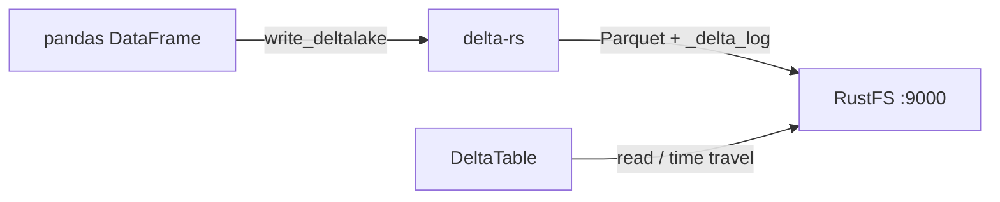
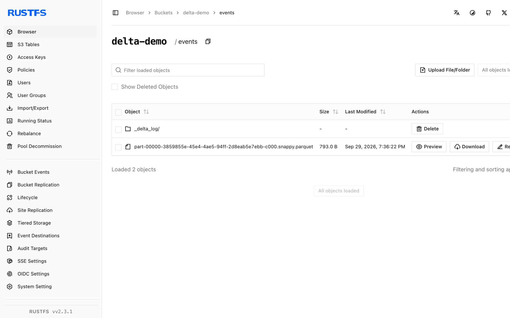

This guide connects [Delta Lake](https://github.com/delta-io/delta) — the open-source lakehouse table format — to **RustFS** through delta-rs, the Rust-native Delta implementation. You will write a Delta table to a RustFS bucket from Python, read it back with ACID transaction history, and confirm the `_delta_log` and Parquet files in the bucket. The workflow was verified with the `deltalake` Python package (delta-rs) and pandas against `rustfs/rustfs-x86-musl:v2.3.1`.

You need Python 3.9 or newer. This deployment is intended for local integration testing, not production.

## Architecture



delta-rs stores each table as Parquet files plus a transaction log (`_delta_log/`). All I/O goes through the `object_store` crate, configured with the same AWS environment variables as other S3 clients.

## 1. Install the client

```bash
pip install deltalake pandas pyarrow
```

`pyarrow` is required to convert pandas frames into Delta-compatible record batches.

## 2. Write a Delta table

Create the bucket and write a table, replacing all connection placeholders. `AWS_S3_ALLOW_UNSAFE_RENAME` is needed because RustFS does not provide copy-if-not-exists, which delta-rs otherwise uses for commit conflicts:

```python title="delta_s3.py"
import pandas as pd
from deltalake import DeltaTable, write_deltalake

storage_options = {
    "AWS_ENDPOINT_URL": "http://<your-rustfs-endpoint>:9000",
    "AWS_ACCESS_KEY_ID": "<your-access-key>",
    "AWS_SECRET_ACCESS_KEY": "<your-secret-key>",
    "AWS_REGION": "us-east-1",
    "AWS_ALLOW_HTTP": "true",
    "AWS_S3_ALLOW_UNSAFE_RENAME": "true",
}

table = "s3://<your-bucket>/events"
df = pd.DataFrame({"id": [1, 2, 3], "name": ["alpha", "beta", "gamma"]})
write_deltalake(table, df, storage_options=storage_options)
print("written:", df.shape[0], "rows")
```

```text
written: 3 rows
```

The `table` URI uses the standard `s3://bucket/prefix` form; the endpoint and credentials come from `storage_options`.

## 3. Read the table back

```python title="delta_read.py"
from deltalake import DeltaTable

back = DeltaTable("s3://<your-bucket>/events", storage_options=storage_options).to_pandas()
print("read back:", back.shape[0], "rows")
print(back.sort_values("id").to_string(index=False))
print("version:", DeltaTable("s3://<your-bucket>/events", storage_options=storage_options).version())
```

```text
read back: 3 rows
 id   name
  1  alpha
  2   beta
  3  gamma
version: 0
```

Because the version is tracked in the transaction log, the same table supports time travel with `DeltaTable(..., version=N)` and appends that bump the version.

## 4. Verify objects in RustFS

List the table prefix:

```bash
rc ls rustfs/<your-bucket>/ -r
```

The first commit created the transaction log and one Parquet file:

```text
events/_delta_log/00000000000000000000.json
events/part-00000-3859855e-45e4-4ae5-94ff-2d8eab5e7ebb-c000.snappy.parquet
```

Every new write adds a `NNNNNNNNNNNNNNNNNNNN.json` log entry and Parquet parts; readers replay the log to get a consistent snapshot.



## 5. Stop or reset

delta-rs holds no state of its own. To delete the table:

```bash
rc rm rustfs/<your-bucket>/events/ --recursive --force
```

## Troubleshooting

### `Import pyarrow failed` when writing a pandas DataFrame

`write_deltalake` converts frames through Arrow. Install `pyarrow` alongside `deltalake` and `pandas`.

### `Generic DeltaTable error: commit conflict` or rename errors on commit

delta-rs commits by copying and renaming temporary objects, which requires atomic rename on the backend. For S3-compatible stores without copy-if-not-exists, set `AWS_S3_ALLOW_UNSAFE_RENAME: "true"` in `storage_options` — acceptable for a single writer, not for concurrent writers.

### `Unknown lengthy error: AWS connectivity or endpoint errors`

Confirm `AWS_ENDPOINT_URL` includes the scheme and that `AWS_ALLOW_HTTP` is `"true"` for plain-HTTP endpoints; without it the S3 client only speaks HTTPS.

## Next steps

- Review [S3 compatibility notes](/administration/protocols/s3) before adopting additional Delta clients.
- Create dedicated production credentials with [Access Key Management](/security-compliance/iam/access-token).
- Follow the [delta-rs usage documentation](https://delta-io.github.io/delta-rs/usage/writing/writing-to-s3/) for concurrent-writer setups with DynamoDB-backed commit coordination.
