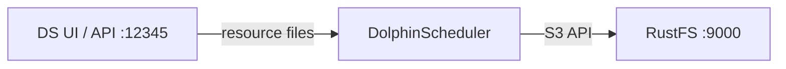
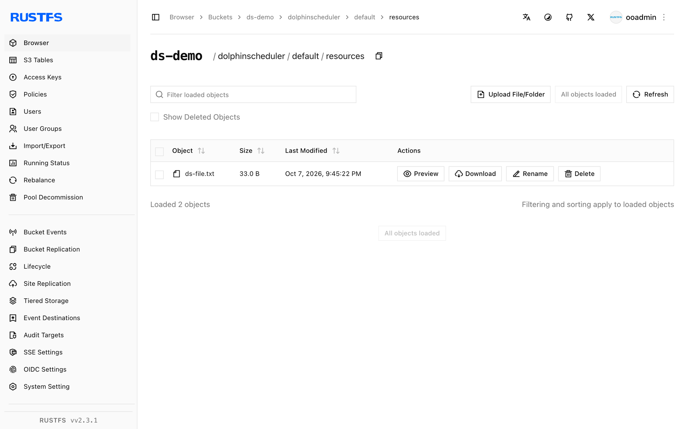

This guide connects [Apache DolphinScheduler](https://github.com/apache/dolphinscheduler) — the workflow scheduler — to **RustFS** as its resource center storage. You will run the standalone server, switch the resource storage to S3, upload a resource file through the API, and verify the object in the bucket. The workflow was verified with DolphinScheduler 3.2.1 (standalone server) against `rustfs/rustfs-x86-musl:v2.3.1`.

You need Docker.

## Architecture



The resource center stores workflow scripts, dependency JARs, and other files. With S3 storage every uploaded file becomes an object under `dolphinscheduler/<tenant>/resources/` in the bucket.

## 1. Run the standalone server

```bash
docker run -d --name dolphinscheduler --hostname dolphinscheduler \
  --network oo-rustfs_default -p 12345:12345 \
  apache/dolphinscheduler-standalone-server:3.2.1
```

The single container bundles master, worker, API, alert, and an embedded ZooKeeper. The UI is at `http://localhost:12345/dolphinscheduler/ui` (default login `admin` / `dolphinscheduler123`).

## 2. Switch the resource center to RustFS

The storage backend lives in `/opt/dolphinscheduler/conf/common.properties`. Append the S3 properties to the existing file — do not replace the file, it holds many other settings:

```bash
docker exec dolphinscheduler bash -c "cat >> /opt/dolphinscheduler/conf/common.properties << 'EOF'

resource.storage.type=S3
resource.storage.base.dir=/ds-resources
resource.aws.s3.bucket.name=ds-demo
resource.aws.s3.endpoint=http://<your-rustfs-endpoint>:9000
resource.aws.access.key.id=<your-access-key>
resource.aws.secret.access.key=<your-secret-key>
resource.aws.region=us-east-1
EOF"
docker restart dolphinscheduler
```

Wait for the API to come back (about a minute), then create the bucket:

```bash
rc mb rustfs/ds-demo
```

## 3. Upload a resource file

Log in through the API to get a session id, then upload a file. The endpoint requires both `name` and `fullName` parameters:

```bash
printf "ds resource file stored in rustfs" > /tmp/ds-file.txt
TOKEN=$(curl -s -m 10 -X POST http://localhost:12345/dolphinscheduler/login \
  -d "userName=admin&userPassword=dolphinscheduler123" \
  | python3 -c "import json,sys; print(json.load(sys.stdin)['data']['sessionId'])")

curl -s -m 30 -X POST "http://localhost:12345/dolphinscheduler/resources" \
  -H "session-id: $TOKEN" -H "Cookie: sessionId=$TOKEN" \
  -F "file=@/tmp/ds-file.txt" -F "type=FILE" -F "currentDir=/" \
  -F "name=ds-file.txt" -F "fullName=/ds-file.txt" -F "description=demo"
```

```json
{"code":0,"msg":"success","data":null,"failed":false,"success":true}
```

## 4. Verify in DolphinScheduler and RustFS

Read the file back through the API:

```bash
curl -s -m 30 "http://localhost:12345/dolphinscheduler/resources/view-ui?fullName=/ds-file.txt&skipLineNum=100&limit=100" \
  -H "session-id: $TOKEN" -H "Cookie: sessionId=$TOKEN" | grep "ds resource"
```

```text
ds resource file stored in rustfs
```

List the bucket — the file sits under the tenant's resources prefix:

```bash
rc ls rustfs/ds-demo/ -r
```

```text
dolphinscheduler/default/resources/ds-file.txt
dolphinscheduler/default/udfs/
```



## 5. Stop or reset

```bash
docker rm -f dolphinscheduler
rc rm rustfs/ds-demo/ --recursive --force
```

## Troubleshooting

### Server fails to start with an Azure `clientId/tenantId/clientSecret` error

The storage config was written as a brand-new file instead of appended, so `resource.storage.type=S3` was lost and the defaults pointed at Azure. Always append to the existing `common.properties` as in step 2.

### `Required request parameter 'name'/'fullName' is not present`

The resource create endpoint requires both `name` and `fullName` form fields alongside `file`, `type`, and `currentDir`.

### API returns 405 for the token call

The login/token endpoints accept POST but `/api/v2/token` style endpoints differ per version — use the login form shown in step 3 and pass `session-id` header plus `Cookie: sessionId=...` on every call.

## Next steps

- Compare with the [Airflow](/developer/integration/big-data/airflow) guide for orchestration without a built-in resource center.
- Create dedicated production credentials with [Access Key Management](/security-compliance/iam/access-token).
- Follow the [DolphinScheduler documentation](https://dolphinscheduler.apache.org/en-us/docs/latest/user_doc/common/resource-management.html) to wire the same S3 resource center into worker task execution.
