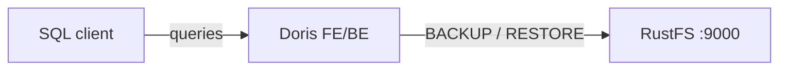
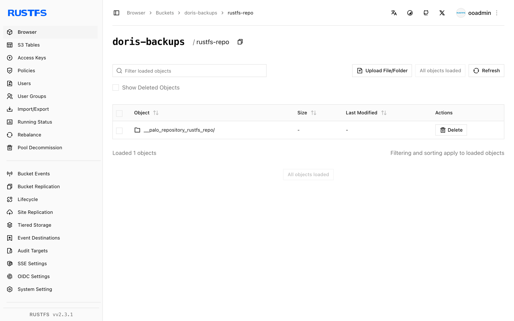

This guide connects [Apache Doris](https://github.com/apache/doris) — the real-time analytical data warehouse — to **RustFS** through an S3 backup repository. You will start an all-in-one Doris container, create an S3 repository pointing at a RustFS bucket, back up a table, drop it, and restore it from RustFS. The workflow was verified with `apache/doris:all-in-one-4.1.3` and `rustfs/rustfs-x86-musl:v2.3.1`.

You need Docker. This deployment is intended for local integration testing, not production.

## Architecture



The repository is a named S3 location under the `doris-backups` bucket. `BACKUP SNAPSHOT` uploads table metadata and tablet data files; `RESTORE SNAPSHOT` downloads them into a new table.

## 1. Start Doris and create the repository

Create the bucket first — Doris does not create buckets:

```bash
rc alias set rustfs http://<your-rustfs-endpoint>:9000 <your-access-key> <your-secret-key>
rc mb rustfs/doris-backups
```

Start the all-in-one container on the same Docker network as RustFS:

```bash
docker run -d --name doris --network oo-rustfs_default \
  -p 8030:8030 -p 9030:9030 apache/doris:all-in-one-4.1.3
```

Wait for the frontend to become healthy, then connect with the MySQL protocol (port 9030, user `root`, no password in the all-in-one image).

Create a test table with rows:

```sql
CREATE DATABASE rustfs_demo;
CREATE TABLE rustfs_demo.events
  (id INT, name VARCHAR(50))
  DISTRIBUTED BY HASH(id) BUCKETS 1
  PROPERTIES ("replication_num" = "1");
INSERT INTO rustfs_demo.events VALUES (1, 'doris-on-rustfs'), (2, 'backup-test');
```

Create the S3 repository, replacing the endpoint with the IP address of the RustFS container and both credential placeholders:

```sql
CREATE REPOSITORY `rustfs_repo`
  WITH S3
  ON LOCATION "s3://doris-backups/rustfs-repo"
  PROPERTIES (
    "AWS_ENDPOINT" = "http://<rustfs-container-ip>:9000",
    "AWS_ACCESS_KEY" = "<your-access-key>",
    "AWS_SECRET_KEY" = "<your-secret-key>",
    "AWS_REGION" = "us-east-1",
    "AWS_PATH_STYLE_ACCESS" = "true"
  );
```

Doris 4.1 resolves the bucket into the endpoint hostname even with `AWS_PATH_STYLE_ACCESS` enabled, so a hostname endpoint fails with `UnknownHostException: doris-backups.rustfs`. Using the container IP address forces path-style requests and works; `SHOW REPOSITORIES` confirms the repository registered with an empty `ErrMsg`.

## 2. Back up a table to RustFS

Take a snapshot of the table:

```sql
BACKUP SNAPSHOT rustfs_demo.demo_snapshot
  TO rustfs_repo
  ON (events);
```

The statement returns immediately; the backup job runs in the background. Watch its state:

```sql
SHOW BACKUP;
```

Wait until `State` reaches `FINISHED` — the snapshot metadata and tablet data files are now objects in the bucket.

## 3. Verify the backup in RustFS

List the bucket:

```bash
rc ls rustfs/doris-backups/ -r
```

The repository stores a repository descriptor, the snapshot metadata, and the tablet files:

```text
rustfs-repo/__palo_repository_rustfs_repo/__repo_info
rustfs-repo/__palo_repository_rustfs_repo/__ss_demo_snapshot/__meta.d50ecf9b...
rustfs-repo/__palo_repository_rustfs_repo/__ss_demo_snapshot/__ss_content/.../...dat...
```



## 4. Restore the table from RustFS

Drop the table and restore it from the snapshot. The timestamp comes from the snapshot name shown by `SHOW SNAPSHOT ON REPOSITORY rustfs_repo;`:

```sql
DROP TABLE rustfs_demo.events;

RESTORE SNAPSHOT rustfs_demo.demo_snapshot
  FROM rustfs_repo
  ON (events)
  PROPERTIES (
    "backup_timestamp" = "2026-09-21-16-35-12",
    "replication_num" = "1"
  );
```

Wait for the restore job to finish and confirm the data:

```sql
SHOW RESTORE;
SELECT count(*) FROM rustfs_demo.events;
```

```text
2
```

## 5. Stop or reset the deployment

Stop Doris while keeping the data:

```bash
docker rm -f doris
```

The backup stays in the `doris-backups` bucket and can be restored into any Doris cluster that registers the same repository. To delete it, remove the bucket:

```bash
rc rb rustfs/doris-backups --force
```

## Troubleshooting

### `UnknownHostException: doris-backups.rustfs` when creating the repository

Doris is building a virtual-hosted hostname from the bucket and endpoint. Use the RustFS container IP address in `AWS_ENDPOINT` together with `AWS_PATH_STYLE_ACCESS = "true"`, as shown above.

### The backup stays in `SNAPSHOTING` for a long time

The backend uploads the tablet files. Confirm the backend is healthy (`SHOW BACKENDS;`) and can reach the endpoint; the all-in-one image needs a minute or two after start before both processes report ready.

### `Failed to create repository: ... file status`

The bucket does not exist or the credentials are wrong. Create `doris-backups` with `rc mb` and re-check the access key pair.

## Next steps

- Review [S3 compatibility notes](/administration/protocols/s3) before adopting additional Doris operations.
- Create dedicated production credentials with [Access Key Management](/security-compliance/iam/access-token).
- Follow the [Doris backup and restore documentation](https://doris.apache.org/docs/data-operate/backup-restore/) to schedule periodic snapshots.
