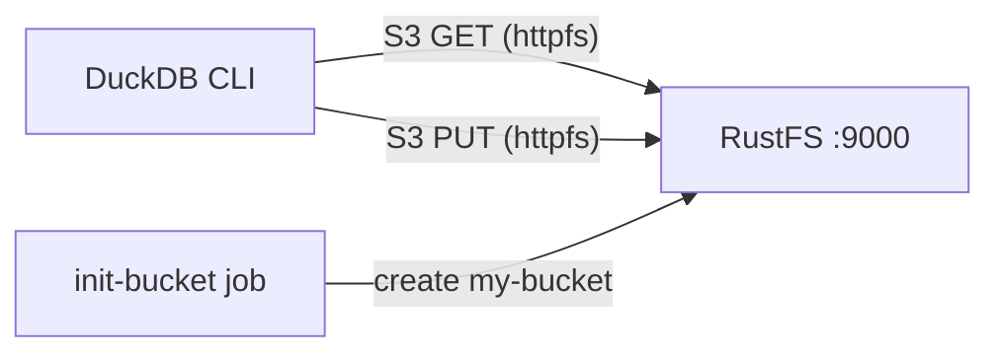

Diese Anleitung betreibt **DuckDB** mit **RustFS** als S3-kompatiblem Speicher. Sie starten beide Dienste mit Docker Compose, konfigurieren DuckDBs `httpfs`-Erweiterung für den RustFS-Endpunkt, schreiben Abfrageergebnisse als Parquet in den Bucket, lesen sie zurück und prüfen die Objekte in RustFS. Der Ablauf wurde mit dem Image `duckdb/duckdb:latest` (v1.5.5) und `rustfs/rustfs-x86-musl:v2.3.1` verifiziert.

Sie benötigen Docker mit dem Compose-Plugin. Dieses Setup ist für lokale Integrationstests gedacht, nicht für den Produktivbetrieb.

## Architektur



DuckDB liest und schreibt Objekte über die [`httpfs`-Erweiterung](https://duckdb.org/docs/stable/extensions/httpfs/overview), die die S3-API implementiert. Ein S3-Secret enthält den RustFS-Endpunkt, die Anmeldeinformationen, Path-Style-Adressierung und die Plain-HTTP-Einstellung; anschließend lassen sich Parquet-Dateien über `s3://my-bucket/...`-Pfade wie lokale Dateien laden und schreiben.

## 1. Projektdateien anlegen

Erstellen Sie ein Arbeitsverzeichnis:

```bash
mkdir rustfs-duckdb
cd rustfs-duckdb
```

Erstellen Sie eine Umgebungsdatei und ersetzen Sie beide Platzhalter für die Anmeldeinformationen:

```ini title=".env"
RUSTFS_ACCESS_KEY=<your-access-key>
RUSTFS_SECRET_KEY=<your-secret-key>
```

Verwenden Sie dedizierte Anmeldeinformationen für den Bucket. Committen Sie `.env` nicht in die Versionsverwaltung.

Erstellen Sie die Compose-Datei:

```yaml title="compose.yaml"
services:
  rustfs:
    image: rustfs/rustfs-x86-musl:v2.3.1
    environment:
      RUSTFS_ACCESS_KEY: ${RUSTFS_ACCESS_KEY}
      RUSTFS_SECRET_KEY: ${RUSTFS_SECRET_KEY}
      RUSTFS_VOLUMES: /data
      RUSTFS_ADDRESS: ":9000"
      RUSTFS_CONSOLE_ADDRESS: ":9001"
      RUSTFS_CONSOLE_ENABLE: "true"
    volumes:
      - rustfs-data:/data
    ports:
      - "9000:9000"
      - "9001:9001"
    healthcheck:
      test: ["CMD", "curl", "-sf", "http://127.0.0.1:9000/health"]
      interval: 10s
      timeout: 5s
      retries: 6
      start_period: 10s
    networks:
      - warehouse

  create-bucket:
    image: rustfs/rc:latest
    depends_on:
      rustfs:
        condition: service_healthy
    environment:
      RUSTFS_ACCESS_KEY: ${RUSTFS_ACCESS_KEY}
      RUSTFS_SECRET_KEY: ${RUSTFS_SECRET_KEY}
    entrypoint:
      - /bin/sh
      - -c
      - |
        until /usr/bin/rc alias set rustfs http://rustfs:9000 "$${RUSTFS_ACCESS_KEY}" "$${RUSTFS_SECRET_KEY}"; do
          echo "Waiting for RustFS..."
          sleep 2
        done
        /usr/bin/rc ls rustfs/my-bucket >/dev/null 2>&1 || /usr/bin/rc mb rustfs/my-bucket
    networks:
      - warehouse

  duckdb:
    image: duckdb/duckdb:latest
    entrypoint: ["/duckdb"]
    depends_on:
      create-bucket:
        condition: service_completed_successfully
    networks:
      - warehouse

networks:
  warehouse:

volumes:
  rustfs-data:
```

Das [`rc`-Image](https://github.com/rustfs/cli) stellt den offiziellen RustFS-Kommandozeilenclient bereit. Der Initialisierer prüft vor dem Anlegen, ob `my-bucket` bereits existiert, sodass wiederholte Starts keine bestehenden Daten löschen. Das Image `duckdb/duckdb` enthält nur die Binärdatei `/duckdb` und keine Shell, daher setzt der Dienst `entrypoint: ["/duckdb"]`.

## 2. Bereitstellung starten

Prüfen Sie die Compose-Datei, bevor Sie Container starten:

```bash
docker compose config
```

Starten Sie die Dienste und warten Sie, bis die Bucket-Initialisierung abgeschlossen ist:

```bash
docker compose up -d
docker compose ps -a
```

Der Dienst `create-bucket` sollte mit dem Exit-Code `0` enden. Die RustFS-Konsole erreichen Sie jederzeit unter `http://localhost:9001/rustfs/console/`.

## 3. Das S3-Secret in DuckDB konfigurieren

Starten Sie eine interaktive DuckDB-Sitzung:

```bash
docker compose run --rm duckdb
```

Installieren Sie die Erweiterung und registrieren Sie den RustFS-Endpunkt:

```sql
INSTALL httpfs;
LOAD httpfs;

CREATE SECRET rustfs (
    TYPE S3,
    KEY_ID '<your-access-key>',
    SECRET '<your-secret-key>',
    ENDPOINT 'rustfs:9000',
    USE_SSL FALSE,
    URL_STYLE 'path'
);
```

Der Endpunkt wird als `host:port` ohne Schema angegeben. `USE_SSL FALSE` wählt Plain HTTP innerhalb des Compose-Netzwerks, und `URL_STYLE 'path'` wählt Path-Style-Adressierung, die RustFS erwartet. Secrets gelten nur für die aktuelle Sitzung — erstellen Sie das Secret bei jeder neuen Sitzung erneut.

## 4. Abfrageergebnisse nach RustFS schreiben

Schreiben Sie eine kleine Tabelle als Parquet in den Bucket:

```sql
COPY
    (SELECT i AS id, 'rustfs-duckdb-demo' AS source FROM range(1000) t(i))
    TO 's3://my-bucket/duckdb-demo/events.parquet'
    (FORMAT PARQUET);
```

```text
┌─────────┐
│ Success │
│ boolean │
├─────────┤
│   true  │
└─────────┘
```

## 5. Parquet aus RustFS zurücklesen

Abfragen Sie das soeben geschriebene Objekt wie eine lokale Datei:

```sql
SELECT count(*) AS rows, min(id) AS min_id, max(id) AS max_id
FROM read_parquet('s3://my-bucket/duckdb-demo/events.parquet');
```

```text
┌───────┬────────┬────────┐
│ rows  │ min_id │ max_id │
│ int64 │ int64  │ int64  │
├───────┼────────┼────────┤
│  1000 │      0 │    999 │
└───────┴────────┴────────┘
```

Jedes Parquet-Objekt unter dem Bucket lässt sich auf diese Weise abfragen, einschließlich Dateien, die von anderen Systemen wie OpenObserve, Spark oder Iceberg geschrieben wurden.

## 6. Objekte in RustFS prüfen

Listen Sie das Präfix über das Bucket-Initialisierungs-Image auf:

```bash
docker compose run --rm --entrypoint /bin/sh create-bucket -c \
  '/usr/bin/rc alias set rustfs http://rustfs:9000 "$RUSTFS_ACCESS_KEY" "$RUSTFS_SECRET_KEY" >/dev/null && /usr/bin/rc ls rustfs/my-bucket/duckdb-demo --recursive'
```

```text
[2026-09-20 06:52:45]   5.32 KiB duckdb-demo/events.parquet
```

Sie können das Präfix `duckdb-demo` auch in der RustFS-Konsole anzeigen:


## 7. Stack stoppen oder zurücksetzen

Stoppen Sie die Container und behalten Sie das RustFS-Datenvolumen:

```bash
docker compose down
```

Um die lokalen Objekte zu löschen und mit einem leeren RustFS-Volumen zu beginnen, fügen Sie ausdrücklich `--volumes` hinzu:

```bash
docker compose down --volumes
```

## Fehlerbehebung

### DuckDB erreicht RustFS nicht

Innerhalb des Compose-Netzwerks lautet der Endpunkt `rustfs:9000`. Für einen DuckDB-Prozess auf dem Host verwenden Sie `localhost:9000` und publizieren Port `9000` wie in der Compose-Datei gezeigt.

### SSL- oder Verbindungsfehler mit einem Plain-HTTP-Endpunkt

`ENDPOINT` nimmt kein Schema an. Läuft RustFS ohne TLS, muss `USE_SSL FALSE` im Secret gesetzt sein; andernfalls versucht `httpfs` HTTPS und schlägt mit einem Verbindungs- oder Zertifikatsfehler fehl.

### AccessDenied-Antworten

Prüfen Sie, ob die Anmeldeinformationen im Secret mit den RustFS-Anmeldeinformationen übereinstimmen und ob die Bucket-Initialisierung erfolgreich abgeschlossen wurde:

```bash
docker compose logs create-bucket
```

### Virtual-Host-Style-Anfragen

`URL_STYLE 'path'` ist für den Container-Netzwerk-Endpunkt erforderlich. Virtual-Host-Style-Anfragen erfordern eine RustFS-Domänenkonfiguration (`RUSTFS_SERVER_DOMAINS`) und passende DNS-Einträge und sind für dieses Setup nicht notwendig.

## Nächste Schritte

- Lesen Sie die [S3-Kompatibilitätshinweise](/administration/protocols/s3), bevor Sie weitere S3-Operationen verwenden.
- Erstellen Sie dedizierte Produktions-Anmeldeinformationen mit dem [Access Key Management](/security-compliance/iam/access-token).
- Folgen Sie der [DuckDB-httpfs-Dokumentation](https://duckdb.org/docs/stable/extensions/httpfs/overview) für erweiterte Optionen wie Regions-Overrides und Verbindungslimits.
