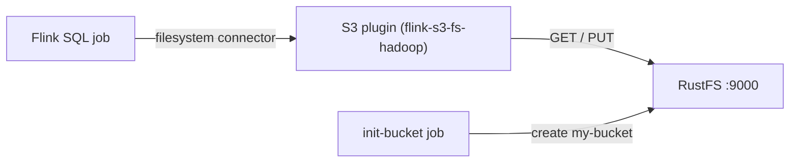

Diese Anleitung verbindet [Apache Flink](https://github.com/apache/flink) über Flinks S3-Dateisystem-Plugin (`flink-s3-fs-hadoop`) mit **RustFS**. Sie starten einen Session-Cluster mit Docker Compose, schreiben ein begrenztes Ergebnis als Batch in den Bucket und lesen es über Flink SQL zurück. Der Ablauf wurde mit `flink:1.20` und `rustfs/rustfs-x86-musl:v2.3.1` verifiziert.

Sie benötigen Docker mit dem Compose-Plugin. Dieses Setup ist für lokale Integrationstests gedacht, nicht für den Produktivbetrieb.

## Architektur



Das Plugin `flink-s3-fs-hadoop` registriert das `s3://`-Schema für Flinks filesystem-Connector. Endpunkt, Path-Style-Adressierung, Plain HTTP und Anmeldeinformationen werden über `s3.*`-Properties in `flink-conf.yaml` konfiguriert (übergeben via `FLINK_PROPERTIES`).

## 1. Projektdateien anlegen

Erstellen Sie ein Arbeitsverzeichnis:

```bash
mkdir rustfs-flink
cd rustfs-flink
```

Erstellen Sie eine Umgebungsdatei und ersetzen Sie beide Platzhalter für die Anmeldeinformationen:

```ini title=".env"
RUSTFS_ACCESS_KEY=<your-access-key>
RUSTFS_SECRET_KEY=<your-secret-key>
```

Verwenden Sie dedizierte Anmeldeinformationen für den Bucket. Committen Sie `.env` nicht in die Versionsverwaltung.

Das S3-Plugin liegt im Image unter `/opt/flink/opt/` und muss geladen werden, indem es nach `/opt/flink/plugins/s3fs/` kopiert wird. Bereiten Sie ein lokales Verzeichnis dafür vor:

```bash
mkdir -p s3fs
docker create --name flink-tmp flink:1.20
docker cp flink-tmp:/opt/flink/opt/flink-s3-fs-hadoop-1.20.5.jar s3fs/
docker rm flink-tmp
```

Erstellen Sie die Compose-Datei:

```yaml title="compose.yaml"
services:
  rustfs:
    image: rustfs/rustfs-x86-musl:v2.3.1
    environment:
      RUSTFS_ACCESS_KEY: ${RUSTFS_ACCESS_KEY}
      RUSTFS_SECRET_KEY: ${RUSTFS_SECRET_KEY}
      RUSTFS_VOLUMES: /data
      RUSTFS_ADDRESS: ":9000"
      RUSTFS_CONSOLE_ADDRESS: ":9001"
      RUSTFS_CONSOLE_ENABLE: "true"
    volumes:
      - rustfs-data:/data
    ports:
      - "9000:9000"
      - "9001:9001"
    healthcheck:
      test: ["CMD", "curl", "-sf", "http://127.0.0.1:9000/health"]
      interval: 10s
      timeout: 5s
      retries: 6
      start_period: 10s
    networks:
      - flink

  create-bucket:
    image: rustfs/rc:latest
    depends_on:
      rustfs:
        condition: service_healthy
    environment:
      RUSTFS_ACCESS_KEY: ${RUSTFS_ACCESS_KEY}
      RUSTFS_SECRET_KEY: ${RUSTFS_SECRET_KEY}
    entrypoint:
      - /bin/sh
      - -c
      - |
        until /usr/bin/rc alias set rustfs http://rustfs:9000 "$${RUSTFS_ACCESS_KEY}" "$${RUSTFS_SECRET_KEY}"; do
          echo "Waiting for RustFS..."
          sleep 2
        done
        /usr/bin/rc ls rustfs/my-bucket >/dev/null 2>&1 || /usr/bin/rc mb rustfs/my-bucket
    networks:
      - flink

  jobmanager:
    image: flink:1.20
    command: jobmanager
    environment:
      FLINK_PROPERTIES: |
        jobmanager.rpc.address: jobmanager
        rest.address: jobmanager
        rest.bind-address: 0.0.0.0
        s3.access-key: ${RUSTFS_ACCESS_KEY}
        s3.secret-key: ${RUSTFS_SECRET_KEY}
        s3.endpoint: http://rustfs:9000
        s3.path-style-access: true
    volumes:
      - ./s3fs:/opt/flink/plugins/s3fs:ro
    ports:
      - "8081:8081"
    depends_on:
      create-bucket:
        condition: service_completed_successfully
    networks:
      - flink

  taskmanager:
    image: flink:1.20
    command: taskmanager
    environment:
      FLINK_PROPERTIES: |
        jobmanager.rpc.address: jobmanager
        taskmanager.host: taskmanager
        s3.access-key: ${RUSTFS_ACCESS_KEY}
        s3.secret-key: ${RUSTFS_SECRET_KEY}
        s3.endpoint: http://rustfs:9000
        s3.path-style-access: true
    volumes:
      - ./s3fs:/opt/flink/plugins/s3fs:ro
    depends_on:
      jobmanager:
        condition: service_started
    networks:
      - flink

networks:
  flink:

volumes:
  rustfs-data:
```

Die Properties `s3.access-key`, `s3.secret-key`, `s3.endpoint` und `s3.path-style-access` konfigurieren das S3-Plugin auf JobManager und TaskManager.

## 2. Bereitstellung starten

Prüfen Sie die Compose-Datei, bevor Sie Container starten:

```bash
docker compose config
```

Starten Sie die Dienste und warten Sie, bis die Bucket-Initialisierung abgeschlossen ist:

```bash
docker compose up -d
docker compose ps -a
```

## 3. Ein Ergebnis nach RustFS schreiben

Erstellen Sie den SQL-Job — Batch-Modus mit dem filesystem-Sink:

```yaml title="batch.sql"
SET 'execution.runtime-mode' = 'batch';

CREATE TABLE sink (
  id INT,
  payload STRING
) WITH (
  'connector' = 'filesystem',
  'path' = 's3://my-bucket/flink-out/',
  'format' = 'csv'
);

INSERT INTO sink
  VALUES (1, 'alpha'), (2, 'bravo'), (3, 'charlie'), (4, 'delta'), (5, 'echo');
```

Übermitteln Sie ihn über den SQL-Client im JobManager:

```bash
docker compose exec jobmanager bash -c "/opt/flink/bin/sql-client.sh embedded -f /dev/stdin" < batch.sql
```

Der Job endet, sobald alle Zeilen geschrieben sind.

## 4. Die Daten zurücklesen

Erstellen Sie die Lesekonfiguration — der filesystem-Connector durchsucht das Präfix:

```yaml title="read.sql"
CREATE TABLE readings (
  id INT,
  payload STRING
) WITH (
  'connector' = 'filesystem',
  'path' = 's3://my-bucket/flink-out/',
  'format' = 'csv'
);

SET 'sql-client.execution.result-mode' = 'TABLEAU';

SELECT * FROM readings;
```

```bash
docker compose exec jobmanager bash -c "/opt/flink/bin/sql-client.sh embedded -f /dev/stdin" < read.sql
```

```text
+----+-------------+--------------------------------+
| op |          id |                         payload |
+----+-------------+--------------------------------+
| +I |           1 |                           alpha |
| +I |           2 |                           bravo |
| +I |           3 |                         charlie |
| +I |           4 |                           delta |
| +I |           5 |                            echo |
+----+-------------+--------------------------------+
```

## 5. Objekte in RustFS prüfen

Listen Sie das Präfix über das Bucket-Initialisierungs-Image auf:

```bash
docker compose run --rm --entrypoint /bin/sh create-bucket -c \
  '/usr/bin/rc alias set rustfs http://rustfs:9000 "$RUSTFS_ACCESS_KEY" "$RUSTFS_SECRET_KEY" >/dev/null && /usr/bin/rc ls rustfs/my-bucket/flink-out --recursive'
```

```text
[2026-09-21 01:34:52]       41 B flink-out/part-f759f9e8-3d1b-46a1-a92e-53e9b727e831-task-0-file-0
```

Sie können das Präfix auch in der RustFS-Konsole anzeigen:


## 6. RustFS S3 Tables verwenden

RustFS S3 Tables bietet einen integrierten Apache-Iceberg-REST-Katalog, sodass Flink einen Table-Bucket als verwaltetes Iceberg-Warehouse nutzen kann, während die Daten in RustFS bleiben. Aktivieren Sie einen Table-Bucket und richten Sie den REST-Katalog des Flink-Iceberg-Connectors auf RustFS, wie in [S3 Tables](/administration/data/s3-tables) beschrieben: Die REST-Katalog-URI ist `http://<rustfs-host>:9000/iceberg`, das Warehouse ist der Bucket-Name, und sowohl Kataloganfragen (AWS Signature Version 4, Signing-Name `s3`) als auch der S3-Dateizugriff verwenden Path-Style-Adressierung.

Laut der S3-Tables-Support-Matrix validieren Sie die exakten Flink- und Iceberg-Versionen Ihrer Bereitstellung gegen den Katalog, bevor Sie diesen Pfad in Produktion übernehmen.

## 7. Stack stoppen oder zurücksetzen

Stoppen Sie die Container und behalten Sie das RustFS-Datenvolumen:

```bash
docker compose down
```

Um die gespeicherten Dateien zu löschen und mit einem leeren RustFS-Volumen zu beginnen, fügen Sie ausdrücklich `--volumes` hinzu:

```bash
docker compose down --volumes
```

## Fehlerbehebung

### No AWS Credentials provided / AccessDenied bei Schreibvorgängen

Das S3-Plugin liest seine Anmeldeinformationen aus den `s3.*`-Properties in `flink-conf.yaml`. Stellen Sie sicher, dass `s3.access-key`, `s3.secret-key`, `s3.endpoint` und `s3.path-style-access` in `FLINK_PROPERTIES` für **sowohl** den JobManager als auch den TaskManager gesetzt sind und dass das Plugin-jar auf beiden unter `/opt/flink/plugins/s3fs/` liegt.

### Der TaskManager kann den Host `rustfs` nicht auflösen

Alle Flink-Container und RustFS müssen sich ein Compose-Netzwerk teilen. Hängt RustFS an einem externen Netzwerk, verbinden Sie auch die Flink-Container damit, bevor Sie den Job übermitteln.

### Ein Streaming-Schreibvorgang schlägt nach einem fehlgeschlagenen Versuch mit "Stream closed" fehl

Die Wiederherstellung eines laufenden S3-Uploads nach einem Fehler kann den Writer in einen nicht wiederherstellbaren Zustand versetzen. Löschen Sie das Ausgabe-Präfix des Jobs im Bucket und übermitteln Sie den Job erneut, oder verwenden Sie für Einmal-Schreibvorgänge den Batch-Modus wie in dieser Anleitung.

## Nächste Schritte

- Lesen Sie die [S3-Kompatibilitätshinweise](/administration/protocols/s3), bevor Sie weitere S3-Operationen verwenden.
- Erstellen Sie dedizierte Produktions-Anmeldeinformationen mit dem [Access Key Management](/security-compliance/iam/access-token).
- Folgen Sie der [Apache-Flink-Dokumentation](https://nightlies.apache.org/flink/flink-docs-stable/) für filesystem-Connector-Optionen wie Partitionierung und Kompaktierung.
