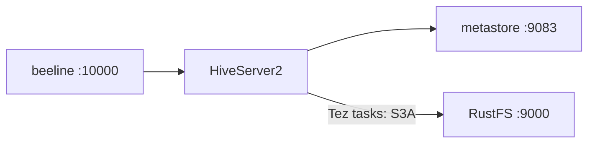
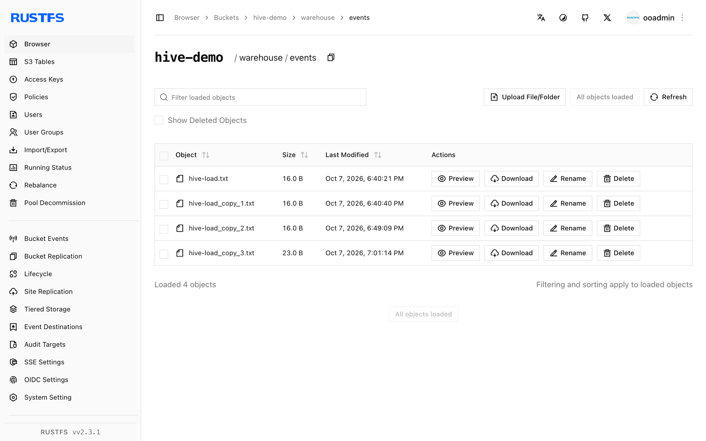

This guide connects [Apache Hive](https://github.com/apache/hive) — the classic data warehouse — to **RustFS** through the S3A filesystem. You will run the Hive 4.0.1 Docker image with a metastore and HiveServer2, configure S3A in three configuration layers, create an external table over a RustFS location, and load and query data. The workflow was verified with Hive 4.0.1 against `rustfs/rustfs-x86-musl:v2.3.1`.

You need Docker (two containers: metastore and hiveserver2).

## Architecture



Hive stores table metadata in the metastore (Derby in this test) and table data in the table's S3A location. Query execution runs on Tez inside the hiveserver2 container.

## 1. Run the metastore and HiveServer2

```bash
docker run -d --name hive-metastore --hostname hive-meta --network oo-rustfs_default \
  -e SERVICE_NAME=metastore -e DB_DRIVER=derby apache/hive:4.0.1

docker run -d --name hive-server --hostname hive-server --network oo-rustfs_default \
  -e SERVICE_NAME=hiveserver2 -e DB_DRIVER=derby apache/hive:4.0.1
```

The metastore takes 1-2 minutes to initialize its Derby schema; HiveServer2 listens on 10000, the metastore on 9083.

## 2. Configure S3A in three places

Tez tasks read the Hadoop configuration directory, HiveServer2 reads the Hive configuration, and the metastore needs the endpoint too. Create one properties file and copy it to all three paths:

```xml title="s3a-core-site.xml"
<?xml version="1.0"?>
<configuration>
  <property><name>fs.s3a.endpoint</name><value>http://<your-rustfs-endpoint>:9000</value></property>
  <property><name>fs.s3a.access.key</name><value><your-access-key></value></property>
  <property><name>fs.s3a.secret.key</name><value><your-secret-key></value></property>
  <property><name>fs.s3a.path.style.access</name><value>true</value></property>
  <property><name>fs.s3a.connection.ssl.enabled</name><value>false</value></property>
  <property><name>fs.s3a.aws.credentials.provider</name><value>org.apache.hadoop.fs.s3a.SimpleAWSCredentialsProvider</value></property>
  <property><name>fs.s3a.impl</name><value>org.apache.hadoop.fs.s3a.S3AFileSystem</value></property>
</configuration>
```

```bash
rc mb rustfs/hive-demo
docker cp s3a-core-site.xml hive-server:/opt/hive/conf/hive-site.xml
docker cp s3a-core-site.xml hive-server:/opt/hive/conf/core-site.xml
docker cp s3a-core-site.xml hive-server:/opt/hadoop/etc/hadoop/core-site.xml
docker exec -u root hive-server bash -c \
  "chown hive:hive /opt/hive/conf/hive-site.xml /opt/hive/conf/core-site.xml /opt/hadoop/etc/hadoop/core-site.xml; \
   mkdir -p /home/hive/.beeline; chmod 777 /home/hive/.beeline"
docker exec hive-server bash -c \
  "echo 'export HADOOP_CONF_DIR=/opt/hadoop/etc/hadoop' >> /opt/hive/conf/hive-env.sh; \
   echo 'export HADOOP_CLASSPATH=/opt/hadoop/share/hadoop/tools/lib/*:/opt/tez/*:/opt/tez/lib/*' >> /opt/hive/conf/hive-env.sh"
docker restart hive-server
```

The `hadoop-aws` jar ships in `/opt/hadoop/share/hadoop/tools/lib` — the `HADOOP_CLASSPATH` export puts it on the query classpath. `mkdir /home/hive/.beeline` silences a harmless beeline home-directory error.

## 3. Create an external table

```bash
docker exec hive-server bash -c "cd /opt/hive && beeline -u 'jdbc:hive2://localhost:10000' \
  -n hive -e \"CREATE EXTERNAL TABLE default.events (id INT, label STRING) \
  ROW FORMAT DELIMITED FIELDS TERMINATED BY ',' STORED AS TEXTFILE \
  LOCATION 's3a://hive-demo/warehouse/events';\""
```

An `EXTERNAL` table with an S3A `LOCATION` keeps all data in RustFS. (A managed `CREATE TABLE ... LOCATION` on a non-default database path is rejected by Hive 4 managed-table rules — use external tables for S3A locations.)

## 4. Load and query data

`LOAD DATA INPATH` moves a local file into the table's S3A location (the rename is executed by HiveServer2, which has the credentials):

```bash
docker exec hive-server bash -c "printf '1,alpha\n2,beta\n3,gamma\n' > /tmp/hive-load.txt"
docker exec hive-server bash -c "cd /opt/hive && beeline -u 'jdbc:hive2://localhost:10000' \
  -n hive -e \"LOAD DATA INPATH 'file:///tmp/hive-load.txt' INTO TABLE default.events;\""
```

```text
INFO  : Loading data to table default.events from file:/tmp/hive-load.txt
```

## 5. Query and verify in RustFS

```bash
docker exec hive-server bash -c "cd /opt/hive && beeline -u 'jdbc:hive2://localhost:10000' \
  -n hive --outputformat=tsv2 -e 'SELECT * FROM default.events ORDER BY id;'"
```

```text
1	alpha
2	beta
3	gamma
```

List the table directory — the loaded file is an ordinary object:

```bash
rc ls rustfs/hive-demo/warehouse/events/
```

```text
warehouse/events/hive-load.txt
warehouse/events/hive-load_copy_1.txt
warehouse/events/hive-load_copy_2.txt
```



## 6. Stop or reset

```bash
docker rm -f hive-server hive-metastore
rc rm rustfs/hive-demo/ --recursive --force
```

## Troubleshooting

### `NoClassDefFoundError: org.apache.tez.mapreduce.hadoop.InputSplitInfo` on INSERT

The Tez jars are missing from the query classpath. Add the `HADOOP_CLASSPATH` export from step 2 (tools lib + tez + tez lib) to `/opt/hive/conf/hive-env.sh`.

### `NoAwsCredentialsException: SimpleAWSCredentialsProvider: No AWS credentials in the Hadoop configuration`

Tez task processes read `/opt/hadoop/etc/hadoop/core-site.xml`, not only the Hive conf directory. Copy the S3A properties to all three paths from step 2.

### `Permission denied` printed after every beeline command

beeline tries to create `/home/hive/.beeline`. Run `mkdir -p /home/hive/.beeline && chmod 777` once (as root in the container).

### `Unable to create database managed path file:/user/hive/warehouse/...`

Hive 4 keeps managed databases inside the managed warehouse root. Use `CREATE EXTERNAL TABLE ... LOCATION 's3a://...'` for S3A locations.

## Next steps

- Compare with the [Trino](/developer/integration/database/trino) guide when you want interactive SQL over the same objects without a metastore.
- Create dedicated production credentials with [Access Key Management](/security-compliance/iam/access-token).
- Follow the [Hive documentation](https://hive.apache.org/) to attach a MySQL-backed metastore and share the same warehouse across Hive and Spark on the same bucket.
