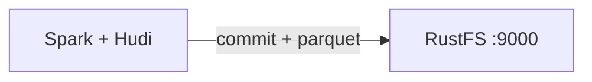
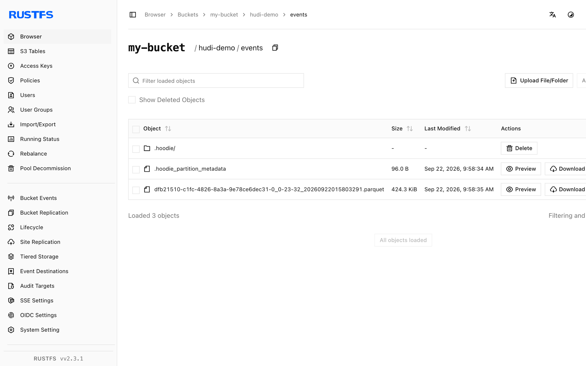

This guide connects [Apache Hudi](https://github.com/apache/hudi) — the transactional data lake platform — to **RustFS** as its copy-on-write table store. You will run Spark with the Hudi bundle, write a table to the `s3a://` location inside a RustFS bucket, read it back, and verify the table files. The workflow was verified with `apache/spark:3.5.6`, `hudi-spark3.5-bundle_2.12:0.15.0`, `hadoop-aws:3.3.4`, and `rustfs/rustfs-x86-musl:v2.3.1`.

You need Docker. This deployment is intended for local integration testing, not production.

## Architecture



Hudi stores the `.hoodie/` timeline, commit files, and Parquet data blocks under the table path in the bucket. Reads resolve the latest table snapshot from the timeline, so every write and query goes through the S3 API.

## 1. Run the Spark write

Hudi requires the Kryo serializer and the s3a credentials as Hadoop properties. The following `spark-shell` session creates a non-partitioned table in `my-bucket` — replace all connection placeholders:

```scala
import org.apache.spark.sql.SaveMode

val df = Seq((1, "a"), (2, "b"), (3, "c")).toDF("id", "name")
df.write.format("hudi")
  .option("hoodie.table.name", "events")
  .option("hoodie.datasource.write.recordkey.field", "id")
  .option("hoodie.datasource.write.precombine.field", "name")
  .option("hoodie.datasource.write.partitionpath.field", "")
  .mode(SaveMode.Overwrite)
  .save("s3a://my-bucket/hudi-demo/events")

val back = spark.read.format("hudi").load("s3a://my-bucket/hudi-demo/events")
back.select("id", "name").show()
```

```bash
docker run --rm --network oo-rustfs_default \
  -v "$PWD/hudi_test.scala":/tmp/hudi_test.scala \
  apache/spark:3.5.6 /opt/spark/bin/spark-shell \
  --packages org.apache.hudi:hudi-spark3.5-bundle_2.12:0.15.0,org.apache.hadoop:hadoop-aws:3.3.4 \
  --conf spark.serializer=org.apache.spark.serializer.KryoSerializer \
  --conf spark.hadoop.fs.s3a.endpoint=http://rustfs:9000 \
  --conf spark.hadoop.fs.s3a.path.style.access=true \
  --conf spark.hadoop.fs.s3a.access.key=<your-access-key> \
  --conf spark.hadoop.fs.s3a.secret.key=<your-secret-key> \
  --conf spark.hadoop.fs.s3a.region=us-east-1 \
  --conf spark.jars.ivy=/tmp/.ivy2 \
  --conf spark.sql.shuffle.partitions=2 \
  -i /tmp/hudi_test.scala
```

The `--packages` flags download the Hudi bundle and the s3a connector on first run. The `spark.jars.ivy` setting avoids Ivy cache permission errors in the container. The read-back `show()` prints the three rows:

```text
+---+----+
|  2|   b|
|  3|   c|
|  1|   a|
+---+----+
```

## 2. Verify objects in RustFS

List the table prefix:

```bash
rc ls rustfs/my-bucket/hudi-demo/ -r
```

The Hudi table layout appears under the table path — the `.hoodie/` timeline with the commit file, plus the Parquet data block:

```text
hudi-demo/events/.hoodie/20260922015803291.commit
hudi-demo/events/.hoodie/20260922015803291.commit.requested
hudi-demo/events/<partition>/<filegroup>/<parquet-block>
```



## 3. Stop or reset

Spark runs as a one-shot client and holds no state. To delete the demo table:

```bash
rc rm rustfs/my-bucket/hudi-demo/ --recursive --force
```

## Troubleshooting

### `hoodie only support org.apache.spark.serializer.KryoSerializer as spark.serializer`

Hudi rejects the default Spark serializer. Pass `--conf spark.serializer=org.apache.spark.serializer.KryoSerializer` as shown above.

### `Partition-path field has to be non-empty` or keygenerator class errors

For a non-partitioned table, keep the default key generator (do not set `hoodie.datasource.write.keygenerator.class`) and set `hoodie.datasource.write.partitionpath.field` to the empty string.

### `NoSuchMethodError` or `ClassNotFoundException` in the Hudi write

The Spark and Hudi bundle versions must match: `hudi-spark3.5-bundle_2.12` goes with Spark 3.5.x, and the bundled Hadoop client must be compatible with `hadoop-aws:3.3.4`.

## Next steps

- Review [S3 compatibility notes](/administration/protocols/s3) before adopting additional Hudi operations.
- Create dedicated production credentials with [Access Key Management](/security-compliance/iam/access-token).
- Follow the [Hudi Spark guide](https://hudi.apache.org/docs/quick-start-guide/) to add upserts, compaction, and query integrations on the same table.
