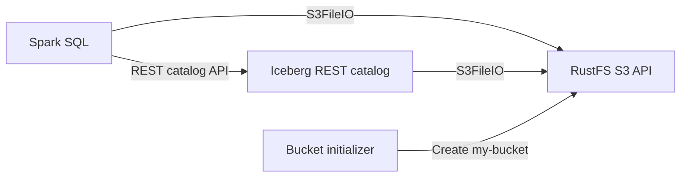

This guide runs **Apache Iceberg** with Spark, an Iceberg REST catalog, and **RustFS** as the S3-compatible warehouse. You will create an Iceberg table, write rows, query them, and verify that the table files are stored in RustFS.

You need Docker with the Compose plugin and enough local resources to run four containers. This deployment is intended for local integration testing, not production.

:::note[Upstream status]

Apache Iceberg [PR #14928](https://github.com/apache/iceberg/pull/14928) demonstrated the same Spark, REST catalog, `S3FileIO`, and RustFS workflow, including table creation and writes. The pull request was closed without merging, and the current [Spark quickstart](https://iceberg.apache.org/spark-quickstart/#docker-compose) still uses another S3-compatible store. The configuration below therefore documents a RustFS integration rather than an Apache Iceberg default.

:::

## Architecture



Spark uses the REST service for catalog operations. Both Spark and the REST catalog receive the RustFS endpoint, region, credentials, and path-style setting so they can access metadata and data files in `s3://my-bucket/warehouse`.

## 1. Create the project files

Create a working directory:

```bash
mkdir rustfs-iceberg
cd rustfs-iceberg
```

Create an environment file and replace both credential placeholders:

```ini title=".env"
RUSTFS_ACCESS_KEY=<your-access-key>
RUSTFS_SECRET_KEY=<your-secret-key>
```

Use dedicated credentials for the warehouse bucket. Do not commit `.env` to source control.

Create the Spark catalog configuration:

```ini title="spark-defaults.conf"
spark.sql.extensions org.apache.iceberg.spark.extensions.IcebergSparkSessionExtensions
spark.sql.catalog.demo org.apache.iceberg.spark.SparkCatalog
spark.sql.catalog.demo.type rest
spark.sql.catalog.demo.uri http://rest:8181
spark.sql.catalog.demo.io-impl org.apache.iceberg.aws.s3.S3FileIO
spark.sql.catalog.demo.warehouse s3://my-bucket/warehouse
spark.sql.catalog.demo.s3.endpoint http://rustfs:9000
spark.sql.catalog.demo.s3.path-style-access true
spark.sql.defaultCatalog demo
spark.sql.catalogImplementation in-memory
```

Path-style access is required for this container-network endpoint. The hostname `rustfs` is resolvable only inside the Compose network; clients running on the host use `http://localhost:9000` instead.

Create the Compose file:

```yaml title="compose.yaml"
services:
  rustfs:
    image: rustfs/rustfs:1.0.0-alpha.83
    environment:
      RUSTFS_ACCESS_KEY: ${RUSTFS_ACCESS_KEY}
      RUSTFS_SECRET_KEY: ${RUSTFS_SECRET_KEY}
      RUSTFS_VOLUMES: /data
      RUSTFS_ADDRESS: 0.0.0.0:9000
      RUSTFS_CONSOLE_ADDRESS: 0.0.0.0:9001
      RUSTFS_CONSOLE_ENABLE: "true"
    volumes:
      - rustfs-data:/data
    ports:
      - "9000:9000"
      - "9001:9001"
    networks:
      - iceberg

  create-bucket:
    image: rustfs/rc:latest
    depends_on:
      - rustfs
    environment:
      RUSTFS_ACCESS_KEY: ${RUSTFS_ACCESS_KEY}
      RUSTFS_SECRET_KEY: ${RUSTFS_SECRET_KEY}
    entrypoint:
      - /bin/sh
      - -c
      - |
        until /usr/bin/rc alias set rustfs http://rustfs:9000 "$${RUSTFS_ACCESS_KEY}" "$${RUSTFS_SECRET_KEY}"; do
          echo "Waiting for RustFS..."
          sleep 2
        done
        /usr/bin/rc ls rustfs/my-bucket >/dev/null 2>&1 || /usr/bin/rc mb rustfs/my-bucket
    networks:
      - iceberg

  rest:
    image: apache/iceberg-rest-fixture
    depends_on:
      create-bucket:
        condition: service_completed_successfully
    environment:
      AWS_ACCESS_KEY_ID: ${RUSTFS_ACCESS_KEY}
      AWS_SECRET_ACCESS_KEY: ${RUSTFS_SECRET_KEY}
      AWS_REGION: us-east-1
      CATALOG_WAREHOUSE: s3://my-bucket/warehouse
      CATALOG_IO__IMPL: org.apache.iceberg.aws.s3.S3FileIO
      CATALOG_S3_ENDPOINT: http://rustfs:9000
      CATALOG_S3_PATH__STYLE__ACCESS: "true"
    ports:
      - "8181:8181"
    networks:
      - iceberg

  spark-iceberg:
    image: tabulario/spark-iceberg
    depends_on:
      create-bucket:
        condition: service_completed_successfully
      rest:
        condition: service_started
    environment:
      AWS_ACCESS_KEY_ID: ${RUSTFS_ACCESS_KEY}
      AWS_SECRET_ACCESS_KEY: ${RUSTFS_SECRET_KEY}
      AWS_REGION: us-east-1
    volumes:
      - ./spark-defaults.conf:/opt/spark/conf/spark-defaults.conf:ro
    ports:
      - "8888:8888"
      - "8080:8080"
    networks:
      - iceberg

networks:
  iceberg:

volumes:
  rustfs-data:
```

The [`rc` image](https://github.com/rustfs/cli) provides the official RustFS command-line client. The initializer checks for `my-bucket` before creating it, so repeated starts do not delete existing warehouse data. The RustFS volume preserves warehouse objects across container recreation.

:::warning[Image versions]

The Apache Iceberg quickstart images are published without stable version tags in the upstream example. Before using this pattern beyond local testing, pin every image to a tested tag or digest and validate the Spark, Iceberg runtime, and REST catalog versions together.

:::

## 2. Validate and start the deployment

Resolve the Compose file before starting containers:

```bash
docker compose config
```

Start the services and wait for the bucket initializer to finish:

```bash
docker compose up -d
docker compose ps -a
```

The `create-bucket` service should show an exit code of `0`. Check its logs if it does not complete:

```bash
docker compose logs create-bucket
```

Open the RustFS Console at `http://localhost:9001`. The REST catalog is available at `http://localhost:8181`, and the Spark notebook server is available at `http://localhost:8888`.

## 3. Create and query an Iceberg table

Start Spark SQL:

```bash
docker compose exec spark-iceberg spark-sql
```

Create a namespace and a partitioned table:

```sql
CREATE NAMESPACE IF NOT EXISTS demo.nyc;

CREATE TABLE demo.nyc.taxis
(
	vendor_id bigint,
	trip_id bigint,
	trip_distance float,
	fare_amount double,
	store_and_fwd_flag string
)
PARTITIONED BY (vendor_id);
```

Insert and query sample rows:

```sql
INSERT INTO demo.nyc.taxis
VALUES
	(1, 1000371, 1.8, 15.32, 'N'),
	(2, 1000372, 2.5, 22.15, 'N'),
	(2, 1000373, 0.9, 9.01, 'N'),
	(1, 1000374, 8.4, 42.13, 'Y');

SELECT * FROM demo.nyc.taxis ORDER BY trip_id;
```

The query should return four rows:

```text
1  1000371  1.8  15.32  N
2  1000372  2.5  22.15  N
2  1000373  0.9  9.01   N
1  1000374  8.4  42.13  Y
```

## 4. Verify objects in RustFS

List the warehouse from the bucket-initializer image:

```bash
docker compose run --rm --entrypoint /bin/sh create-bucket -c \
  '/usr/bin/rc alias set rustfs http://rustfs:9000 "$RUSTFS_ACCESS_KEY" "$RUSTFS_SECRET_KEY" >/dev/null && /usr/bin/rc find rustfs/my-bucket/warehouse'
```

The output should include Iceberg metadata and data objects below the `warehouse/nyc/taxis` prefix. You can also inspect the `my-bucket` bucket in the RustFS Console.

## 5. Stop or reset the stack

Stop the containers while keeping the RustFS data volume:

```bash
docker compose down
```

To delete the local warehouse and start from an empty RustFS volume, explicitly include `--volumes`:

```bash
docker compose down --volumes
```

## Troubleshooting

### Spark cannot reach RustFS

Use `http://rustfs:9000` inside Compose. `http://localhost:9000` refers to the Spark container itself when used in `spark-defaults.conf`.

Confirm that `spark.sql.catalog.demo.s3.path-style-access` is `true`. Virtual-hosted requests require additional RustFS domain and DNS configuration.

### The catalog returns an S3 error

Check that the credentials in `.env` match the RustFS credentials and that the `create-bucket` service completed successfully:

```bash
docker compose logs create-bucket rest
```

The REST catalog property uses doubled underscores in `CATALOG_IO__IMPL` and `CATALOG_S3_PATH__STYLE__ACCESS`; the fixture converts them to the dotted and hyphenated Iceberg property names.

## Next steps

- Review [S3 compatibility notes](/administration/protocols/s3) before adopting additional Iceberg operations.
- Create dedicated production credentials with [Access Key Management](/security-compliance/iam/access-token).
- Follow the [Apache Iceberg Spark documentation](https://iceberg.apache.org/docs/latest/spark-getting-started/) to configure your existing Spark environment.