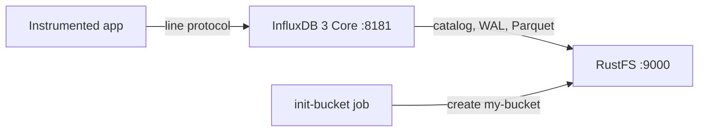

Diese Anleitung betreibt [InfluxDB](https://github.com/influxdata/influxdb) — konkret **InfluxDB 3 Core**, die Rust-basierte Zeitreihendatenbank mit einer Parquet-Speicher-Engine — mit **RustFS** als Objektspeicher. Sie starten InfluxDB mit Docker Compose, schreiben Line Protocol über die HTTP-API, fragen es per SQL zurück, prüfen die persistierten Objekte in RustFS und bestätigen, dass die Daten einen Neustart von InfluxDB überstehen. Der Ablauf wurde mit `influxdb:3-core` (v3.11.5) und `rustfs/rustfs-x86-musl:v2.3.1` verifiziert.

Sie benötigen Docker mit dem Compose-Plugin. Dieses Setup ist für lokale Integrationstests gedacht, nicht für den Produktivbetrieb.

## Architektur



InfluxDB 3 Core hält Katalog, Write-Ahead-Log und Parquet-Datendateien im konfigurierten Objektspeicher. Schreibvorgänge landen zuerst im WAL und werden nach RustFS persistiert, sodass jeder Schreibvorgang einen Neustart übersteht, noch bevor die Kompaktierung Parquet-Dateien erzeugt. Der Server verwendet standardmäßig Path-Style-Adressierung gegenüber dem konfigurierten Endpunkt.

## 1. Projektdateien anlegen

Erstellen Sie ein Arbeitsverzeichnis:

```bash
mkdir rustfs-influxdb
cd rustfs-influxdb
```

Erstellen Sie eine Umgebungsdatei und ersetzen Sie beide Platzhalter für die Anmeldeinformationen:

```ini title=".env"
RUSTFS_ACCESS_KEY=<your-access-key>
RUSTFS_SECRET_KEY=<your-secret-key>
```

Verwenden Sie dedizierte Anmeldeinformationen für den Bucket. Committen Sie `.env` nicht in die Versionsverwaltung.

Erstellen Sie die Compose-Datei:

```yaml title="compose.yaml"
services:
  rustfs:
    image: rustfs/rustfs-x86-musl:v2.3.1
    environment:
      RUSTFS_ACCESS_KEY: ${RUSTFS_ACCESS_KEY}
      RUSTFS_SECRET_KEY: ${RUSTFS_SECRET_KEY}
      RUSTFS_VOLUMES: /data
      RUSTFS_ADDRESS: ":9000"
      RUSTFS_CONSOLE_ADDRESS: ":9001"
      RUSTFS_CONSOLE_ENABLE: "true"
    volumes:
      - rustfs-data:/data
    ports:
      - "9000:9000"
      - "9001:9001"
    healthcheck:
      test: ["CMD", "curl", "-sf", "http://127.0.0.1:9000/health"]
      interval: 10s
      timeout: 5s
      retries: 6
      start_period: 10s
    networks:
      - influxdb

  create-bucket:
    image: rustfs/rc:latest
    depends_on:
      rustfs:
        condition: service_healthy
    environment:
      RUSTFS_ACCESS_KEY: ${RUSTFS_ACCESS_KEY}
      RUSTFS_SECRET_KEY: ${RUSTFS_SECRET_KEY}
    entrypoint:
      - /bin/sh
      - -c
      - |
        until /usr/bin/rc alias set rustfs http://rustfs:9000 "$${RUSTFS_ACCESS_KEY}" "$${RUSTFS_SECRET_KEY}"; do
          echo "Waiting for RustFS..."
          sleep 2
        done
        /usr/bin/rc ls rustfs/my-bucket >/dev/null 2>&1 || /usr/bin/rc mb rustfs/my-bucket
    networks:
      - influxdb

  influxdb:
    image: influxdb:3-core
    command:
      - serve
      - --node-id
      - influxdb-demo
      - --object-store
      - s3
      - --bucket
      - my-bucket
      - --aws-endpoint
      - http://rustfs:9000
      - --aws-access-key-id
      - ${RUSTFS_ACCESS_KEY}
      - --aws-secret-access-key
      - ${RUSTFS_SECRET_KEY}
      - --aws-allow-http
    ports:
      - "8181:8181"
    depends_on:
      create-bucket:
        condition: service_completed_successfully
    networks:
      - influxdb

networks:
  influxdb:

volumes:
  rustfs-data:
```

`--object-store s3` mit `--aws-endpoint` leitet alle Katalog-, WAL- und Parquet-Schreibvorgänge an RustFS. InfluxDB verwendet standardmäßig Path-Style-Adressierung gegenüber dem Endpunkt, und `--aws-allow-http` erlaubt Plain HTTP innerhalb des Compose-Netzwerks.

## 2. Bereitstellung starten

Prüfen Sie die Compose-Datei, bevor Sie Container starten:

```bash
docker compose config
```

Starten Sie die Dienste und warten Sie, bis die Bucket-Initialisierung abgeschlossen ist:

```bash
docker compose up -d
docker compose ps -a
```

## 3. Den Admin-Token erstellen

InfluxDB 3 Core schützt jede API-Anfrage mit einem Bearer-Token. Erstellen Sie den Admin-Token einmal nach dem ersten Start und bewahren Sie den ausgegebenen Wert auf:

```bash
docker compose exec influxdb3 influxdb3 create token --admin
```

```text
Token: <your-admin-token>
```

:::note[Token-Erstellung]

Der Token-Wert wird nur einmal ausgegeben und kann später nicht wiederhergestellt werden. Existiert der Token-Name bereits (HTTP 409), hat der Knoten Metadaten — beginnen Sie mit einem frischen Bucket-Präfix oder löschen Sie das Knoten-Präfix im Bucket, bevor Sie es erneut versuchen.

:::

## 4. Line Protocol schreiben

Senden Sie einen Batch von CPU-Messungen im Line Protocol an die Datenbank `rustfs_demo`:

```bash
python3 - <<'PY'
import time, urllib.request

token = "<your-admin-token>"
now_ns = int(time.time() * 1e9)
lines = []
for i in range(30):
    ts = now_ns - i * 1_000_000_000
    lines.append(f"cpu_usage,host=az-server,region=us-east-1 usage={60 + i % 30}.{i % 10} {ts}")

req = urllib.request.Request(
    "http://localhost:8181/api/v3/write_lp?db=rustfs_demo",
    data="\n".join(lines).encode(),
    headers={"Content-Type": "text/plain", "Authorization": f"Bearer {token}"},
    method="POST",
)
with urllib.request.urlopen(req, timeout=30) as r:
    print("write:", r.status)
PY
```

```text
write: 204
```

## 5. Mit SQL abfragen

Fragen Sie die Messung über die SQL-API zurück:

```bash
curl -sG "http://localhost:8181/api/v3/query_sql" \
  --data-urlencode "db=rustfs_demo" \
  --data-urlencode "format=json" \
  --data-urlencode "q=SELECT count(*) AS cnt FROM cpu_usage" \
  -H "Authorization: Bearer <your-admin-token>"
```

```text
[{"cnt":30}]
```

## 6. Objekte in RustFS prüfen

Listen Sie das Knoten-Präfix über das Bucket-Initialisierungs-Image auf:

```bash
docker compose run --rm --entrypoint /bin/sh create-bucket -c \
  '/usr/bin/rc alias set rustfs http://rustfs:9000 "$RUSTFS_ACCESS_KEY" "$RUSTFS_SECRET_KEY" >/dev/null && /usr/bin/rc ls rustfs/my-bucket/influxdb-demo --recursive'
```

Katalog, Write-Ahead-Log und später die Parquet-Datendateien liegen unter dem Knoten-Präfix:

```text
[2026-09-20 23:18:28]      105 B influxdb-demo/catalog/v3/snapshot
[2026-09-20 23:20:54]     1.45 KiB influxdb-demo/wal/00000000001.wal
[2026-09-20 23:20:19]       31 B influxdb-demo/table-index-conversion-completed
```

Sie können das Präfix auch in der RustFS-Konsole anzeigen:


## 7. Persistenz über einen Neustart bestätigen

Starten Sie InfluxDB neu und wiederholen Sie die SQL-Abfrage:

```bash
docker compose restart influxdb
curl -sG "http://localhost:8181/api/v3/query_sql" \
  --data-urlencode "db=rustfs_demo" \
  --data-urlencode "format=json" \
  --data-urlencode "q=SELECT count(*) AS cnt FROM cpu_usage" \
  -H "Authorization: Bearer <your-admin-token>"
```

```text
[{"cnt":30}]
```

Die Zählung bleibt unverändert, weil Katalog und WAL aus RustFS wiedereingespielt wurden — der Objektspeicher ist die persistente Schicht, genau wie in Produktionstopologien.

## 8. Stack stoppen oder zurücksetzen

Stoppen Sie die Container und behalten Sie das RustFS-Datenvolumen:

```bash
docker compose down
```

Um die gespeicherten Daten zu löschen und mit einem leeren RustFS-Volumen zu beginnen, fügen Sie ausdrücklich `--volumes` hinzu:

```bash
docker compose down --volumes
```

## Fehlerbehebung

### "the request was not authenticated" bei jeder Anfrage

InfluxDB 3 Core verlangt den Admin-Bearer-Token für API-Anfragen. Erstellen Sie ihn einmal mit `influxdb3 create token --admin` und senden Sie ihn als `Authorization: Bearer <token>`.

### "token name already exists" beim Erstellen des Admin-Tokens

Der Knoten hat bereits einen Admin-Token, und der Wert kann nicht wiederhergestellt werden. Löschen Sie das Knoten-Präfix im Bucket (zum Beispiel `influxdb-demo/`), während der Container gestoppt ist, starten Sie ihn erneut und erstellen Sie den Token neu.

### AccessDenied- oder 403-Antworten

Stellen Sie sicher, dass die Anmeldeinformationen in der Compose-Datei mit den RustFS-Anmeldeinformationen übereinstimmen und dass der Dienst `create-bucket` erfolgreich abgeschlossen wurde:

```bash
docker compose logs create-bucket
```

### Verbindungs- oder Zertifikatsfehler

`--aws-endpoint` nimmt eine vollständige URL; `--aws-allow-http` erlaubt Plain HTTP für den Container-Netzwerk-Endpunkt. Verwenden Sie innerhalb des Compose-Netzwerks `http://rustfs:9000` und auf dem Host `http://localhost:9000`.

## Nächste Schritte

- Lesen Sie die [S3-Kompatibilitätshinweise](/administration/protocols/s3), bevor Sie weitere S3-Operationen verwenden.
- Erstellen Sie dedizierte Produktions-Anmeldeinformationen mit dem [Access Key Management](/security-compliance/iam/access-token).
- Folgen Sie der [InfluxDB-3-Core-Dokumentation](https://docs.influxdata.com/influxdb3/core/), um Telegraf oder die Write-APIs als Datenproduzenten anzubinden.
