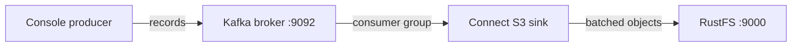
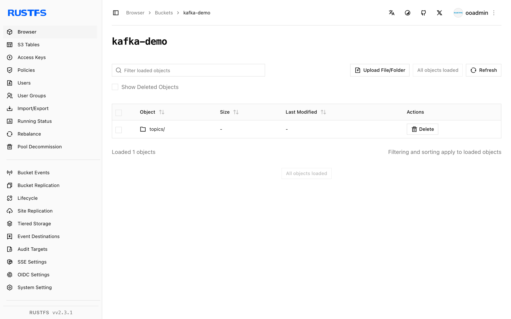

This guide connects [Apache Kafka](https://github.com/apache/kafka) — the distributed event streaming platform — to **RustFS** through the Kafka Connect S3 sink connector. You will run a KRaft broker and a Connect worker, deploy the S3 sink for a topic, and produce records that land as objects in a RustFS bucket. The workflow was verified with `apache/kafka:4.0.0` and `confluentinc/kafka-connect-s3` v10.5.25 against `rustfs/rustfs-x86-musl:v2.3.1`.

Kafka's KIP-405 tiered storage needs a `RemoteLogStorageManager` plugin, and the S3 implementations in the ecosystem are vendor-proprietary. The Connect S3 sink is the open, self-hosted way to move topic data to S3-compatible storage and is the approach documented here.

You need Docker. This deployment is intended for local integration testing, not production.

## Architecture



The sink task consumes a topic in a dedicated consumer group and writes record batches to the bucket, one object per `flush.size` records per partition.

## 1. Run the broker

Start a KRaft broker whose advertised listener is reachable from other containers:

```bash
docker run -d --name kafka --hostname kafka --network oo-rustfs_default \
  -e CLUSTER_ID=5L6g3nShT-eMCtK--X86sw \
  -e KAFKA_NODE_ID=1 \
  -e KAFKA_PROCESS_ROLES=broker,controller \
  -e KAFKA_LISTENERS=PLAINTEXT://:9092,CONTROLLER://:9093 \
  -e KAFKA_ADVERTISED_LISTENERS=PLAINTEXT://kafka:9092 \
  -e KAFKA_CONTROLLER_LISTENER_NAMES=CONTROLLER \
  -e KAFKA_LISTENER_SECURITY_PROTOCOL_MAP=CONTROLLER:PLAINTEXT,PLAINTEXT:PLAINTEXT \
  -e KAFKA_CONTROLLER_QUORUM_VOTERS=1@kafka:9093 \
  -e KAFKA_OFFSETS_TOPIC_REPLICATION_FACTOR=1 \
  -e KAFKA_TRANSACTION_STATE_LOG_REPLICATION_FACTOR=1 \
  -e KAFKA_TRANSACTION_STATE_LOG_MIN_ISR=1 \
  apache/kafka:4.0.0

docker exec kafka /opt/kafka/bin/kafka-topics.sh \
  --bootstrap-server localhost:9092 \
  --create --topic rustfs-topic --partitions 1 --replication-factor 1

rc mb rustfs/kafka-demo
```

The image defaults to advertising `localhost:9092`, which only works from inside the broker container. The `KAFKA_ADVERTISED_LISTENERS` override is what makes Connect (and any remote client) able to reach the broker.

## 2. Install the connector

Download the Confluent Hub archive, which bundles the connector and its dependencies, and unpack it where the worker can see it:

```bash
curl -Lo kafka-connect-s3.zip "https://hub-downloads.confluent.io/api/plugins/confluentinc/kafka-connect-s3/versions/10.5.25/confluentinc-kafka-connect-s3-10.5.25.zip"
unzip kafka-connect-s3.zip -d /opt/kafka-conn/plugins
```

## 3. Configure the worker and the sink

Create the worker properties. The value converter must be `ByteArrayConverter` so records are written verbatim:

```ini title="worker.properties"
bootstrap.servers=kafka:9092
key.converter=org.apache.kafka.connect.storage.StringConverter
value.converter=org.apache.kafka.connect.converters.ByteArrayConverter
offset.storage.file.filename=/tmp/connect.offsets
offset.flush.interval.ms=5000
plugin.path=/opt/kafka-conn-plugins
```

Create the sink connector configuration, replacing all connection placeholders:

```ini title="rustfs-sink.properties"
name=rustfs-sink
connector.class=io.confluent.connect.s3.S3SinkConnector
tasks.max=1
topics=rustfs-topic
s3.bucket.name=kafka-demo
s3.region=us-east-1
store.url=http://<your-rustfs-endpoint>:9000
s3.path.style.access.enabled=true
flush.size=3
storage.class=io.confluent.connect.s3.storage.S3Storage
format.class=io.confluent.connect.s3.format.bytearray.ByteArrayFormat
consumer.override.auto.offset.reset=earliest
```

Kafka 4.0 moved the class to `org.apache.kafka.connect.converters.ByteArrayConverter` — the old `storage` package path no longer resolves.

## 4. Run the worker

Run `connect-standalone` in the foreground so its logs go to `docker logs`, with the bucket credentials in the environment:

```bash
docker run -d --name kafka-connect --hostname kafka-connect \
  --network oo-rustfs_default \
  -v /opt/kafka-conn/plugins:/opt/kafka-conn-plugins:ro \
  -v "$PWD/worker.properties":/etc/kafka/worker.properties:ro \
  -v "$PWD/rustfs-sink.properties":/etc/kafka/sink.properties:ro \
  -e AWS_ACCESS_KEY_ID=<your-access-key> \
  -e AWS_SECRET_ACCESS_KEY=<your-secret-key> \
  apache/kafka:4.0.0 \
  /opt/kafka/bin/connect-standalone.sh /etc/kafka/worker.properties /etc/kafka/sink.properties
```

The worker is ready when the sink task claims the partition:

```text
INFO [rustfs-sink|task-0] Assigned topic partitions: [rustfs-topic-0]
```

## 5. Produce records

Send at least `flush.size` records so the connector completes a batch:

```bash
docker exec kafka sh -c "printf 'msg-one\nmsg-two\nmsg-three\n' | \
  /opt/kafka/bin/kafka-console-producer.sh --bootstrap-server localhost:9092 --topic rustfs-topic"
```

After a few seconds the batch becomes an object in the bucket:

```bash
rc ls rustfs/kafka-demo/ -r
rc cat rustfs/kafka-demo/topics/rustfs-topic/partition=0/rustfs-topic+0+0000000000.bin
```

```text
topics/rustfs-topic/partition=0/rustfs-topic+0+0000000000.bin
topics/rustfs-topic/partition=0/rustfs-topic+0+0000000003.bin
msg-one
msg-two
msg-three
```

The object name encodes topic, partition, and starting offset. Each subsequent batch of three records lands in the next object (`+0000000003.bin` and so on).



## 6. Stop or reset

To tear down the demo while keeping the bucket objects:

```bash
docker rm -f kafka-connect kafka
```

To delete the stored data:

```bash
rc rm rustfs/kafka-demo/ --recursive --force
```

## Troubleshooting

### `AdminClient ... Rebootstrapping with Cluster (id: null)` loops forever

The broker advertises `localhost:9092`, so a remote client receives metadata pointing at itself. Set `KAFKA_ADVERTISED_LISTENERS=PLAINTEXT://kafka:9092` (and matching listener variables) as in step 1.

### `Invalid schema type for ByteArrayConverter: STRING`

The `ByteArrayFormat` writer only accepts raw bytes. Either switch the worker's `value.converter` to the ByteArray converter or choose a format class that matches the converter you use.

### `Class org.apache.kafka.connect.storage.ByteArrayConverter could not be found`

Kafka 4.0 moved the class to `org.apache.kafka.connect.converters.ByteArrayConverter`. Use the new package path in `worker.properties`.

### The connector downloads but the plugin is not found

The plain connector JAR from Maven lacks its dependencies. Use the Confluent Hub archive from step 2, which bundles the complete `lib/` directory, and make sure `plugin.path` points at the directory that contains the connector folder.

## Next steps

- Review [S3 compatibility notes](/administration/protocols/s3) before adopting additional connectors.
- Create dedicated production credentials with [Access Key Management](/security-compliance/iam/access-token).
- Follow the [Kafka Connect S3 sink documentation](https://docs.confluent.io/kafka-connect-s3/current/index.html) for Parquet and Avro formats, partitioning by time, and IAM-based credential chains.
