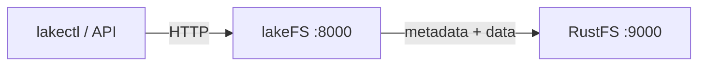
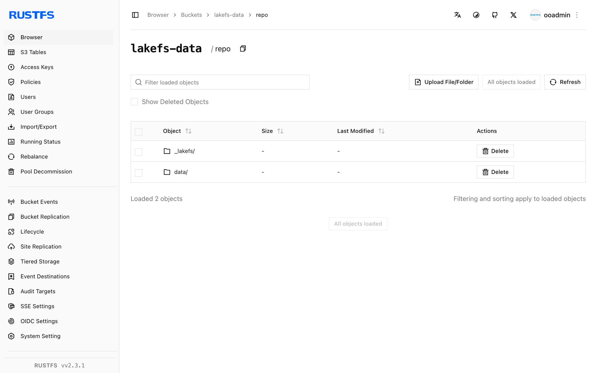

This guide connects [lakeFS](https://github.com/treeverse/lakeFS) — the Git-like data lake versioning layer — to **RustFS** as its S3 blockstore. You will start lakeFS, create a repository whose storage namespace points at a RustFS bucket, commit an object, and verify that the lakeFS metadata and data files live in RustFS. The workflow was verified with `treeverse/lakefs:1.58.0` and `rustfs/rustfs-x86-musl:v2.3.1`.

You need Docker. This deployment is intended for local integration testing, not production.

## Architecture



lakeFS stores repository metadata and committed data files in the blockstore under the storage namespace. The bucket holds one `repo/` prefix containing `_lakefs/` metadata and `data/` objects; lakeFS reads and writes them through the S3 API.

## 1. Create the project files

Create the bucket, then the lakeFS configuration:

```bash
rc alias set rustfs http://<your-rustfs-endpoint>:9000 <your-access-key> <your-secret-key>
rc mb rustfs/lakefs-data
```

```yaml title="config.yaml"
database:
  type: local
  local:
    path: /lakefs/data

blockstore:
  type: s3
  s3:
    endpoint: http://rustfs:9000
    region: us-east-1
    force_path_style: true

auth:
  encrypt:
    secret_key: change-me-to-a-random-string

gateways:
  s3:
    domain_name: rustfs-gateway.local

logging:
  format: text
  level: info
```

`force_path_style: true` is required — without it lakeFS builds `lakefs-data.<hostname>` as a hostname and every request fails with a DNS error. The credentials are supplied through the standard `AWS_ACCESS_KEY_ID` and `AWS_SECRET_ACCESS_KEY` environment variables.

Create the environment file for the service credentials and the initial admin user, replacing the placeholders:

```ini title=".env"
AWS_ACCESS_KEY_ID=<your-access-key>
AWS_SECRET_ACCESS_KEY=<your-secret-key>
LAKEFS_INSTALLATION_USER_NAME=admin
LAKEFS_INSTALLATION_ACCESS_KEY_ID=<your-lakefs-access-key>
LAKEFS_INSTALLATION_SECRET_ACCESS_KEY=<your-lakefs-secret-key>
LAKEFS_STATS_ENABLED=false
```

## 2. Start lakeFS

```bash
docker run -d --name lakefs --network oo-rustfs_default \
  -p 8000:8000 \
  -v "$PWD/config.yaml":/etc/lakefs/config.yaml:ro \
  --env-file .env \
  treeverse/lakefs:1.58.0 run
```

Wait for `http://localhost:8000/api/healthcheck` to return `200`, then create a repository with a storage namespace inside the bucket:

```bash
curl -s -u <your-lakefs-access-key>:<your-lakefs-secret-key> \
  -X POST http://localhost:8000/api/v1/repositories \
  -H "Content-Type: application/json" \
  -d '{"name": "rustfs-demo", "storage_namespace": "s3://lakefs-data/repo"}'
```

## 3. Commit an object

Upload a file to the `main` branch and commit it:

```bash
echo "hello from lakefs on rustfs" > hello.txt

curl -s -u <your-lakefs-access-key>:<your-lakefs-secret-key> \
  -X POST "http://localhost:8000/api/v1/repositories/rustfs-demo/branches/main/objects?path=hello.txt" \
  --data-binary @hello.txt

curl -s -u <your-lakefs-access-key>:<your-lakefs-secret-key> \
  -X POST "http://localhost:8000/api/v1/repositories/rustfs-demo/branches/main/commits" \
  -H "Content-Type: application/json" \
  -d '{"message": "add hello"}'
```

Read the object back through the branch ref — the response body is the committed content:

```bash
curl -s -u <your-lakefs-access-key>:<your-lakefs-secret-key> \
  "http://localhost:8000/api/v1/repositories/rustfs-demo/refs/main/objects?path=hello.txt"
```

## 4. Verify objects in RustFS

List the bucket:

```bash
rc ls rustfs/lakefs-data/ -r
```

The output shows the lakeFS metadata objects and the committed data file under the repository prefix:

```text
repo/_lakefs/19b2b26e37cb20fc6763c527f88eb5151891b04a2c8c9ddd32870c5c3f353281
repo/data/fueia10jdra000e1c480/daots7ojdra000e1c490
```



## 5. Stop or reset the deployment

Stop lakeFS while keeping the data:

```bash
docker rm -f lakefs
```

The repository metadata and data stay in the `lakefs-data` bucket, so restarting lakeFS with the same configuration brings the repository back. To delete everything, remove the bucket:

```bash
rc rb rustfs/lakefs-data --force
```

## Troubleshooting

### `failed to create repository: failed to access storage` with a DNS error

lakeFS is using virtual-hosted addressing. Set `force_path_style: true` under `blockstore.s3` — in the 1.x configuration schema the older `path_style` key is rejected at startup.

### `missing required keys: [auth.encrypt.secret_key]`

lakeFS 1.x requires an encryption key for the local database. Add the `auth.encrypt.secret_key` block as shown in the configuration above.

### `mkdir /lakefs: permission denied`

The container runs as a non-root user and cannot create the database directory. Run the container with `-u 0` for local testing, or mount a writable directory at the configured path.

## Next steps

- Review [S3 compatibility notes](/administration/protocols/s3) before adopting additional lakeFS operations.
- Create dedicated production credentials with [Access Key Management](/security-compliance/iam/access-token).
- Follow the [lakeFS S3 blockstore documentation](https://docs.lakefs.io/howto/using-s3.html) to configure the S3 gateway for tools that speak the S3 protocol.
