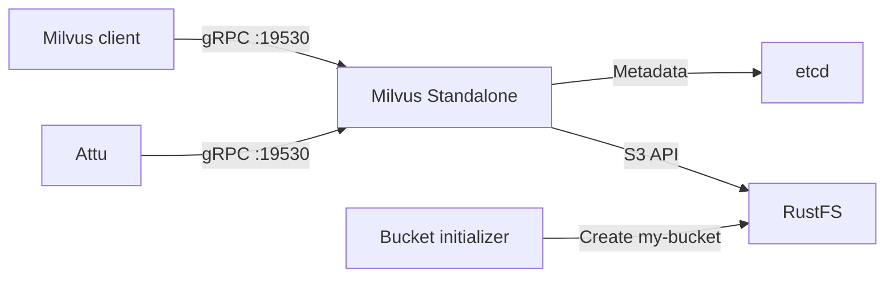

This guide runs **Milvus Standalone** with **RustFS** as its S3-compatible object storage backend. You will start Milvus, etcd, RustFS, and Attu; insert sample vectors; and verify that Milvus persists objects in RustFS.

You need Docker with the Compose plugin and Python 3.9 or later. This deployment is intended for local integration testing, not production.

:::note[Milvus configuration names]

Milvus groups S3-compatible storage settings under the `minio` configuration key. The name does not require a MinIO server. In this guide, `minio.address` points to the RustFS service, and Milvus uses the S3 API exposed by RustFS.

:::

## Architecture



Milvus stores service metadata in etcd and persists vector data, indexes, and related objects under `s3://my-bucket/milvus` in RustFS. The local Milvus volume remains necessary for runtime data and caches.

## 1. Create the project files

Create a working directory:

```bash
mkdir rustfs-milvus
cd rustfs-milvus
```

Create an environment file and replace both credential placeholders:

```ini title=".env"
RUSTFS_ACCESS_KEY=<your-access-key>
RUSTFS_SECRET_KEY=<your-secret-key>
```

Use dedicated credentials for the Milvus bucket. Do not commit `.env` to source control.

Create the Milvus storage override:

```yaml title="user.yaml"
common:
  storageType: remote

minio:
  address: rustfs:9000
  port: 9000
  bucketName: my-bucket
  rootPath: milvus
  useSSL: false
  useIAM: false
  cloudProvider: aws
  region: us-east-1
  useVirtualHost: false
```

`useVirtualHost: false` selects path-style S3 requests. The hostname `rustfs` resolves inside the Compose network; clients on the host use `http://localhost:9000`.

Create the Compose file:

```yaml title="compose.yaml"
services:
  etcd:
    image: quay.io/coreos/etcd:v3.5.18
    environment:
      ETCD_AUTO_COMPACTION_MODE: revision
      ETCD_AUTO_COMPACTION_RETENTION: "1000"
      ETCD_QUOTA_BACKEND_BYTES: "4294967296"
      ETCD_SNAPSHOT_COUNT: "50000"
    command:
      - etcd
      - --advertise-client-urls=http://etcd:2379
      - --listen-client-urls=http://0.0.0.0:2379
      - --data-dir=/etcd
    volumes:
      - etcd-data:/etcd
    healthcheck:
      test: ["CMD", "etcdctl", "endpoint", "health"]
      interval: 30s
      timeout: 20s
      retries: 3
    networks:
      - milvus

  rustfs:
    image: rustfs/rustfs:1.0.0-alpha.83
    environment:
      RUSTFS_ACCESS_KEY: ${RUSTFS_ACCESS_KEY}
      RUSTFS_SECRET_KEY: ${RUSTFS_SECRET_KEY}
      RUSTFS_VOLUMES: /data
      RUSTFS_ADDRESS: ":9000"
      RUSTFS_CONSOLE_ADDRESS: ":9001"
      RUSTFS_CONSOLE_ENABLE: "true"
      RUSTFS_OBS_LOGGER_LEVEL: error
      RUSTFS_OBS_LOG_DIRECTORY: /var/log/rustfs/
    volumes:
      - rustfs-data:/data
    ports:
      - "9000:9000"
      - "9001:9001"
    healthcheck:
      test: ["CMD-SHELL", "curl -fsS http://localhost:9000/health/ready"]
      interval: 10s
      timeout: 5s
      retries: 12
      start_period: 20s
    networks:
      - milvus

  create-bucket:
    image: rustfs/rc:latest
    depends_on:
      rustfs:
        condition: service_healthy
    environment:
      RUSTFS_ACCESS_KEY: ${RUSTFS_ACCESS_KEY}
      RUSTFS_SECRET_KEY: ${RUSTFS_SECRET_KEY}
    entrypoint:
      - /bin/sh
      - -c
      - |
        /usr/bin/rc alias set rustfs http://rustfs:9000 "$${RUSTFS_ACCESS_KEY}" "$${RUSTFS_SECRET_KEY}" \
          --region us-east-1 --bucket-lookup path
        /usr/bin/rc bucket create rustfs/my-bucket --ignore-existing
    networks:
      - milvus

  standalone:
    image: milvusdb/milvus:v2.6.0
    command: ["milvus", "run", "standalone"]
    security_opt:
      - seccomp:unconfined
    depends_on:
      etcd:
        condition: service_healthy
      create-bucket:
        condition: service_completed_successfully
    environment:
      ETCD_ENDPOINTS: etcd:2379
      MINIO_ADDRESS: rustfs:9000
      MINIO_ACCESS_KEY_ID: ${RUSTFS_ACCESS_KEY}
      MINIO_SECRET_ACCESS_KEY: ${RUSTFS_SECRET_KEY}
      MINIO_REGION: us-east-1
      MQ_TYPE: woodpecker
    volumes:
      - milvus-data:/var/lib/milvus
      - ./user.yaml:/milvus/configs/user.yaml:ro
    ports:
      - "19530:19530"
      - "9091:9091"
    healthcheck:
      test: ["CMD", "curl", "-f", "http://localhost:9091/healthz"]
      interval: 30s
      timeout: 20s
      retries: 3
      start_period: 90s
    networks:
      - milvus

  attu:
    image: zilliz/attu:v2.6.5
    depends_on:
      standalone:
        condition: service_healthy
    environment:
      MILVUS_URL: standalone:19530
    ports:
      - "8000:3000"
    networks:
      - milvus

networks:
  milvus:

volumes:
  etcd-data:
  rustfs-data:
  milvus-data:
```

The `create-bucket` service uses the official [`rc`](https://github.com/rustfs/cli) image and exits after ensuring that `my-bucket` exists. Named volumes preserve etcd metadata, RustFS objects, and Milvus local data when containers are recreated.

:::warning[Protect local service ports]

The Compose file publishes the RustFS API and Console, Milvus gRPC and health ports, and Attu on the host for local testing. Do not expose these ports to an untrusted network. Production deployments require scoped credentials, TLS, authentication, resource planning, backups, and independently operated dependencies.

:::

## 2. Validate and start the deployment

Resolve the Compose file before starting containers:

```bash
docker compose config
```

Start the services:

```bash
docker compose up -d
docker compose ps -a
```

The `create-bucket` service should exit with code `0`, and `etcd`, `rustfs`, and `standalone` should become healthy. Inspect logs if a service does not reach its expected state:

```bash
docker compose logs create-bucket rustfs standalone
```

Open these local interfaces:

- RustFS Console: `http://localhost:9001`
- Attu: `http://localhost:8000`
- Milvus health endpoint: `http://localhost:9091/healthz`

Attu connects to `standalone:19530` through the Compose network. If Attu asks for a connection address, use that service name instead of `localhost:19530`.

## 3. Insert and query sample vectors

Create a Python virtual environment and install the Milvus client version that matches the server release:

```bash
python3 -m venv .venv
source .venv/bin/activate
python -m pip install "pymilvus==2.6.0"
```

Create a test script:

```python title="verify_milvus.py"
from pymilvus import MilvusClient

client = MilvusClient(uri="http://localhost:19530")
collection_name = "rustfs_demo"

if client.has_collection(collection_name=collection_name):
    client.drop_collection(collection_name=collection_name)

client.create_collection(
    collection_name=collection_name,
    dimension=4,
)

client.insert(
    collection_name=collection_name,
    data=[
        {"id": 1, "vector": [0.1, 0.2, 0.3, 0.4]},
        {"id": 2, "vector": [0.2, 0.3, 0.4, 0.5]},
        {"id": 3, "vector": [0.9, 0.8, 0.7, 0.6]},
    ],
)

client.flush(collection_name=collection_name)
results = client.search(
    collection_name=collection_name,
    data=[[0.1, 0.2, 0.3, 0.4]],
    limit=2,
    output_fields=["id"],
)

print(results)
client.close()
```

Run the script:

```bash
python verify_milvus.py
```

The result should rank the row with ID `1` first. Open Attu and confirm that the `rustfs_demo` collection contains three entities.

## 4. Verify Milvus objects in RustFS

Use the bucket-initializer image to list objects below the configured `milvus` root path:

```bash
docker compose run --rm --entrypoint /bin/sh create-bucket -c \
  '/usr/bin/rc alias set rustfs http://rustfs:9000 "$RUSTFS_ACCESS_KEY" "$RUSTFS_SECRET_KEY" --region us-east-1 --bucket-lookup path >/dev/null && /usr/bin/rc find rustfs/my-bucket/milvus'
```

The output should contain objects created by Milvus below the `milvus/` prefix. You can also open `my-bucket` in the RustFS Console.

Milvus may buffer or compact data before every expected object appears. The successful insert, flush, query, and RustFS object listing together validate the integration path.

## 5. Stop or reset the stack

Stop the containers while retaining all named volumes:

```bash
docker compose down
```

To delete the local test data, including the Milvus bucket contents and etcd metadata, explicitly remove the volumes:

```bash
docker compose down --volumes
```

:::warning[Reset removes the test data]

The `--volumes` option permanently deletes the named volumes used by this Compose project. Do not run it against data you need to retain.

:::

## Troubleshooting

### Milvus cannot reach RustFS

Use `rustfs:9000` as the S3 endpoint inside Compose. `localhost:9000` inside the Milvus container refers to that container, not RustFS.

Confirm that `useVirtualHost` remains `false` and that the credential values passed to Milvus match the RustFS credentials:

```bash
docker compose logs standalone rustfs
```

### The bucket initializer fails

Check RustFS readiness and the initializer logs:

```bash
curl -fsS http://localhost:9000/health/ready
docker compose logs create-bucket
```

Verify that `.env` contains non-empty credentials and that `docker compose config` resolves both variables.

### Milvus starts without existing data

Do not change `minio.bucketName`, `minio.rootPath`, or the etcd root for an existing deployment. Confirm that the `rustfs-data`, `etcd-data`, and `milvus-data` volumes still exist and that the same Compose project name is in use.

### Attu cannot connect

The Attu container must use `standalone:19530`. A browser or host-side client uses `localhost:19530`. Check Milvus health and Attu logs:

```bash
curl -fsS http://localhost:9091/healthz
docker compose logs attu standalone
```

## Next steps

- Review [S3 compatibility notes](/administration/protocols/s3) before enabling additional Milvus storage features.
- Create dedicated production credentials with [Access Key Management](/security-compliance/iam/access-token).
- Follow the [Milvus documentation](https://milvus.io/docs) when adapting this local pattern to a managed or distributed deployment.