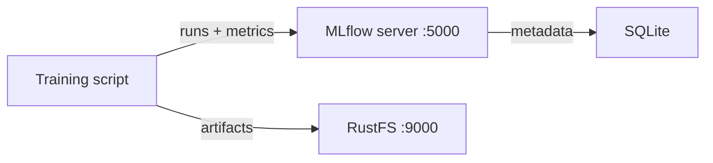
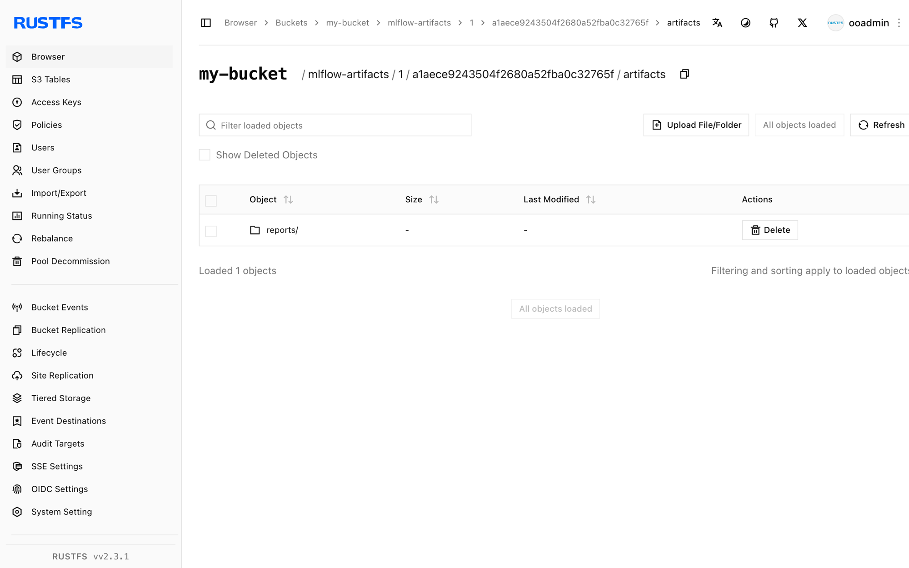

This guide connects [MLflow](https://github.com/mlflow/mlflow) — the experiment tracking and model registry platform — to **RustFS** as its S3 artifact store. You will start the MLflow tracking server with Docker Compose, log parameters, metrics, and artifacts from a training run, and verify that the artifacts are stored in RustFS. The workflow was verified with `ghcr.io/mlflow/mlflow:v2.22.1` and `rustfs/rustfs-x86-musl:v2.3.1`.

You need Docker with the Compose plugin. This deployment is intended for local integration testing, not production.

## Architecture



The tracking server keeps experiment and run metadata in SQLite and stores artifacts — model files, plots, reports — directly in RustFS through the `s3://` artifact root. The client needs the same RustFS credentials because it uploads artifacts itself, using boto3 and the `MLFLOW_S3_ENDPOINT_URL` setting.

## 1. Create the project files

Create a working directory:

```bash
mkdir rustfs-mlflow
cd rustfs-mlflow
```

Create an environment file and replace both credential placeholders:

```ini title=".env"
RUSTFS_ACCESS_KEY=<your-access-key>
RUSTFS_SECRET_KEY=<your-secret-key>
MLFLOW_BUCKET=my-bucket
```

Use dedicated credentials for the artifact bucket. Do not commit `.env` to source control.

Create the Compose file:

```yaml title="compose.yaml"
services:
  rustfs:
    image: rustfs/rustfs-x86-musl:v2.3.1
    environment:
      RUSTFS_ACCESS_KEY: ${RUSTFS_ACCESS_KEY}
      RUSTFS_SECRET_KEY: ${RUSTFS_SECRET_KEY}
      RUSTFS_VOLUMES: /data
      RUSTFS_ADDRESS: ":9000"
      RUSTFS_CONSOLE_ADDRESS: ":9001"
      RUSTFS_CONSOLE_ENABLE: "true"
    volumes:
      - rustfs-data:/data
    ports:
      - "9000:9000"
      - "9001:9001"
    healthcheck:
      test: ["CMD", "curl", "-sf", "http://127.0.0.1:9000/health"]
      interval: 10s
      timeout: 5s
      retries: 6
      start_period: 10s
    networks:
      - mlflow

  create-bucket:
    image: rustfs/rc:latest
    depends_on:
      rustfs:
        condition: service_healthy
    environment:
      RUSTFS_ACCESS_KEY: ${RUSTFS_ACCESS_KEY}
      RUSTFS_SECRET_KEY: ${RUSTFS_SECRET_KEY}
      MLFLOW_BUCKET: ${MLFLOW_BUCKET}
    entrypoint:
      - /bin/sh
      - -c
      - |
        /usr/bin/rc alias set rustfs http://rustfs:9000 "$${RUSTFS_ACCESS_KEY}" "$${RUSTFS_SECRET_KEY}"
        /usr/bin/rc mb --ignore-existing rustfs/$${MLFLOW_BUCKET}
    networks:
      - mlflow

  mlflow:
    image: ghcr.io/mlflow/mlflow:v2.22.1
    command:
      - server
      - --backend-store-uri
      - sqlite:////mlflow/mlflow.db
      - --default-artifact-root
      - s3://${MLFLOW_BUCKET}/mlflow-artifacts
      - --host
      - 0.0.0.0
      - --port
      - "5000"
    environment:
      AWS_ACCESS_KEY_ID: ${RUSTFS_ACCESS_KEY}
      AWS_SECRET_ACCESS_KEY: ${RUSTFS_SECRET_KEY}
      MLFLOW_S3_ENDPOINT_URL: http://rustfs:9000
      AWS_DEFAULT_REGION: us-east-1
    depends_on:
      create-bucket:
        condition: service_completed_successfully
    ports:
      - "5000:5000"
    volumes:
      - mlflow-db:/mlflow
    networks:
      - mlflow

networks:
  mlflow:

volumes:
  rustfs-data:
  mlflow-db:
```

The `create-bucket` service must run before the server starts because MLflow does not create the bucket. `MLFLOW_S3_ENDPOINT_URL` points the server's boto3 client at RustFS with path-style addressing. The SQLite database lives on a volume so experiment metadata survives restarts; production deployments should use a managed database backend instead.

## 2. Validate and start the deployment

Resolve the Compose file before starting containers:

```bash
docker compose config
```

Start the services and wait for the tracking server:

```bash
docker compose up -d
docker compose ps
```

The `create-bucket` service should exit with code `0`, and the MLflow UI should answer on `http://localhost:5000`:

```bash
curl -sf http://localhost:5000/ >/dev/null && echo ready
```

Open the RustFS Console at `http://localhost:9001` to watch artifacts land in `my-bucket` during the next step.

## 3. Log a training run

Create the client script — it runs inside the MLflow image, which ships every dependency:

```bash title="train_demo.py" {12}
import mlflow

mlflow.set_tracking_uri("http://localhost:5000")
mlflow.set_experiment("rustfs-demo")

with mlflow.start_run(run_name="rustfs-verify") as run:
    mlflow.log_params({"model": "demo-regressor", "alpha": 0.5})
    for step in range(3):
        mlflow.log_metric("rmse", 0.9 - step * 0.2, step=step)
    with open("model-summary.txt", "w") as f:
        f.write("demo model trained against RustFS artifact store\n")
    mlflow.log_artifact("model-summary.txt", artifact_path="reports")
    print("run_id:", run.info.run_id)
    print("artifact_uri:", run.info.artifact_uri)
```

Copy the script into the running container and execute it with the service environment:

```bash
docker compose cp train_demo.py mlflow:/tmp/train_demo.py
docker compose exec -w /tmp mlflow python train_demo.py
```

The `artifact_uri` prints as `s3://my-bucket/mlflow-artifacts/<experiment-id>/<run-id>/artifacts` — the artifact is uploaded straight to RustFS by the client.

## 4. Verify artifacts in RustFS

Read the artifact back through the tracking server, then list the same object in RustFS. Save the following as `verify.py`, replace `<your-run-id>` with the identifier printed in step 3, and run it the same way:

```bash title="verify.py" {5}
import mlflow

mlflow.set_tracking_uri("http://localhost:5000")
client = mlflow.MlflowClient()
print([a.path for a in client.list_artifacts("<your-run-id>", "reports")])
path = client.download_artifacts("<your-run-id>", "reports/model-summary.txt")
print(open(path).read())
```

The download reads the object from RustFS through the tracking server. Then confirm the objects in the bucket:

```bash
docker compose exec rustfs /usr/bin/rc ls local/my-bucket/mlflow-artifacts/ -r
```

The output should include the artifact object:

```text
mlflow-artifacts/1/a1aece9243504f2680a52fba0c32765f/artifacts/reports/model-summary.txt
```



Runs, parameters, and metrics survive a server restart because they are stored in SQLite, while the artifacts stay in RustFS:

```bash
docker compose restart mlflow
docker compose exec -w /tmp mlflow python verify.py
```

The `list_artifacts` call succeeds again against the restarted server, reading from the same objects in RustFS.

## 5. Stop or reset the deployment

Stop the containers while keeping all data:

```bash
docker compose down
```

The RustFS volume keeps the artifact objects and the MLflow volume keeps the metadata database. To delete everything, including the artifacts in RustFS, add `--volumes`.

## Troubleshooting

### `ModuleNotFoundError: No module named 'boto3'` when logging artifacts

The client performing `log_artifact` needs boto3 because it uploads directly to S3. Install it in the environment that runs the training script, or run the script inside the MLflow image as shown in step 3.

### `AccessDenied` or connection errors during artifact upload

Confirm that `MLFLOW_S3_ENDPOINT_URL` is set in the client environment — without it, boto3 sends requests to real AWS S3. The endpoint must be reachable from the machine running the training script; use `http://localhost:9000` outside the Compose network and `http://rustfs:9000` inside it.

### The server fails to start with a bucket error

The artifact bucket must exist before the server starts. Check the `create-bucket` service logs:

```bash
docker compose logs create-bucket
```

## Next steps

- Review [S3 compatibility notes](/administration/protocols/s3) before adopting additional MLflow operations.
- Create dedicated production credentials with [Access Key Management](/security-compliance/iam/access-token).
- Follow the [MLflow documentation](https://mlflow.org/docs/latest/) to add a model registry or move the metadata store to a managed database.
