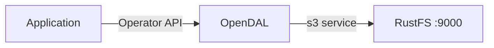
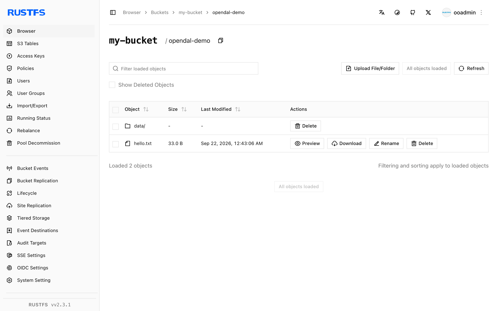

This guide connects [Apache OpenDAL](https://github.com/apache/opendal) — the unified data access layer — to **RustFS** through its `s3` service. You will run the OpenDAL Python binding against RustFS, write and read an object, list a prefix, and delete it. The workflow was verified with the `opendal` Python package 0.46 on `python:3.12-slim` and `rustfs/rustfs-x86-musl:v2.3.1`.

You need Docker and Python 3.9 or later. OpenDAL supports the same `s3` service from Rust, Java, Node.js, and Go bindings with equivalent settings.

## Architecture



An OpenDAL `Operator` bound to the `s3` service exposes one uniform API — `write`, `read`, `stat`, `list`, `delete` — over the bucket, so the same code runs against S3, RustFS, or any other supported service by changing the connection settings.

## 1. Set up the project

Install the Python binding:

```bash
pip install opendal
```

Create the script, replacing all connection placeholders:

```python title="opendal_demo.py"
import opendal

op = opendal.Operator(
    "s3",
    endpoint="http://<your-rustfs-endpoint>:9000",
    bucket="my-bucket",
    access_key_id="<your-access-key>",
    secret_access_key="<your-secret-key>",
    region="us-east-1",
)
op.write("opendal-demo/hello.txt", b"hello from opendal against rustfs")
print("read-back:", op.read("opendal-demo/hello.txt"))
print("content_length:", op.stat("opendal-demo/hello.txt").content_length)
for entry in op.list("opendal-demo/"):
    print("listed:", entry.path)
op.delete("opendal-demo/hello.txt")
print("deleted:", not op.exists("opendal-demo/hello.txt"))
```

The credential option names are `access_key_id` and `secret_access_key` — the shorter `access_key` names do not exist and fail with a signing error. Path-style addressing is the default for non-AWS endpoints.

## 2. Run the demo

Run the script from a machine that can reach RustFS:

```bash
python opendal_demo.py
```

```text
read-back: b"hello from opendal against rustfs"
content_length: 33
listed: opendal-demo/hello.txt
deleted: True
```

The round trip exercises the full object lifecycle: write uploads the bytes, `read` fetches them back, `stat` returns the object size, `list` enumerates the prefix, and `delete` removes the object.

## 3. Verify objects in RustFS

Comment out the final `op.delete` line, run the script again, and list the prefix in RustFS:

```bash
rc ls rustfs/my-bucket/opendal-demo/ -r
```

```text
hello.txt
data/rows.csv
```



The objects visible in the RustFS Console are exactly the paths the OpenDAL API wrote.

## 4. Stop or reset

OpenDAL is a library and holds no state of its own. To clean up the demo objects:

```bash
rc rm rustfs/my-bucket/opendal-demo/ --recursive --force
```

## Troubleshooting

### `failed to load signing credential`

The operator received no usable credentials. Use the exact option names `access_key_id` and `secret_access_key`; other spellings are silently ignored and signing then fails.

### Connection or DNS errors on write

Confirm the endpoint includes the scheme and port and is reachable from the application. Inside a Compose network the hostname is `rustfs`; from the host use `http://localhost:9000`.

## Next steps

- Review [S3 compatibility notes](/administration/protocols/s3) before adopting additional OpenDAL operations.
- Create dedicated production credentials with [Access Key Management](/security-compliance/iam/access-token).
- Follow the [OpenDAL documentation](https://opendal.apache.org/docs/) to use the same operator from Rust, Java, or Node.js.
