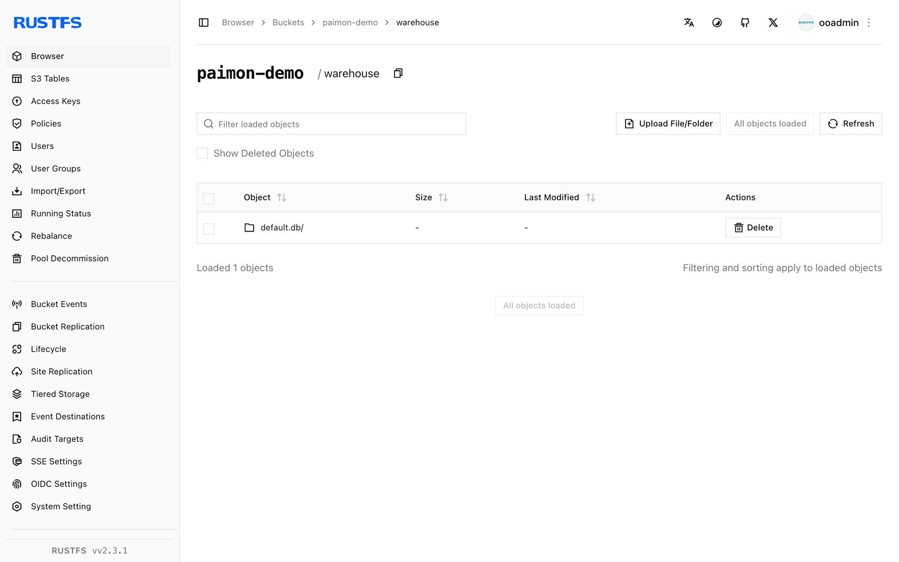

This guide connects [Apache Paimon](https://github.com/apache/paimon) — the streaming lakehouse table format — to **RustFS** as its warehouse storage. You will create a Paimon catalog over a RustFS bucket with Spark, write a primary-key table, and read it back. The workflow was verified with Paimon 1.2.0 on Spark 3.5.6 against `rustfs/rustfs-x86-musl:v2.3.1`.

You need Docker and the `rc` client.

## Architecture


Paimon stores each table under the catalog warehouse as a `*.db` directory containing `schema/`, `snapshot/`, and data files. All I/O goes through Paimon's own S3 FileIO (`paimon-s3`), not Hadoop S3A.

## 1. Run Spark

```bash
docker run -d --name spark-paimon --hostname spark --network oo-rustfs_default \
  spark:3.5.6-scala2.12-java17-python3-ubuntu sleep infinity
docker cp paimon_test.sql spark-paimon:/tmp/paimon_test.sql
```

Create the SQL file (note: the catalog options are passed on the CLI below, not in the file):

```sql title="paimon_test.sql"
CREATE TABLE paimon.default.events (id INT, label STRING) TBLPROPERTIES ("primary-key"="id");
INSERT INTO paimon.default.events VALUES (1,'alpha'),(2,'beta'),(3,'gamma');
SELECT * FROM paimon.default.events ORDER BY id;
```

## 2. Run the SQL script

Three pieces are required: the Spark extensions, Paimon's own S3 FileIO (`paimon-s3` — the Hadoop S3A jars are not used by Paimon's reader), and the catalog-level `s3.*` options:

```bash
docker exec -u root spark-paimon bash -c "cd /opt/spark && \
  ./bin/spark-sql \
  --packages org.apache.paimon:paimon-spark-3.5:1.2.0,org.apache.paimon:paimon-s3:1.2.0,org.apache.hadoop:hadoop-aws:3.3.4 \
  --conf spark.sql.extensions=org.apache.paimon.spark.extensions.PaimonSparkSessionExtensions \
  --conf spark.sql.catalog.paimon=org.apache.paimon.spark.SparkCatalog \
  --conf spark.sql.catalog.paimon.warehouse=s3://paimon-demo/warehouse \
  --conf spark.sql.catalog.paimon.s3.endpoint=http://rustfs:9000 \
  --conf spark.sql.catalog.paimon.s3.access-key=<your-access-key> \
  --conf spark.sql.catalog.paimon.s3.secret-key=<your-secret-key> \
  --conf spark.sql.catalog.paimon.s3.path-style-access=true \
  -f /tmp/paimon_test.sql"
```

```text
Time taken: 9.447 seconds
1	alpha
2	beta
3	gamma
Time taken: 1.257 seconds, Fetched 3 row(s)
```

Without the extensions line Paimon fails fast with a `requiredSparkConfsCheck` error; without `paimon-s3` the catalog fails with `UnsupportedSchemeException: Could not find a file io implementation for scheme 's3'`.

## 3. Verify objects in RustFS

```bash
rc ls rustfs/paimon-demo/warehouse/ -r | head -6
```

```text
warehouse/default.db/events/schema/schema-0
warehouse/default.db/events/snapshot/snapshot-1
warehouse/default.db/events/bucket-0/data-...
warehouse/default.db/events/manifest/...
```

The bucket holds the full lakehouse layout: schemas, snapshots, manifests, and data files per bucket.



## 4. Stop or reset

```bash
docker rm -f spark-paimon
rc rm rustfs/paimon-demo/ --recursive --force
```

## Troubleshooting

### `UnsupportedSchemeException: Could not find a file io implementation for scheme 's3'`

Paimon's own FileIO needs its S3 plugin on the classpath. Add `org.apache.paimon:paimon-s3:1.2.0` to `--packages` alongside the Spark connector.

### `When using Paimon, it is necessary to configure spark.sql.extensions...`

Add `--conf spark.sql.extensions=org.apache.paimon.spark.extensions.PaimonSparkSessionExtensions` — Paimon fails fast without it.

### `SCHEMA_NOT_FOUND: The schema paimon cannot be found`

The catalog was not registered. Register it as `spark.sql.catalog.paimon` and qualify table names with `paimon.`.

### Writes fail with S3 errors on the exec side

The catalog-level `s3.*` options (`s3.endpoint`, `s3.access-key`, `s3.secret-key`, `s3.path-style-access`) are what Paimon's FileIO reads — Hadoop `fs.s3a.*` settings alone are not used by the exec-side file operations.

## Next steps

- Compare with the [Iceberg](/developer/integration/big-data/iceberg), [Hudi](/developer/integration/big-data/hudi), and [Delta Lake](/developer/integration/big-data/delta-lake) guides for the other lakehouse formats on the same bucket.
- Create dedicated production credentials with [Access Key Management](/security-compliance/iam/access-token).
- Follow the [Paimon documentation](https://paimon.apache.org/docs/master/) for compaction, changelog producers, and Flink streaming writes on the same bucket.
