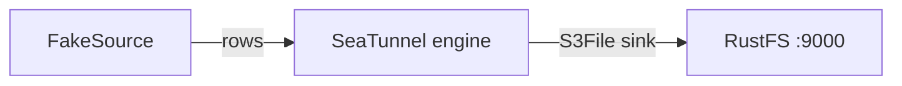
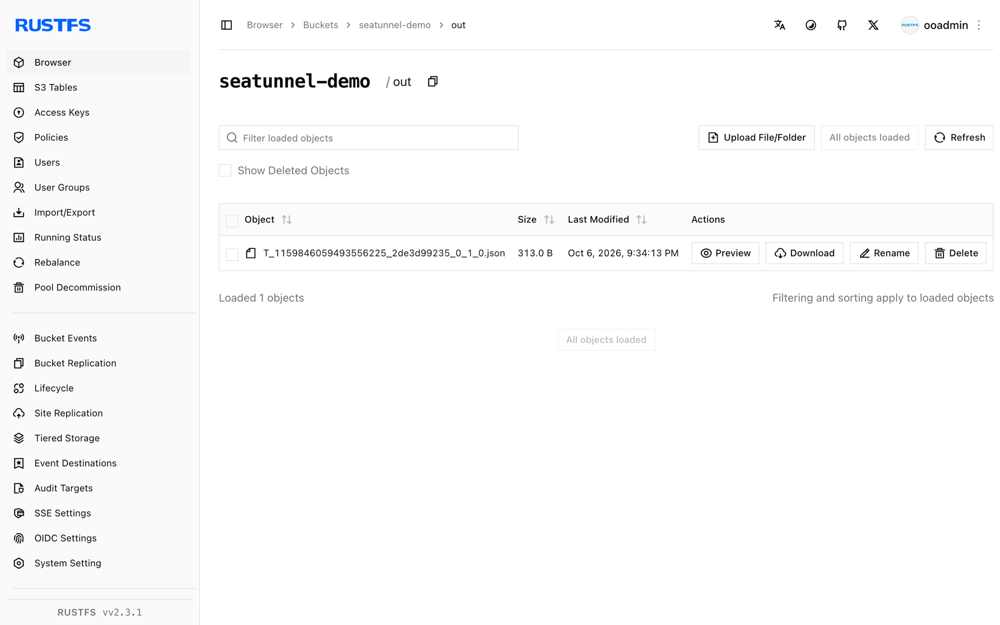

This guide connects [Apache SeaTunnel](https://github.com/apache/seatunnel) — the data integration engine — to **RustFS** through the S3File connector. You will run a batch job that generates rows with FakeSource and writes them as JSON files into a RustFS bucket. The workflow was verified with SeaTunnel 2.3.12 against `rustfs/rustfs-x86-musl:v2.3.1`.

You need Docker and the `rc` client.

## Architecture



The S3File sink writes through the Hadoop S3A filesystem, so the connector accepts both its own credential options and the standard `fs.s3a.*` Hadoop keys.

## 1. Run the engine

The connector and the Hadoop AWS jars ship inside the image:

```bash
docker run --rm apache/seatunnel:2.3.12 \
  sh -c "ls /opt/seatunnel/connectors/ | grep s3; ls /opt/seatunnel/lib/ | grep hadoop-aws"
```

```text
connector-file-s3-2.3.12.jar
seatunnel-hadoop-aws.jar
```

## 2. Write the job config

The tricky part: the sink validates `access_key`/`secret_key` at compile time, while the actual S3A client reads the `fs.s3a.*` keys. Provide both, and keep the endpoint without a scheme — the bundled Hadoop version rejects `http://` endpoints:

```text title="seatunnel-rustfs.conf"
env {
  parallelism = 1
  job.mode = "BATCH"
}

source {
  FakeSource {
    plugin_output = "fake"
    row.num = 5
    schema = {
      fields {
        id = "int"
        name = "string"
        value = "double"
      }
    }
  }
}

sink {
  S3File {
    bucket = "s3a://seatunnel-demo"
    access_key = "<your-access-key>"
    secret_key = "<your-secret-key>"
    fs.s3a.endpoint = "<your-rustfs-endpoint>:9000"
    fs.s3a.access.key = "<your-access-key>"
    fs.s3a.secret.key = "<your-secret-key>"
    fs.s3a.aws.credentials.provider = "org.apache.hadoop.fs.s3a.SimpleAWSCredentialsProvider"
    fs.s3a.connection.ssl.enabled = "false"
    file_format_type = "json"
    path = "/out"
  }
}
```

## 3. Run the job

```bash
docker run --rm --network oo-rustfs_default \
  -v "$PWD/seatunnel-rustfs.conf":/task.conf:ro \
  apache/seatunnel:2.3.12 \
  sh -c "cd /opt/seatunnel && ./bin/seatunnel.sh --config /task.conf -e local"
```

```text
2026-10-07 ... INFO  ... Submit job finished, job id: 1159846059493556225
```

## 4. Verify objects in RustFS

```bash
rc ls rustfs/seatunnel-demo/out/
rc cat rustfs/seatunnel-demo/out/T_1159846059493556225_2de3d99235_0_1_0.json | head -1
```

```text
out/T_1159846059493556225_2de3d99235_0_1_0.json
{"id":168282592,"name":"ELyqD","value":1.594479327987022E308}
```

Five FakeSource rows landed as one JSON file in the bucket.



## 5. Stop or reset

SeaTunnel in `-e local` mode is stateless. To delete the output:

```bash
rc rm rustfs/seatunnel-demo/ --recursive --force
```

## Troubleshooting

### `Plugin PluginIdentifier{... pluginName='S3'} not found`

The sink class is registered as `S3File`, not `S3`.

### `There are unconfigured options, the options('access_key', 'secret_key') are required`

The S3File sink requires its own `access_key`/`secret_key` options even when `fs.s3a.*` keys are present. Provide both sets as in step 2.

### `No AWS Credentials provided by InstanceProfileCredentialsProvider`

The S3A client on the coordinator side fell back to the instance-profile provider because `fs.s3a.aws.credentials.provider` and the `fs.s3a.access.key`/`fs.s3a.secret.key` pair were missing. Add all three as in step 2.

### Job hangs on `doesBucketExist`

The bundled Hadoop version rejects `http://` scheme endpoints. Use the bare `host:port` form for `fs.s3a.endpoint` and add `fs.s3a.connection.ssl.enabled = "false"`.

## Next steps

- Review [S3 compatibility notes](/administration/protocols/s3) before adopting additional SeaTunnel connectors.
- Create dedicated production credentials with [Access Key Management](/security-compliance/iam/access-token).
- Follow the [SeaTunnel S3File documentation](https://seatunnel.apache.org/docs/connector-v2/sink/S3File) for parquet/orc formats, partitioned writes, and the matching S3File source.
