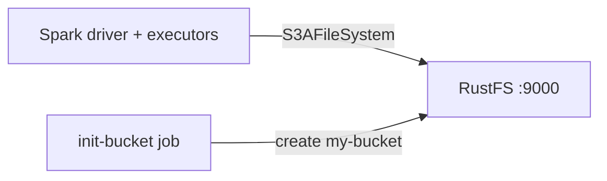

Diese Anleitung verbindet [Apache Spark](https://github.com/apache/spark) über den `s3a`-Connector mit **RustFS**. Sie starten RustFS mit Docker Compose, führen einen Spark-Job aus, der ein Parquet-Dataset in den Bucket schreibt, lesen es zurück und prüfen die Objekte in RustFS. Der Ablauf wurde mit `apache/spark:3.5.6` (Hadoop 3.3.4 via `hadoop-aws`) und `rustfs/rustfs-x86-musl:v2.3.1` verifiziert.

Sie benötigen Docker mit dem Compose-Plugin. Dieses Setup ist für lokale Integrationstests gedacht, nicht für den Produktivbetrieb.

## Architektur



Spark spricht über das `hadoop-aws`-S3A-Dateisystem mit RustFS. Die Connector-Einstellungen — Endpunkt, Path-Style-Adressierung, Plain HTTP und Anmeldeinformationen — werden als `spark.hadoop.fs.s3a.*`-Properties übergeben.

## 1. Projektdateien anlegen

Erstellen Sie ein Arbeitsverzeichnis:

```bash
mkdir rustfs-spark
cd rustfs-spark
```

Erstellen Sie eine Umgebungsdatei und ersetzen Sie beide Platzhalter für die Anmeldeinformationen:

```ini title=".env"
RUSTFS_ACCESS_KEY=<your-access-key>
RUSTFS_SECRET_KEY=<your-secret-key>
```

Verwenden Sie dedizierte Anmeldeinformationen für den Bucket. Committen Sie `.env` nicht in die Versionsverwaltung.

Erstellen Sie den Spark-Job:

```python title="job.py"
from pyspark.sql import SparkSession

spark = SparkSession.builder.appName("rustfs-spark-demo").getOrCreate()
spark.sparkContext.setLogLevel("WARN")

spark.range(1000).withColumnRenamed("id", "num") \
    .write.mode("overwrite").parquet("s3a://my-bucket/spark-demo/events")

back = spark.read.parquet("s3a://my-bucket/spark-demo/events")
print("ROWS_READ_BACK:", back.count())
spark.stop()
```

Erstellen Sie die Compose-Datei:

```yaml title="compose.yaml"
services:
  rustfs:
    image: rustfs/rustfs-x86-musl:v2.3.1
    environment:
      RUSTFS_ACCESS_KEY: ${RUSTFS_ACCESS_KEY}
      RUSTFS_SECRET_KEY: ${RUSTFS_SECRET_KEY}
      RUSTFS_VOLUMES: /data
      RUSTFS_ADDRESS: ":9000"
      RUSTFS_CONSOLE_ADDRESS: ":9001"
      RUSTFS_CONSOLE_ENABLE: "true"
    volumes:
      - rustfs-data:/data
    ports:
      - "9000:9000"
      - "9001:9001"
    healthcheck:
      test: ["CMD", "curl", "-sf", "http://127.0.0.1:9000/health"]
      interval: 10s
      timeout: 5s
      retries: 6
      start_period: 10s
    networks:
      - warehouse

  create-bucket:
    image: rustfs/rc:latest
    depends_on:
      rustfs:
        condition: service_healthy
    environment:
      RUSTFS_ACCESS_KEY: ${RUSTFS_ACCESS_KEY}
      RUSTFS_SECRET_KEY: ${RUSTFS_SECRET_KEY}
    entrypoint:
      - /bin/sh
      - -c
      - |
        until /usr/bin/rc alias set rustfs http://rustfs:9000 "$${RUSTFS_ACCESS_KEY}" "$${RUSTFS_SECRET_KEY}"; do
          echo "Waiting for RustFS..."
          sleep 2
        done
        /usr/bin/rc ls rustfs/my-bucket >/dev/null 2>&1 || /usr/bin/rc mb rustfs/my-bucket
    networks:
      - warehouse

  spark:
    image: apache/spark:3.5.6
    entrypoint: ["/opt/spark/bin/spark-submit"]
    volumes:
      - ./job.py:/job.py:ro
    command:
      - --conf
      - spark.jars.ivy=/tmp/.ivy2
      - --packages
      - org.apache.hadoop:hadoop-aws:3.3.4
      - --conf
      - spark.hadoop.fs.s3a.endpoint=http://rustfs:9000
      - --conf
      - spark.hadoop.fs.s3a.access.key=${RUSTFS_ACCESS_KEY}
      - --conf
      - spark.hadoop.fs.s3a.secret.key=${RUSTFS_SECRET_KEY}
      - --conf
      - spark.hadoop.fs.s3a.path.style.access=true
      - --conf
      - spark.hadoop.fs.s3a.connection.ssl.enabled=false
      - --conf
      - spark.hadoop.fs.s3a.impl=org.apache.hadoop.fs.s3a.S3AFileSystem
      - /job.py
    depends_on:
      create-bucket:
        condition: service_completed_successfully
    networks:
      - warehouse

networks:
  warehouse:

volumes:
  rustfs-data:
```

`--packages org.apache.hadoop:hadoop-aws:3.3.4` lädt den S3-Connector beim Start herunter; er muss zur Hadoop-Version des Spark-Images passen. `spark.jars.ivy=/tmp/.ivy2` verschiebt den Download-Cache in ein beschreibbares Verzeichnis.

## 2. Speicher starten und Job ausführen

Starten Sie die Speicherdienste:

```bash
docker compose up -d
docker compose ps -a
```

Führen Sie den Spark-Job aus:

```bash
docker compose run --rm spark
```

```text
ROWS_READ_BACK: 1000
```

## 3. Objekte in RustFS prüfen

Listen Sie das Dataset über das Bucket-Initialisierungs-Image auf:

```bash
docker compose run --rm --entrypoint /bin/sh create-bucket -c \
  '/usr/bin/rc alias set rustfs http://rustfs:9000 "$RUSTFS_ACCESS_KEY" "$RUSTFS_SECRET_KEY" >/dev/null && /usr/bin/rc ls rustfs/my-bucket/spark-demo --recursive'
```

```text
[2026-09-21 00:58:22]        0 B spark-demo/events/_SUCCESS
[2026-09-21 00:58:21]   1.46 KiB spark-demo/events/part-00000-...-c000.snappy.parquet
[2026-09-21 00:58:21]   1.46 KiB spark-demo/events/part-00001-...-c000.snappy.parquet
[2026-09-21 00:58:21]   1.46 KiB spark-demo/events/part-00002-...-c000.snappy.parquet
```

Sie können das Präfix auch in der RustFS-Konsole anzeigen:


## 4. RustFS S3 Tables verwenden

RustFS S3 Tables bietet einen integrierten Apache-Iceberg-REST-Katalog, sodass Spark einen Table-Bucket als verwaltetes Iceberg-Warehouse nutzen kann, während die Daten in RustFS bleiben. Aktivieren Sie einen Table-Bucket und verbinden Sie den Iceberg-REST-Katalog von Spark wie in [S3 Tables](/administration/data/s3-tables) beschrieben: Die REST-Katalog-URI ist `http://<rustfs-host>:9000/iceberg`, das Warehouse ist der Bucket-Name, und sowohl Kataloganfragen (AWS Signature Version 4, Signing-Name `s3`) als auch der S3-Dateizugriff verwenden Path-Style-Adressierung.

Laut der S3-Tables-Support-Matrix validieren Sie die exakten Spark- und Iceberg-Versionen Ihrer Bereitstellung gegen den Katalog, bevor Sie diesen Pfad in Produktion übernehmen.

## 5. Stack stoppen oder zurücksetzen

Stoppen Sie die Container und behalten Sie das RustFS-Datenvolumen:

```bash
docker compose down
```

Um das Dataset zu löschen und mit einem leeren RustFS-Volumen zu beginnen, fügen Sie ausdrücklich `--volumes` hinzu:

```bash
docker compose down --volumes
```

## Fehlerbehebung

### NumberFormatException: For input string: "60s"

Die `hadoop-aws`-Version passt nicht zur Hadoop-Version im Spark-Image. Spark-4.x-Images benötigen `hadoop-aws` 3.4.x; diese Anleitung pinnt `apache/spark:3.5.6` zusammen mit `hadoop-aws:3.3.4`.

### Verbindungsfehler zu `rustfs:9000`

`fs.s3a.endpoint` wird innerhalb des Compose-Netzwerks aufgelöst. Für einen Spark-Prozess auf dem Host verwenden Sie `http://localhost:9000`.

### AccessDenied- oder 403-Antworten

Stellen Sie sicher, dass die Connector-Einstellungen mit den RustFS-Anmeldeinformationen übereinstimmen und dass der Dienst `create-bucket` erfolgreich abgeschlossen wurde:

```bash
docker compose logs create-bucket
```

## Nächste Schritte

- Lesen Sie die [S3-Kompatibilitätshinweise](/administration/protocols/s3), bevor Sie weitere S3-Operationen verwenden.
- Erstellen Sie dedizierte Produktions-Anmeldeinformationen mit dem [Access Key Management](/security-compliance/iam/access-token).
- Folgen Sie der [Spark-Dokumentation](https://spark.apache.org/docs/latest/) für Structured Streaming und Datenquellenoptionen.
