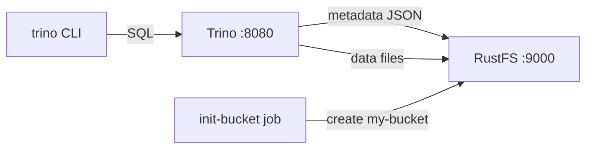
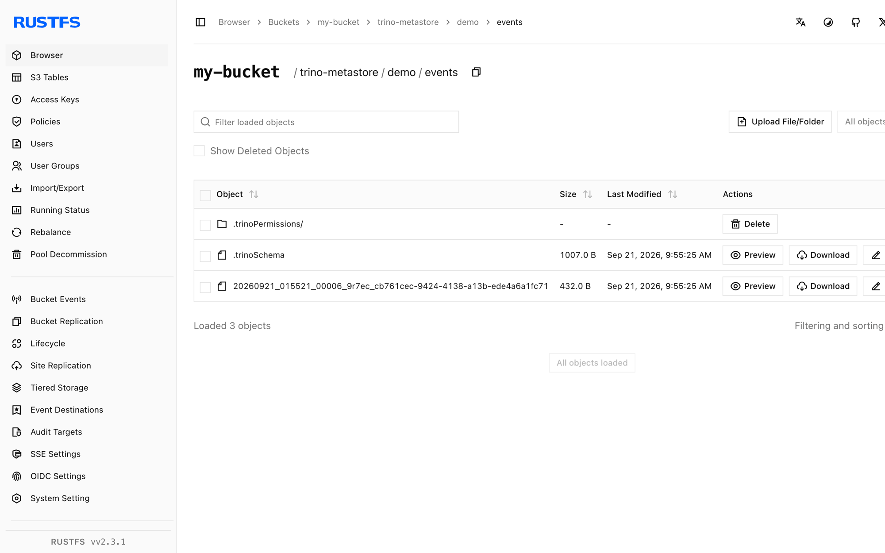

Diese Anleitung verbindet [Trino](https://github.com/trinodb/trino) — die verteilte SQL-Abfrage-Engine — über den hive-Connector mit seinem File-Metastore und das native S3-Dateisystem mit **RustFS**. Sie erstellen ein Schema und eine Tabelle, fügen Zeilen ein, lesen sie zurück und prüfen die Objekte in RustFS. Sowohl Tabellenmetadaten als auch Datendateien liegen in RustFS. Der Ablauf wurde mit `trinodb/trino:435` und `rustfs/rustfs-x86-musl:v2.3.1` verifiziert.

Sie benötigen Docker mit dem Compose-Plugin. Dieses Setup ist für lokale Integrationstests gedacht, nicht für den Produktivbetrieb.

## Architektur



Der hive-Connector mit `hive.metastore=file` hält Schema- und Tabellenmetadaten als JSON-Objekte unter dem Katalogverzeichnis, und das native S3-Dateisystem (`fs.s3.enabled`) speichert Metadaten und Datendateien in RustFS mit Path-Style-Adressierung über Plain HTTP.

## 1. Projektdateien anlegen

Erstellen Sie ein Arbeitsverzeichnis:

```bash
mkdir rustfs-trino
cd rustfs-trino
```

Erstellen Sie eine Umgebungsdatei und ersetzen Sie beide Platzhalter für die Anmeldeinformationen:

```ini title=".env"
RUSTFS_ACCESS_KEY=<your-access-key>
RUSTFS_SECRET_KEY=<your-secret-key>
```

Verwenden Sie dedizierte Anmeldeinformationen für den Bucket. Committen Sie `.env` nicht in die Versionsverwaltung.

Erstellen Sie die Katalog-Konfiguration für Trino:

```ini title="hive.properties"
connector.name=hive
hive.metastore=file
hive.metastore.catalog.dir=s3://my-bucket/trino-metastore
fs.s3.enabled=true
s3.endpoint=http://rustfs:9000
s3.region=us-east-1
s3.path-style-access=true
s3.aws-access-key=<your-access-key>
s3.aws-secret-key=<your-secret-key>
```

`hive.metastore.catalog.dir` richtet den File-Metastore in den Bucket, sodass Metadaten und Daten beide in RustFS liegen. `fs.s3.enabled` aktiviert das native S3-Dateisystem; `s3.path-style-access` ist für den Container-Netzwerk-Endpunkt erforderlich.

Erstellen Sie die Compose-Datei:

```yaml title="compose.yaml"
services:
  rustfs:
    image: rustfs/rustfs-x86-musl:v2.3.1
    environment:
      RUSTFS_ACCESS_KEY: ${RUSTFS_ACCESS_KEY}
      RUSTFS_SECRET_KEY: ${RUSTFS_SECRET_KEY}
      RUSTFS_VOLUMES: /data
      RUSTFS_ADDRESS: ":9000"
      RUSTFS_CONSOLE_ADDRESS: ":9001"
      RUSTFS_CONSOLE_ENABLE: "true"
    volumes:
      - rustfs-data:/data
    ports:
      - "9000:9000"
      - "9001:9001"
    healthcheck:
      test: ["CMD", "curl", "-sf", "http://127.0.0.1:9000/health"]
      interval: 10s
      timeout: 5s
      retries: 6
      start_period: 10s
    networks:
      - warehouse

  create-bucket:
    image: rustfs/rc:latest
    depends_on:
      rustfs:
        condition: service_healthy
    environment:
      RUSTFS_ACCESS_KEY: ${RUSTFS_ACCESS_KEY}
      RUSTFS_SECRET_KEY: ${RUSTFS_SECRET_KEY}
    entrypoint:
      - /bin/sh
      - -c
      - |
        until /usr/bin/rc alias set rustfs http://rustfs:9000 "$${RUSTFS_ACCESS_KEY}" "$${RUSTFS_SECRET_KEY}"; do
          echo "Waiting for RustFS..."
          sleep 2
        done
        /usr/bin/rc ls rustfs/my-bucket >/dev/null 2>&1 || /usr/bin/rc mb rustfs/my-bucket
    networks:
      - warehouse

  trino:
    image: trinodb/trino:435
    volumes:
      - ./hive.properties:/etc/trino/catalog/hive.properties:ro
      - metastore-data:/data/metastore
    depends_on:
      create-bucket:
        condition: service_completed_successfully
    networks:
      - warehouse

networks:
  warehouse:

volumes:
  rustfs-data:
  metastore-data:
```

## 2. Bereitstellung starten

Prüfen Sie die Compose-Datei, bevor Sie Container starten:

```bash
docker compose config
```

Starten Sie die Dienste und warten Sie, bis die Bucket-Initialisierung abgeschlossen ist:

```bash
docker compose up -d
docker compose ps -a
```

Trino läuft, wenn das Server-Log `SERVER STARTED` meldet. Der Container läuft als Benutzer `trino` (uid 1000); stellen Sie sicher, dass das Metastore-Volume beschreibbar ist:

```bash
docker compose exec trino id
docker compose exec trino ls -la /data/metastore
```

## 3. Schema und Tabelle erstellen

Erstellen Sie das Schema ohne explizite Location — Trino legt es unter dem Katalogverzeichnis in RustFS ab:

```bash
docker compose exec trino trino --execute \
  "CREATE SCHEMA hive.demo"
```

Erstellen Sie eine Tabelle und fügen Sie fünf Zeilen ein:

```bash
docker compose exec trino trino --execute \
  "CREATE TABLE hive.demo.events (id bigint, label varchar) WITH (format = 'parquet')"

docker compose exec trino trino --execute \
  "INSERT INTO hive.demo.events VALUES (1,'alpha'),(2,'bravo'),(3,'charlie'),(4,'delta'),(5,'echo')"
```

```text
INSERT: 5 rows
```

## 4. Die Daten abfragen

Lesen Sie die Zeilen zurück:

```bash
docker compose exec trino trino --execute \
  "SELECT * FROM hive.demo.events ORDER BY id"
```

```text
"1","alpha"
"2","bravo"
"3","charlie"
"4","delta"
"5","echo"
```

## 5. Objekte in RustFS prüfen

Listen Sie das Metastore-Präfix über das Bucket-Initialisierungs-Image auf:

```bash
docker compose run --rm --entrypoint /bin/sh create-bucket -c \
  '/usr/bin/rc alias set rustfs http://rustfs:9000 "$RUSTFS_ACCESS_KEY" "$RUSTFS_SECRET_KEY" >/dev/null && /usr/bin/rc ls rustfs/my-bucket/trino-metastore --recursive'
```

```text
[2026-09-21 01:55:16]      155 B trino-metastore/.demo.trinoSchema
[2026-09-21 01:55:19]      474 B trino-metastore/demo/events/.trinoPermissions/user_trino
[2026-09-21 01:55:25]     1007 B trino-metastore/demo/events/.trinoSchema
[2026-09-21 01:55:25]      432 B trino-metastore/demo/events/20260921_..._cb761cec-...parquet
```

Sie können das Präfix auch in der RustFS-Konsole anzeigen:



## 6. RustFS S3 Tables verwenden

RustFS S3 Tables bietet einen integrierten Apache-Iceberg-REST-Katalog, sodass Trino einen Table-Bucket als verwaltetes Iceberg-Warehouse nutzen kann, während die Daten in RustFS bleiben. Aktivieren Sie einen Table-Bucket und verbinden Sie den Iceberg-Connector von Trino mit dem REST-Katalog, wie in [S3 Tables](/administration/data/s3-tables) beschrieben: Die REST-Katalog-URI ist `http://<rustfs-host>:9000/iceberg`, das Warehouse ist der Bucket-Name, und sowohl Kataloganfragen (AWS Signature Version 4, Signing-Name `s3`) als auch der S3-Dateizugriff verwenden Path-Style-Adressierung.

Laut der S3-Tables-Support-Matrix wurde Trino nur als Read-only-Probe gegen den Katalog geprüft; validieren Sie die Schreibkompatibilität und die exakte Trino-Version Ihrer Bereitstellung, bevor Sie diesen Pfad in Produktion übernehmen.

## 7. Stack stoppen oder zurücksetzen

Stoppen Sie die Container und behalten Sie das RustFS-Datenvolumen:

```bash
docker compose down
```

Um die gespeicherten Metadaten und Daten zu löschen und mit einem leeren RustFS-Volumen zu beginnen, fügen Sie ausdrücklich `--volumes` hinzu:

```bash
docker compose down --volumes
```

## Fehlerbehebung

### Konfigurationsfehler für `fs.native-s3.enabled` oder `fs.s3.enabled`

Der Property-Name des nativen S3-Dateisystems hat sich zwischen Trino-Versionen geändert: Trino 435 verwendet `fs.native-s3.enabled`, neuere Releases `fs.s3.enabled`. Diese Anleitung pinnt `trinodb/trino:435`, daher verwenden Sie `fs.native-s3.enabled`.

### "Table directory must be ..." beim Erstellen einer Tabelle

Mit dem File-Metastore müssen Tabellen-Locations unter `hive.metastore.catalog.dir` bleiben. Erstellen Sie das Schema ohne explizite Location, oder zeigen Sie die Schema-Location auf ein Verzeichnis innerhalb desselben Bucket-Präfixes.

### Hive CSV storage format only supports VARCHAR

Das CSV-Format lehnt Nicht-String-Spalten ab. Verwenden Sie für typisierte Tabellen `format = 'parquet'` wie in dieser Anleitung.

### AccessDenied- oder 403-Antworten

Stellen Sie sicher, dass die Anmeldeinformationen in `hive.properties` mit den RustFS-Anmeldeinformationen übereinstimmen und dass der Dienst `create-bucket` erfolgreich abgeschlossen wurde:

```bash
docker compose logs create-bucket
```

## Nächste Schritte

- Lesen Sie die [S3-Kompatibilitätshinweise](/administration/protocols/s3), bevor Sie weitere S3-Operationen verwenden.
- Erstellen Sie dedizierte Produktions-Anmeldeinformationen mit dem [Access Key Management](/security-compliance/iam/access-token).
- Folgen Sie der [Trino-Dokumentation](https://trino.io/docs/current/), um BI-Tools anzubinden und weitere Objektspeicher-Kataloge hinzuzufügen.
