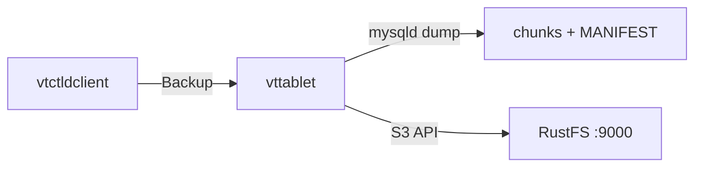
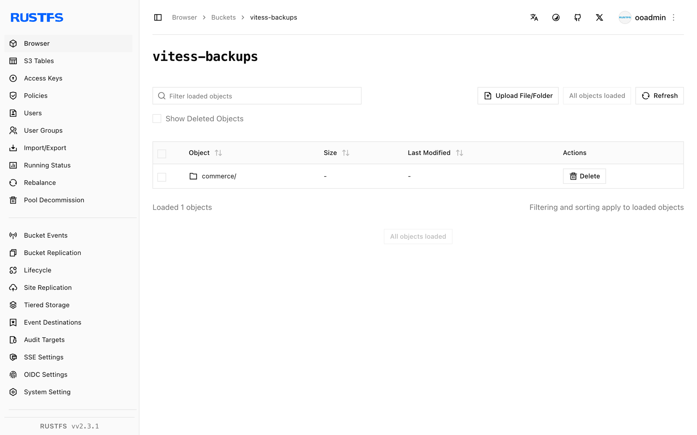

This guide connects [Vitess](https://github.com/vitessio/vitess) — the database clustering system for horizontal scaling of MySQL — to **RustFS** through Vitess's S3 backup storage implementation. You will bring up a minimal Vitess topology on a single host, run `Backup` on a tablet, and confirm the backup chunks and `MANIFEST` in the bucket, then read the backup list back from RustFS. The workflow was verified with `vitess/lite` (Vitess v25.0.0-SNAPSHOT, built 2026-09-22), MySQL 8.4, and `rustfs/rustfs-x86-musl:v2.3.1`; stable Vitess 20+ releases use the same flags.

You need Docker. This deployment is intended for local integration testing, not production.

## Architecture



`vtctld` triggers the backup, but the `vttablet` owning the tablet performs it: it snapshots MySQL, compresses the data into numbered chunks, and uploads them together with a `MANIFEST` through the S3-compatible endpoint.

## 1. Run etcd and the Vitess image

Vitess stores its topology in etcd, and the `vitess/lite` image ships all Vitess binaries plus MySQL:

```bash
docker run -d --name etcd --hostname etcd --network oo-rustfs_default \
  quay.io/coreos/etcd:v3.5.17 etcd \
  --advertise-client-urls http://etcd:2379 \
  --listen-client-urls http://0.0.0.0:2379

docker run -d --name vtess --hostname vtess --network oo-rustfs_default \
  -e AWS_ACCESS_KEY_ID=<your-access-key> \
  -e AWS_SECRET_ACCESS_KEY=<your-secret-key> \
  vitess/lite:latest sleep infinity
```

The AWS environment variables supply the credentials for the S3 backup storage in both `vtctld` and `vttablet`.

## 2. Initialize MySQL

Initialize a MySQL instance in the standard Vitess tablet directory so `vttablet` can load its `my.cnf` later:

```bash
docker exec vtess sh -c \
  "/vt/bin/mysqlctl --log_dir /tmp/vtlogs init --tablet-dir vt_0000000100"
```

The instance is ready when the socket file exists:

```text
/vt/vtdataroot/vt_0000000100/mysql.sock
```

## 3. Start vtctld and vttablet

Start `vtctld` with the S3 backup flags, register the cell, and start the tablet. Replace all connection placeholders:

```bash
docker exec vtess sh -c "nohup /vt/bin/vtctld \
  --topo-implementation etcd2 \
  --topo-global-server-address etcd:2379 \
  --topo-global-root /vitess/global \
  --service-map grpc-vtctl,grpc-vtctld \
  --backup-storage-implementation s3 \
  --s3-backup-aws-endpoint http://<your-rustfs-endpoint>:9000 \
  --s3-backup-aws-region us-east-1 \
  --s3-backup-force-path-style \
  --s3-backup-storage-bucket vitess-backups \
  --s3-backup-storage-root commerce \
  --port 15999 --grpc-port 15998 \
  --log_dir /tmp/vtlogs > /tmp/vtlogs/vtctld.out 2>&1 &"

docker exec vtess sh -c \
  "/vt/bin/vtctldclient --server localhost:15998 \
  AddCellInfo --root /vitess/zone1 --server-address etcd:2379 zone1"

docker exec vtess sh -c "nohup /vt/bin/vttablet \
  --topo-implementation etcd2 \
  --topo-global-server-address etcd:2379 \
  --topo-global-root /vitess/global \
  --tablet-path zone1-0000000100 \
  --init-keyspace commerce --init-shard 0 --init-tablet-type replica \
  --port 15100 --grpc-port 15101 \
  --service-map grpc-queryservice,grpc-tabletmanager,grpc-throttler \
  --mycnf-file /vt/vtdataroot/vt_0000000100/my.cnf \
  --db-dba-user root --db-allprivs-user root --db-app-user root --db-repl-user root \
  --db-dba-use-ssl=false --db-allprivs-use-ssl=false \
  --db-app-use-ssl=false --db-repl-use-ssl=false \
  --backup-storage-implementation s3 \
  --s3-backup-aws-endpoint http://<your-rustfs-endpoint>:9000 \
  --s3-backup-aws-region us-east-1 \
  --s3-backup-force-path-style \
  --s3-backup-storage-bucket vitess-backups \
  --s3-backup-storage-root commerce \
  --log_dir /tmp/vtlogs > /tmp/vtlogs/vttablet.out 2>&1 &"
```

Both processes carry the S3 flags because `vttablet` performs the backup while `vtctld` lists and removes backups. `--s3-backup-force-path-style` is mandatory for non-AWS endpoints. Check that the tablet registered:

```bash
docker exec vtess /vt/bin/vtctldclient --server localhost:15998 GetTablets
```

```text
zone1-0000000100 commerce 0 replica vtess:15100 vtess:3306 [] <null>
```

## 4. Run the backup

Create the bucket and trigger the backup:

```bash
rc mb rustfs/vitess-backups

docker exec vtess /vt/bin/vtctldclient --server localhost:15998 \
  Backup zone1-0000000100
```

The stream ends with the engine writing the manifest:

```text
commerce/0 (zone1-0000000100): ... value:"Completed backing up MANIFEST (attempt 1/2)"
```

## 5. Verify objects in RustFS

List the backup prefix:

```bash
rc ls rustfs/vitess-backups/ -r | head -4
```

The tablet uploaded compressed data chunks plus the metadata files:

```text
commerce/commerce/0/2026-09-23.011225.zone1-0000000100/0
commerce/commerce/0/2026-09-23.011225.zone1-0000000100/1
commerce/commerce/0/2026-09-23.011225.zone1-0000000100/MANIFEST
```



Read the backup list back from RustFS through `vtctld`:

```bash
docker exec vtess /vt/bin/vtctldclient --server localhost:15998 GetBackups commerce/0
```

```text
2026-09-23.011225.zone1-0000000100
```

## 6. Stop or reset

To tear down the demo while keeping the bucket objects:

```bash
docker rm -f vtess etcd
```

To delete the stored backups:

```bash
rc rm rustfs/vitess-backups/ --recursive --force
```

## Troubleshooting

### `cannot perform backup without my.cnf`

Passing connection parameters such as `--db-socket` or `--db-host` makes `vttablet` skip loading `my.cnf`, and backups refuse to run. Start `vttablet` with `--mycnf-file` pointing at the instance config and let it discover the socket from there — this is why the MySQL instance lives in the `vt_0000000100` directory from step 2.

### `unknown service vtctlservice.Vtctld`

`vtctld` exposes the API used by `vtctldclient` only when the service map includes it: `--service-map grpc-vtctl,grpc-vtctld`. Also make sure `vtctldclient --server` points at the gRPC port (`15998` here), not the web UI port.

### `node doesn't exist: /vitess/global/cells/zone1/CellInfo`

The cell must exist before tablets register. Run `vtctldclient AddCellInfo` as shown in step 3 before starting `vttablet`.

### Flag parse errors such as `unknown shorthand flag`

Vitess 20+ normalizes underscores to dashes, so write flags in dash style (`--tablet-path`). A single-dash long flag like `-tablet_dir` is parsed as shorthand options and fails.

## Next steps

- Review [S3 compatibility notes](/administration/protocols/s3) before adopting additional Vitess storage options.
- Create dedicated production credentials with [Access Key Management](/security-compliance/iam/access-token).
- Follow the [Vitess backup and restore documentation](https://vitess.io/docs/user-guides/configuration-basic/#backups) to schedule backups and restore tablets from the bucket.
