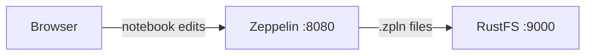
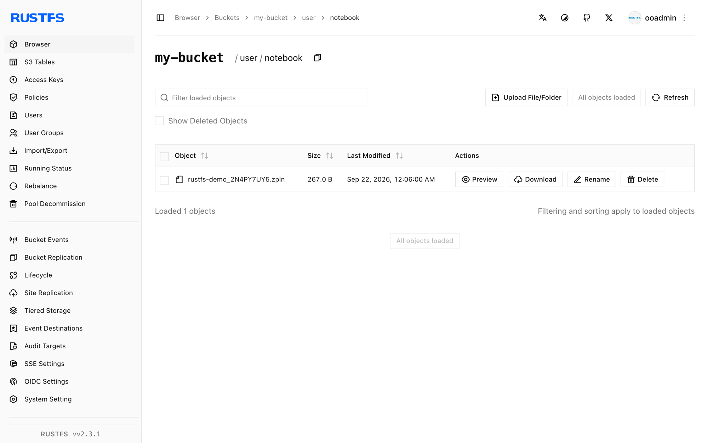

This guide connects [Apache Zeppelin](https://github.com/apache/zeppelin) — the web-based notebook for data analytics — to **RustFS** through Zeppelin's S3 notebook storage. You will start Zeppelin pointed at a RustFS bucket, create a note, and verify that the notebook file is stored in RustFS and survives a restart. The workflow was verified with `apache/zeppelin:0.12.0` and `rustfs/rustfs-x86-musl:v2.3.1`.

You need Docker. This deployment is intended for local integration testing, not production.

## Architecture



With the `S3NotebookRepo` storage class, every note is persisted as a `.zpln` JSON file under the `user/notebook/` prefix of the bucket. Zeppelin reads and writes the bucket directly, so notes survive container restarts and can be shared between instances.

## 1. Start Zeppelin

Create an environment file and replace both credential placeholders:

```ini title=".env"
AWS_ACCESS_KEY_ID=<your-access-key>
AWS_SECRET_ACCESS_KEY=<your-secret-key>
```

Start Zeppelin on the same Docker network as RustFS with the S3 storage settings:

```bash
docker run -d --name zeppelin --network oo-rustfs_default \
  -p 8080:8080 \
  -e AWS_ACCESS_KEY_ID \
  -e AWS_SECRET_ACCESS_KEY \
  -e ZEPPELIN_NOTEBOOK_STORAGE=org.apache.zeppelin.notebook.repo.S3NotebookRepo \
  -e ZEPPELIN_NOTEBOOK_S3_BUCKET=my-bucket \
  -e ZEPPELIN_NOTEBOOK_S3_ENDPOINT=http://rustfs:9000 \
  -e ZEPPELIN_NOTEBOOK_S3_PATH_STYLE_ACCESS=true \
  apache/zeppelin:0.12.0
```

Zeppelin reads `ZEPPELIN_*` environment variables as configuration properties, so no `zeppelin-site.xml` edit is needed. This guide uses the existing `my-bucket`; notes land under its `user/notebook/` prefix, which the S3 storage creates on demand.

## 2. Create a note

Wait for the UI on `http://localhost:8080`, then create a note named `rustfs-demo` in the notebook list and add a paragraph, or use the REST API:

```bash
NOTE=$(curl -s -X POST "http://localhost:8080/api/notebook" \
  -H "Content-Type: application/json" \
  -d '{"name": "rustfs-demo"}' | python3 -c "import json,sys; print(json.load(sys.stdin)['body'])")
echo "note id: $NOTE"
```

## 3. Verify the notebook in RustFS

List the notebook prefix:

```bash
rc ls rustfs/my-bucket/user/notebook/ -r
```

The note is stored as a JSON file named after the note and its ID:

```text
user/notebook/rustfs-demo_2N4PY7UY5.zpln
```



Notes survive a restart because Zeppelin loads them from the bucket:

```bash
docker restart zeppelin
curl -s "http://localhost:8080/api/notebook" | head -c 200
```

The note list contains `2N4PY7UY5` again after the restart.

## 4. Stop or reset the deployment

Stop Zeppelin while keeping the notes:

```bash
docker rm -f zeppelin
```

The notes stay in the `user/notebook/` prefix of `my-bucket`. To delete them, remove the prefix:

```bash
rc rm rustfs/my-bucket/user/notebook/ --recursive --force
```

## Troubleshooting

### Zeppelin starts but notes never appear in the bucket

Confirm the three `ZEPPELIN_NOTEBOOK_S3_*` variables are set and that the credentials environment variables reach the container — the S3 repository is initialized at startup, so the container must be recreated after any change.

### `UnknownHostException: my-bucket.rustfs`

The path-style flag was not picked up. Keep `ZEPPELIN_NOTEBOOK_S3_PATH_STYLE_ACCESS=true` exactly as shown; with path-style disabled Zeppelin treats the bucket as a hostname.

## Next steps

- Review [S3 compatibility notes](/administration/protocols/s3) before adopting additional Zeppelin operations.
- Create dedicated production credentials with [Access Key Management](/security-compliance/iam/access-token).
- Follow the [Zeppelin storage documentation](https://zeppelin.apache.org/docs/latest/setup/storage/storage.html#notebook-storage-in-s3) to organize notes in per-user prefixes.
