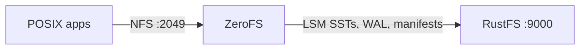
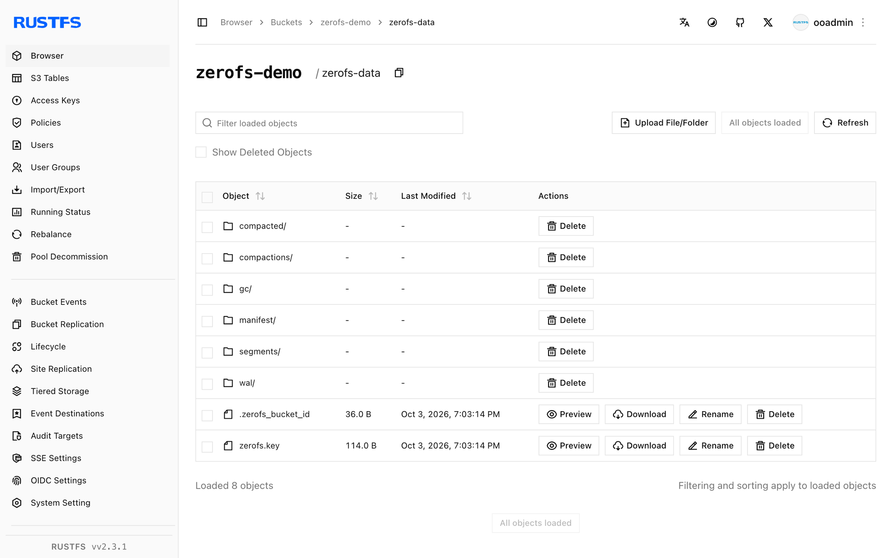

This guide connects [ZeroFS](https://github.com/Barre/ZeroFS) — the log-structured filesystem that serves S3 buckets as POSIX filesystems — to **RustFS** as its object storage backend. You will run ZeroFS with its LSM tree rooted in a RustFS bucket, mount the filesystem over NFS on a Linux host, write files through the mount, and verify they survive a ZeroFS restart as objects in the bucket. The workflow was verified with ZeroFS v2.3.5 (ghcr.io/barre/zerofs) against `rustfs/rustfs-x86-musl:v2.3.1`.

You need Docker and a Linux host with an NFS client (`nfs-common`). This deployment is intended for local integration testing, not production.

## Architecture



ZeroFS translates filesystem operations into an LSM key-value tree stored in the bucket: writes land in a write-ahead log, flush into SST segments, and compaction runs in the background. Clients see an ordinary directory tree over NFS (or 9P/NBD).

## 1. Generate the configuration

Create the bucket and the config file, replacing all connection placeholders:

```bash
rc mb rustfs/zerofs-demo

docker run --rm -u root:root -v /opt/zerofs:/cfg -w /cfg \
  --entrypoint /bin/sh ghcr.io/barre/zerofs:latest -c "zerofs init"
```

Then edit `zerofs.toml` so the storage and AWS sections point at RustFS:

```toml title="zerofs.toml"
[cache]
dir = "/cache"
disk_size_gb = 5.0

[storage]
url = "s3://zerofs-demo/zerofs-data"
encryption_password = "${ZEROFS_PASSWORD}"

[servers.nfs]
addresses = ["0.0.0.0:2049"]

[servers.rpc]
addresses = ["0.0.0.0:7000"]

[aws]
access_key_id = "${AWS_ACCESS_KEY_ID}"
secret_access_key = "${AWS_SECRET_ACCESS_KEY}"
endpoint = "http://<your-rustfs-endpoint>:9000"
default_region = "us-east-1"
allow_http = "true"
```

The `endpoint` plus `allow_http` pair is what redirects ZeroFS from AWS to RustFS. Custom endpoints use path-style addressing, so no extra option is needed.

## 2. Run ZeroFS

Run the server with the config file, credentials, and a writable cache directory (the image runs as UID 1001):

```bash
mkdir -p /opt/zerofs/cache && chown -R 1001:1001 /opt/zerofs/cache

docker run -d --name zerofs --network oo-rustfs_default -p 2049:2049 \
  -e ZEROFS_PASSWORD=<encryption-password> \
  -e AWS_ACCESS_KEY_ID=<your-access-key> \
  -e AWS_SECRET_ACCESS_KEY=<your-secret-key> \
  -v /opt/zerofs/zerofs.toml:/zerofs.toml:ro \
  -v /opt/zerofs/cache:/cache \
  ghcr.io/barre/zerofs:latest run -c /zerofs.toml
```

```text
INFO zerofs::nfs: NFS server listening on 0.0.0.0:2049
```

## 3. Mount over NFS

On the host, mount the export with the options ZeroFS recommends:

```bash
apt-get install -y nfs-common
mkdir -p /mnt/zerofs

mount -t nfs -o async,nolock,rsize=1048576,wsize=1048576,tcp,port=2049,mountport=2049,hard \
  127.0.0.1:/ /mnt/zerofs
```

The mount is an ordinary POSIX filesystem:

```bash
echo "written via zerofs nfs mount on rustfs" > /mnt/zerofs/hello.txt
dd if=/dev/urandom of=/mnt/zerofs/data/inner/blob.bin bs=1M count=8
```

## 4. Verify persistence and objects in RustFS

Force pending writes to the bucket, then restart ZeroFS and remount:

```bash
docker exec zerofs zerofs flush -c /zerofs.toml
umount /mnt/zerofs
docker restart zerofs
mount -t nfs -o async,nolock,rsize=1048576,wsize=1048576,tcp,port=2049,mountport=2049,hard \
  127.0.0.1:/ /mnt/zerofs
```

Everything written before the restart is still there:

```bash
cat /mnt/zerofs/hello.txt
sha1sum /mnt/zerofs/data/inner/blob.bin
```

```text
written via zerofs nfs mount on rustfs
645faaefe499f9ebda8edceeeb1a6261999aece7  /mnt/zerofs/data/inner/blob.bin
```

List the bucket to see where the files actually live:

```bash
rc ls rustfs/zerofs-demo/ -r | head -4
```

```text
zerofs-data/compacted/01M40Q1RA0X3AVG76VC0SBYE58.sst
zerofs-data/manifest/0000000000000000.json
zerofs-data/wal/00000000000000000001.sst
```

Files are not stored 1:1 — they are keys and values inside the LSM tree, which is what lets ZeroFS serve a bucket as a filesystem.



## 5. Stop or reset

To tear down the demo while keeping the bucket objects:

```bash
umount /mnt/zerofs
docker rm -f zerofs
```

To delete the stored data (this erases the filesystem itself):

```bash
rc rm rustfs/zerofs-demo/ --recursive --force
```

## Troubleshooting

### `Failed to parse config file: missing field uid` at `[servers.webui]`

ZeroFS v2.3.5 requires `uid` and `gid` in the `[servers.webui]` section when it is present. Either add `uid = 1000` and `gid = 1000` or delete the section entirely if you do not need the Web UI.

### `Permission denied` creating the cache directory

The container runs as UID 1001. After mounting the cache volume, run `chown -R 1001:1001 <cache-dir>` before starting the container.

### Mount fails or hangs

Confirm the NFS client package is installed (`nfs-common`) and that ZeroFS is listening on `0.0.0.0:2049` inside a network your client can reach. The `port=2049,mountport=2049` options matter because ZeroFS serves the mountd traffic on the same port.

### Writes vanish after a container crash

ZeroFS buffers writes and flushes periodically. For the demo, run `docker exec zerofs zerofs flush -c /zerofs.toml`; in production, clients that need strict durability should fsync (or use the 9P mount, whose fsync waits for stable storage).

## Next steps

- Review [S3 compatibility notes](/administration/protocols/s3) before adopting additional ZeroFS backends.
- Create dedicated production credentials with [Access Key Management](/security-compliance/iam/access-token).
- Follow the [ZeroFS configuration guide](https://www.zerofs.net/configuration) for cache sizing, 9P/NBD serving, and high-availability replication over the same bucket.
