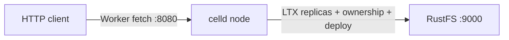
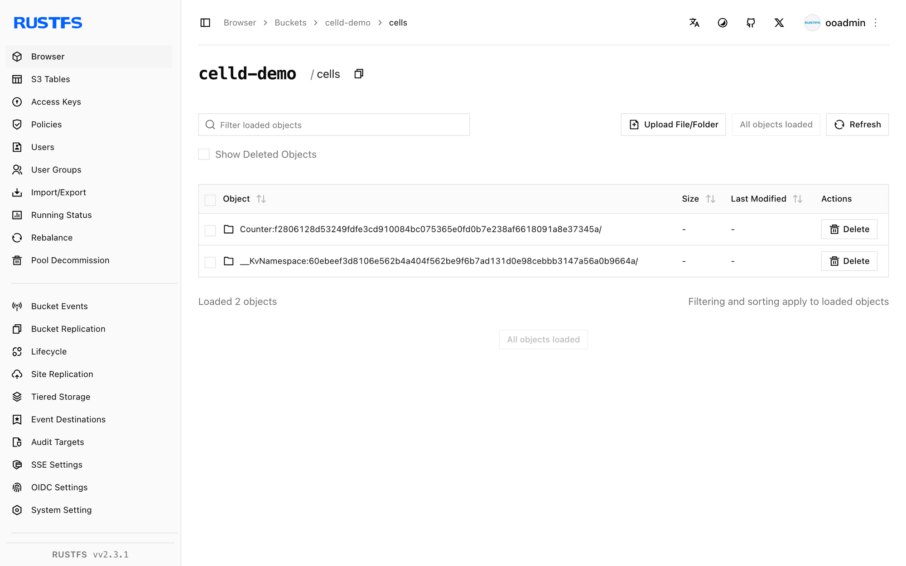

This guide connects [celld](https://github.com/denoland/celld) — the self-hosted, distributed Durable Objects runtime from Denoland — to **RustFS** as its fleet bucket. You will run `celld diagnose` against a RustFS bucket (including the conditional-write probe), deploy a Counter worker, mutate Durable Object state over HTTP, restart celld, and confirm the state survives. The workflow was verified with celld v0.6.2 against `rustfs/rustfs-x86-musl:v2.3.1`.

You need the `celld` binary, `esbuild` (for bundling), and Node.js to drive the deployed worker.

## Architecture



celld keeps only a local WAL. Every committed SQLite write is captured in LTX format and uploaded to the fleet bucket; a conditional bucket write (put-if-not-exists) assigns node ownership. The bucket is the source of truth — nodes can crash or restart without losing Durable Object state.

## 1. Install celld

```bash
curl -sLo /tmp/celld.gz \
  https://github.com/denoland/celld/releases/download/v0.6.2/celld-x86_64-unknown-linux-gnu.gz
gunzip /tmp/celld.gz && chmod +x /tmp/celld
mv /tmp/celld /usr/local/bin/celld
celld --version
```

```text
celld 0.6.2
```

Install esbuild as well — `celld deploy` bundles workers with it:

```bash
npm install -g esbuild
```

## 2. Diagnose the bucket

`celld diagnose` probes the bucket including the conditional write that celld requires for ownership fencing:

```bash
export S3_ENDPOINT=http://<your-rustfs-endpoint>:9000
export AWS_REGION=us-east-1
export AWS_ACCESS_KEY_ID=<your-access-key>
export AWS_SECRET_ACCESS_KEY=<your-secret-key>

rc mb rustfs/celld-demo
celld diagnose --bucket s3://celld-demo
```

```text
ok listen 127.0.0.1:18080: bind check; diagnose does not serve
ok bucket s3://celld-demo
ok bucket conditional write: create, reject-create, update, reject-stale
ok fleet: 0 node lease(s) enumerated
```

`ok bucket conditional write` is the important line — RustFS supports put-if-not-exists natively, so no fallback storage is needed.

## 3. Start a node

A non-loopback `--listen` requires an explicit `--internal-listen`:

```bash
nohup celld --bucket s3://celld-demo \
  --listen 0.0.0.0:18080 \
  --internal-listen 0.0.0.0:9099 \
  --advertise 127.0.0.1:9099 > /opt/celld/celld.out 2>&1 &
```

```text
INFO celld: host runtime initialized event="host_runtime" worker_count=4
INFO celld::fleet: no deployment yet; run `celld deploy` ...
```

## 4. Deploy the Counter worker

Use the counter example from the celld repository — a Durable Object that increments `n` in SQLite storage on every request:

```bash
curl -sLo /tmp/celld.zip https://codeload.github.com/denoland/celld/zip/refs/tags/v0.6.2
unzip /tmp/celld.zip -d /opt/celld
cd /opt/celld/celld-0.6.2/examples/counter
celld deploy . --bucket s3://celld-demo
```

```text
Uploaded counter (0.02 sec)
  s3://celld-demo/deploy/counter/bf5806589892a6cc
Current Version ID: bf5806589892a6cc
```

## 5. Mutate Durable Object state

Each request routes to the `Counter` Durable Object, which reads `n` from storage, increments, and writes it back:

```bash
curl -s "http://127.0.0.1:18080/?name=rustfs"
curl -s "http://127.0.0.1:18080/?name=rustfs"
curl -s "http://127.0.0.1:18080/?name=rustfs"
```

```json
{"n":1,"url":"http://127.0.0.1:18080/?name=rustfs"}
{"n":2,"url":"http://127.0.0.1:18080/?name=rustfs"}
{"n":3,"url":"http://127.0.0.1:18080/?name=rustfs"}
```

## 6. Restart celld and verify persistence

Kill the node, start it again, and hit the same URL — the counter continues from where it stopped, because the state was in RustFS the whole time:

```bash
pkill -f "celld --bucket"
nohup celld --bucket s3://celld-demo \
  --listen 0.0.0.0:18080 --internal-listen 0.0.0.0:9099 \
  --advertise 127.0.0.1:9099 > /opt/celld/celld2.out 2>&1 &
sleep 8
curl -s "http://127.0.0.1:18080/?name=rustfs"
```

```json
{"n":4,"url":"http://127.0.0.1:18080/?name=rustfs"}
```

List the bucket — the fleet state is all there:

```bash
rc ls rustfs/celld-demo/ -r | head -5
```

```text
cells/Counter:f2806128.../ltx/e1/0000/0000000000000001-0000000000000001.ltx
cells/Counter:f2806128.../own.json
deploy/counter/bf5806589892a6cc/index.js
deploy/counter/current.json
```



## 7. Stop or reset

```bash
pkill -f "celld --bucket"
rc rm rustfs/celld-demo/ --recursive --force
```

## Troubleshooting

### `bind --listen 127.0.0.0.1:8080 ... Address already in use`

Port 8080 is commonly taken (a local GitLab registry or dev server). Move the Worker listener: `--listen 0.0.0.0:18080`.

### `a non-loopback --listen requires an explicit --internal-listen`

Binding a public interface requires a separate peer listener: add `--internal-listen 0.0.0.0:9099 --advertise 127.0.0.1:9099`.

### `esbuild not found`

`celld deploy` bundles the worker with esbuild. Install it globally (`npm install -g esbuild`) or point `CELLD_ESBUILD` at the binary.

### `celld deploy` on the example prints `unknown command init for argo` at runtime

That means the executor container/pod is running an `argo` CLI binary instead of argoexec — a sign the wrong image was tagged as the executor in your cluster setup, unrelated to celld itself. On a plain host (no cluster) this does not occur.

## Next steps

- Compare with the [Cloudflare Durable Objects documentation](https://developers.cloudflare.com/durable-objects/) — celld runs the same programming model on your own bucket.
- Create dedicated production credentials with [Access Key Management](/security-compliance/iam/access-token).
- Follow the [celld README](https://github.com/denoland/celld) for multi-node fleets: point a second node at the same bucket and let conditional writes elect the owner.
