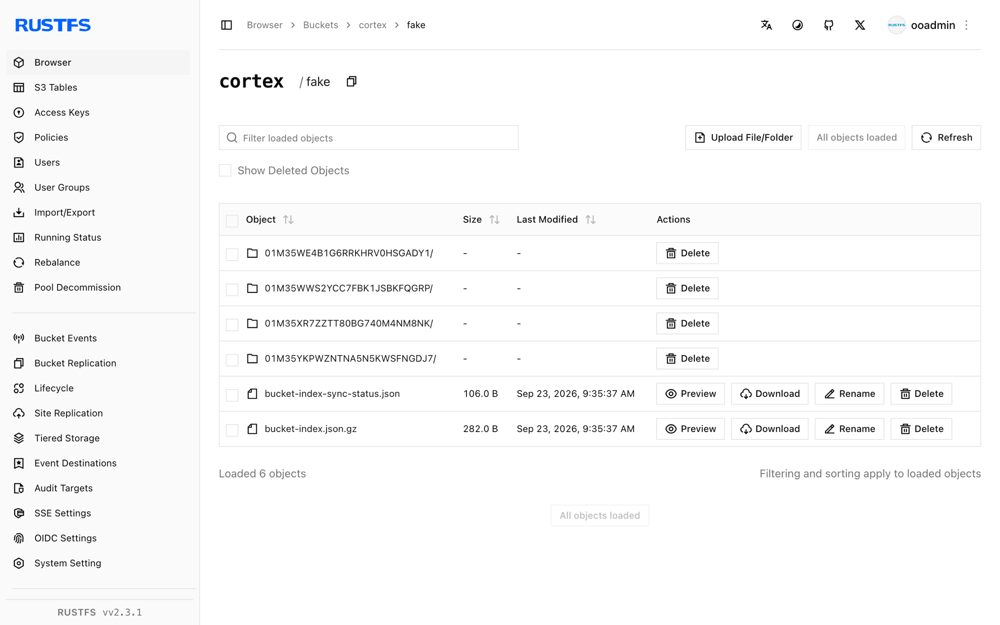

This guide connects [Cortex](https://github.com/cortexproject/cortex) — the horizontally scalable Prometheus-compatible metrics backend — to **RustFS** through Cortex's native S3 bucket storage. You will run Cortex in single-binary mode with blocks, ruler, and alertmanager storage pointed at a RustFS bucket, push metrics with remote write, store a rule group, and verify the objects. The workflow was verified with `cortexproject/cortex:v1.21.1` and `rustfs/rustfs-x86-musl:v2.3.1`.

You need Docker. This deployment is intended for local integration testing, not production.

## Architecture


Cortex stores every TSDB block, ruler rule group, and alertmanager configuration in object storage. Pointing the `s3` backend at RustFS makes the bucket the single source of truth for all tenant data.

## 1. Create the Cortex config

Create the config file, replacing all connection placeholders:

```yaml title="cortex.yaml"
target: all
auth_enabled: false

server:
  http_listen_port: 9009

distributor:
  shard_by_all_labels: true
  pool:
    health_check_ingesters: true

ingester:
  lifecycler:
    min_ready_duration: 0s
    final_sleep: 0s
    num_tokens: 512
    ring:
      kvstore:
        store: inmemory
      replication_factor: 1

blocks_storage:
  backend: s3
  s3: &s3
    endpoint: <your-rustfs-endpoint>:9000
    region: us-east-1
    bucket_name: cortex
    access_key_id: <your-access-key>
    secret_access_key: <your-secret-key>
    insecure: true
    bucket_lookup_type: path
  tsdb:
    dir: /data/tsdb
    block_ranges_period: [15m]
    ship_interval: 30s
  bucket_store:
    sync_dir: /data/tsdb-sync
    bucket_index:
      enabled: true

compactor:
  data_dir: /data/compactor
  sharding_ring:
    kvstore:
      store: inmemory

ruler:
  enable_api: true
  rule_path: /data/ruler

ruler_storage:
  backend: s3
  s3:
    <<: *s3

alertmanager:
  external_url: /alertmanager
  enable_api: true
  data_dir: /data/alertmanager

alertmanager_storage:
  backend: s3
  s3:
    <<: *s3
```

Cortex names the bucket field `bucket_name` and controls addressing with `bucket_lookup_type: path`. `insecure: true` allows the plain-HTTP endpoint. The `block_ranges_period` and `ship_interval` values shorten the block cycle so the test produces objects quickly; keep the defaults in production.

## 2. Run Cortex

Create the bucket and start Cortex on the same Docker network as RustFS:

```bash
rc mb rustfs/cortex

docker run -d --name cortex --network oo-rustfs_default -p 9009:9009 \
  -v "$PWD/cortex.yaml":/etc/cortex/cortex.yaml:ro \
  -v /opt/cortex/data:/data \
  cortexproject/cortex:v1.21.1 -config.file=/etc/cortex/cortex.yaml
```

```text
ts=... caller=cortex.go:469 level=info msg="Cortex started"
```

## 3. Push metrics and rules

Start a Prometheus that scrapes itself and remote-writes into Cortex:

```yaml title="prometheus.yml"
global:
  scrape_interval: 5s
scrape_configs:
  - job_name: self
    static_configs:
      - targets: ["localhost:9090"]
remote_write:
  - url: http://cortex:9009/api/v1/push
```

```bash
docker run -d --name prom-writer --network oo-rustfs_default \
  -v "$PWD/prometheus.yml":/etc/prometheus/prometheus.yml:ro \
  prom/prometheus:latest --config.file=/etc/prometheus/prometheus.yml
```

Store a rule group through the ruler API:

```bash
cat > rules.yaml << "EOF"
name: rustfs-demo
rules:
  - alert: RustFSAlwaysFiring
    expr: vector(1)
    labels:
      severity: demo
    annotations:
      summary: "demo alert stored in RustFS"
EOF

curl -s -o /dev/null -w "%{http_code}\n" \
  -X POST http://localhost:9009/api/v1/rules/rustfs-demo \
  --data-binary @rules.yaml -H "Content-Type: application/yaml"
```

```text
202
```

Query the ingested series back:

```bash
curl -s "http://localhost:9009/prometheus/api/v1/query?query=up"
```

```text
{"status":"success","data":{"resultType":"vector","result":[{"metric":{"__name__":"up",...},"value":[...,"1"]}]}}
```

## 4. Verify objects in RustFS

List the bucket prefixes:

```bash
rc ls rustfs/cortex/ -r
```

The ruler config landed immediately, and the ingester shipped two TSDB blocks (each with `chunks`, `index`, and `meta.json`):

```text
fake/01M35WE4B1G6RRKHRV0HSGADY1/chunks/000001
fake/01M35WE4B1G6RRKHRV0HSGADY1/index
fake/01M35WE4B1G6RRKHRV0HSGADY1/meta.json
fake/01M35WWS2YCC7FBK1JSBKFQGRP/chunks/000001
fake/01M35WWS2YCC7FBK1JSBKFQGRP/index
fake/01M35WWS2YCC7FBK1JSBKFQGRP/meta.json
rules/fake/cnVzdGZzLWRlbW8=/cnVzdGZzLWRlbW8=
```



## 5. Stop or reset

To tear down the demo while keeping the bucket objects:

```bash
docker rm -f cortex prom-writer
```

To delete the stored data:

```bash
rc rm rustfs/cortex/ --recursive --force
```

## Troubleshooting

### `field bucket not found in type s3.Config`

Cortex uses `bucket_name`, not `bucket`. Path-style addressing is set with `bucket_lookup_type: path` — the `force_path_style` key used by Thanos does not exist in Cortex.

### Blocks never appear in the bucket

The ingester only ships a block after the head is compacted at a `block_ranges_period` boundary (default 2h). For tests, set a small range such as `[15m]` together with `ship_interval: 30s` and wait for one period.

### `Unauthorized` or empty bucket listings

Confirm `access_key_id` and `secret_access_key` are present in every `s3` block that uses the bucket, and that `insecure: true` matches the plain-HTTP endpoint.

## Next steps

- Review [S3 compatibility notes](/administration/protocols/s3) before adopting additional Cortex storage options.
- Create dedicated production credentials with [Access Key Management](/security-compliance/iam/access-token).
- Combine Cortex with [Thanos](/developer/integration/observability/thanos) when you need block storage for long-term Prometheus data as well.
