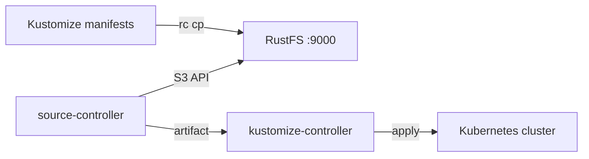

This guide connects [Flux CD](https://github.com/fluxcd/flux2) — the GitOps toolkit for Kubernetes — to **RustFS** through the source-controller Bucket API. You will seed a RustFS bucket with Kubernetes manifests, register the bucket as a Flux `Bucket` source with the `generic` provider, and let a Kustomization apply everything it contains. The workflow was verified with `flux v2.9.5` (source-controller) on `k3s v1.36.4+k3s1` against `rustfs/rustfs-x86-musl:v2.3.1`.

You need a Kubernetes cluster with Flux installed (`flux install`) and the `rc` client. This deployment is intended for local integration testing, not production.

## Architecture



The source-controller lists and downloads objects from the bucket over the S3 API, packs them into an artifact, and the kustomize-controller applies the manifests from that artifact. RustFS acts as the pull-based source of truth for the cluster.

## 1. Seed the bucket

Store a Kustomize overlay in the bucket, replacing all connection placeholders:

```yaml title="clusters/staging/kustomization.yaml"
apiVersion: kustomize.config.k8s.io/v1beta1
kind: Kustomization
resources:
  - rustfs-demo-configmap.yaml
```

```yaml title="clusters/staging/rustfs-demo-configmap.yaml"
apiVersion: v1
kind: ConfigMap
metadata:
  name: rustfs-flux-demo
  namespace: default
data:
  storage: rustfs
  source: s3-bucket
```

Upload the files:

```bash
rc mb rustfs/flux-src
rc cp --recursive ./clusters rustfs/flux-src/
rc ls rustfs/flux-src/ -r
```

```text
staging/kustomization.yaml
staging/rustfs-demo-configmap.yaml
```

## 2. Create the credentials secret

Flux reads the credentials from a secret in the same namespace as the source, using lowercase keys:

```bash
kubectl -n flux-system create secret generic rustfs-creds \
  --from-literal=accesskey=<your-access-key> \
  --from-literal=secretkey=<your-secret-key>
```

The field names must be `accesskey` and `secretkey` — capitalization such as `accessKey` fails with an `AuthenticationFailed` status.

## 3. Register the Bucket source

Create the Bucket source with the `generic` provider:

```bash
flux create source bucket rustfs-demo \
  --bucket-name=flux-src \
  --endpoint=<your-rustfs-endpoint>:9000 \
  --insecure \
  --secret-ref=rustfs-creds \
  --provider=generic \
  --interval=30s \
  --namespace=flux-system
```

```text
✔ Bucket source reconciliation completed
```

If reconciliation is still running, check the status with `flux get sources bucket`:

```text
NAME        REVISION       SUSPENDED READY MESSAGE
rustfs-demo sha256:481816d1 False     True  stored artifact: revision 'sha256:481816d1'
```

The `generic` provider uses path-style requests and plain HTTP with `--insecure`, so the endpoint is the bare `host:port`.

## 4. Apply the manifests

Create a Kustomization that consumes the artifact:

```bash
flux create kustomization rustfs-demo \
  --source=Bucket/rustfs-demo \
  --path="./staging" \
  --prune=true \
  --interval=30s \
  --namespace=flux-system
```

```text
✔ applied revision sha256:481816d1
```

Confirm the manifest landed on the cluster:

```bash
kubectl -n default get configmap rustfs-flux-demo -o jsonpath="{.data}"
```

```text
{"source":"s3-bucket","storage":"rustfs"}
```

## 5. Stop or reset

Suspend or delete the Flux resources without touching the bucket:

```bash
flux suspend source bucket rustfs-demo --namespace=flux-system
flux delete kustomization rustfs-demo --namespace=flux-system
```

To delete the bucket contents:

```bash
rc rm rustfs/flux-src/ --recursive --force
```

## Troubleshooting

### `invalid 'rustfs-creds' secret data: required fields 'accesskey' and 'secretkey'`

The secret keys are lowercase. Recreate the secret with `accesskey` and `secretkey` as literal key names.

### Reconciliation never becomes ready

Confirm the endpoint is reachable from inside the cluster — pods cannot use `localhost`, so point the source at the host IP or the Docker bridge gateway (commonly `172.17.0.1`) that publishes the RustFS port. `--insecure` is required for plain HTTP.

### `AuthenticationFailed` despite valid credentials

Check that the secret lives in the same namespace as the Bucket source and that the keys have no trailing whitespace or quoting.

## Next steps

- Review [S3 compatibility notes](/administration/protocols/s3) before adopting additional source types.
- Create dedicated production credentials with [Access Key Management](/security-compliance/iam/access-token).
- Follow the [Flux Bucket source documentation](https://fluxcd.io/flux/components/source/buckets/) to combine bucket sources with Helm releases and image automation.
