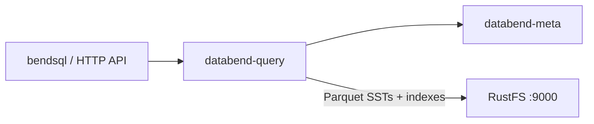
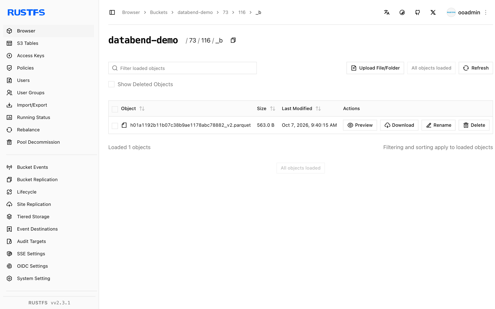

This guide connects [Databend](https://github.com/datafuselabs/databend) — the open-source cloud data warehouse — to **RustFS** as its object storage backend. You will start the meta service and query node, point the storage backend at a RustFS bucket, create a database and table, and verify the Parquet files in the bucket. The workflow was verified with Databend v1.2.925-patch-13 against `rustfs/rustfs-x86-musl:v2.3.1`.

You need the Databend release tarball on a Linux host (or Docker). This deployment is intended for local integration testing, not production.

## Architecture



Databend stores table data as Parquet files with bloom-filter indexes in object storage, so the bucket holds the entire table dataset and the query node stays stateless.

## 1. Download and install

Grab a release tarball and unpack the binaries:

```bash
curl -Lo /tmp/databend.tgz \
  "https://github.com/datafuselabs/databend/releases/download/v1.2.925-patch-13/databend-v1.2.925-patch-13-x86_64-unknown-linux-gnu.tar.gz"
tar -xzf /tmp/databend.tgz -C /opt
```

Create the data directories:

```bash
mkdir -p /opt/databend/data /opt/databend/logs /opt/databend/meta-logs
```

## 2. Configure the meta service

Create `databend-meta.toml` — note the top-level addresses and the `[raft_config]` section with `single = true`:

```toml title="databend-meta.toml"
admin_api_address = "0.0.0.0:28002"
grpc_api_address = "0.0.0.0:9191"
grpc_api_advertise_host = "127.0.0.1"

[log]
[log.file]
level = "INFO"
dir = "/opt/databend/meta-logs"

[raft_config]
id = 0
raft_dir = "/opt/databend/data/raft"
raft_api_port = 28004
raft_listen_host = "127.0.0.1"
raft_advertise_host = "127.0.0.1"
single = true
```

## 3. Configure the query node

Create `databend-query.toml`. The `tenant_id` and `cluster_id` keys must live inside the `[query]` section, and `[storage.s3]` points at RustFS:

```toml title="databend-query.toml"
[query]
username = "databend"
tenant_id = "default"
cluster_id = "rustfs-demo"
flight_api_address = "127.0.0.1:9091"
metric_api_address = "127.0.0.1:7071"
admin_api_address = "127.0.0.1:8081"

[[query.users]]
name = "databend"
auth_type = "no_password"

[log]
[log.file]
dir = "/opt/databend/logs"

[meta]
endpoints = ["127.0.0.1:9191"]
username = "root"
password = "root"
client_timeout_in_second = 20
auto_sync_interval = 60

[storage]
type = "s3"

[storage.s3]
bucket = "databend-demo"
endpoint_url = "http://<your-rustfs-endpoint>:9000"
access_key_id = "<your-access-key>"
secret_access_key = "<your-secret-key>"
enable_virtual_host_style = false
```

Keep all keys before the `[[query.users]]` array entry — TOML treats everything after it as part of that array element, and misplaced keys fail validation with confusing errors.

## 4. Start the services

```bash
nohup /opt/databend/bin/databend-meta -c /opt/databend/databend-meta.toml > /opt/databend/meta.out 2>&1 &
sleep 10
nohup /opt/databend/bin/databend-query -c /opt/databend/databend-query.toml > /opt/databend/query.out 2>&1 &
sleep 20
```

## 5. Create a table and query

Databend serves an HTTP API on port 8000. Create a database and a table, insert rows, and read them back — quotes inside SQL must be single quotes (double quotes mean identifiers):

```bash
curl -s -m 90 -u databend: http://127.0.0.1:8000/v1/query \
  -H "Content-Type: application/json" \
  -d '{"sql": "CREATE DATABASE rustfs_demo; CREATE TABLE rustfs_demo.events (id INT, label STRING);"}' | head -c 120

curl -s -m 120 -u databend: http://127.0.0.1:8000/v1/query \
  -H "Content-Type: application/json" \
  -d "{\"sql\": \"INSERT INTO rustfs_demo.events VALUES (1,'alpha'),(2,'beta'),(3,'gamma')\"}" | head -c 120

curl -s -m 120 -u databend: http://127.0.0.1:8000/v1/query \
  -H "Content-Type: application/json" \
  -d "{\"sql\": \"SELECT * FROM rustfs_demo.events ORDER BY id\"}" | head -c 300
```

```text
{"id":"...","state":"Succeeded",...,"data":[["1","alpha"],["2","beta"],["3","gamma"]],...}
```

## 6. Verify objects in RustFS

List the bucket — the table lives as Parquet blocks with index files under numeric prefixes:

```bash
rc ls rustfs/databend-demo/ -r | head -4
```

```text
73/116/_b/h01a1192b11b07c38b9ae1178abc78882_v2.parquet
73/116/_i_b_v2/01a1192b11b07c38b9ae1178abc78882_v4.parquet
```



## 7. Stop or reset

```bash
pkill -f databend-query; pkill -f databend-meta
rc rm rustfs/databend-demo/ --recursive --force
```

## Troubleshooting

### `cluster_id is empty without resources management`

`tenant_id` and `cluster_id` were placed outside the `[query]` section. In TOML, every key belongs to the most recent section header — move them back under `[query]`.

### `CannotListenerPort ... 127.0.0.1:9090`

The flight API defaults to 9090, which other local services often occupy. Set `flight_api_address`, `metric_api_address`, and `admin_api_address` to free ports inside `[query]`.

### Query returns `Authentication error: no authorization header provided`

The HTTP API requires basic auth matching the `[[query.users]]` entry, e.g. `-u databend:` with `auth_type = "no_password"`.

### `Unknown table` right after CREATE succeeded

Double-quoted strings in SQL are identifiers, not literals. Use single quotes for VALUES and for the CONNECTION/LOCATION options.

## Next steps

- Review [S3 compatibility notes](/administration/protocols/s3) before adopting additional Databend storage options.
- Create dedicated production credentials with [Access Key Management](/security-compliance/iam/access-token).
- Follow the [Databend documentation](https://docs.databend.com/) for multi-node clusters and share tables on top of the same bucket.
