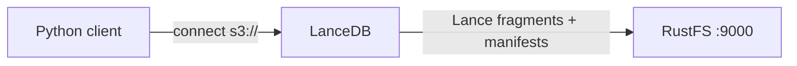
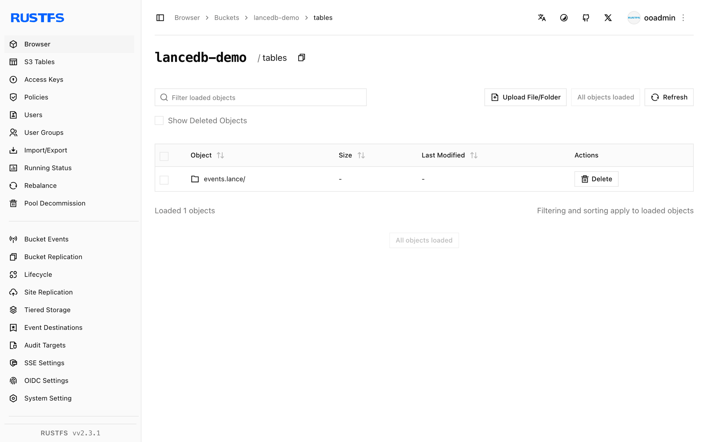

This guide connects [LanceDB](https://github.com/lancedb/lancedb) — the open-source vector database built on the Lance columnar format — to **RustFS** as its storage backend. You will create a vector table directly at an `s3://` location, add rows, run a vector search, and confirm the Lance table files in the bucket. The workflow was verified with the `lancedb` Python package against `rustfs/rustfs-x86-musl:v2.3.1`.

You need Python 3.9 or newer. This deployment is intended for local integration testing, not production.

## Architecture



LanceDB is embedded: there is no server to run. The Python (or Rust, or JavaScript) client talks to the bucket directly, storing each table as a `*.lance` directory with data fragments, version manifests, and transaction logs.

## 1. Install the client

```bash
pip install lancedb
```

## 2. Create a table on RustFS

Connect straight to the bucket and create a table, replacing all connection placeholders. The `storage_options` keys follow Lance's object-store conventions; custom endpoints use path-style addressing:

```python title="lance_s3.py"
import lancedb

storage_options = {
    "endpoint": "http://<your-rustfs-endpoint>:9000",
    "access_key_id": "<your-access-key>",
    "secret_access_key": "<your-secret-key>",
    "region": "us-east-1",
    "allow_http": "true",
}

db = lancedb.connect("s3://<your-bucket>/tables", storage_options=storage_options)

rows = [{"id": i, "label": f"row-{i}", "vector": [float(i) / 10, 0.5, 0.25, 0.1] * 2}
        for i in range(5)]
table = db.create_table("events", data=rows)
print("created:", table.count_rows(), "rows")

table.add([{"id": 99, "label": "query-target", "vector": [0.9, 0.5, 0.25, 0.1] * 2}])
print("after add:", table.count_rows(), "rows")
```

```text
created: 5 rows
after add: 6 rows
```

The table URI uses the `s3://bucket/prefix` form; every write and read goes to RustFS over its S3 API.

## 3. Run a vector search

```python title="lance_search.py"
import lancedb

db = lancedb.connect("s3://<your-bucket>/tables", storage_options=storage_options)
table = db.open_table("events")

res = table.search([0.9, 0.5, 0.25, 0.1] * 2).limit(3).to_list()
print("top3:", [(r["id"], r["label"]) for r in res])
print("version:", table.version)
```

```text
top3: [(99, 'query-target'), (4, 'row-4'), (3, 'row-3')]
version: 2
```

The nearest neighbor is the row added in the previous step, and the version counter reflects the two commits (create and add).

## 4. Verify objects in RustFS

List the table prefix:

```bash
rc ls rustfs/<your-bucket>/ -r
```

Each table is a `.lance` directory holding data fragments, version manifests, and transaction records:

```text
tables/events.lance/_transactions/0-b93cf795-fc3d-4bc9-88c8-e37baeefdd46.txn
tables/events.lance/_versions/18446744073709551613.manifest
tables/events.lance/data/101101011110110010000100e7a149411b847dbad6ebc7d47e.lance
```

Multiple tables share the bucket under the `tables/` prefix, so one bucket can back an entire LanceDB workspace.



## 5. Stop or reset

LanceDB holds no server state. To delete the table:

```bash
rc rm rustfs/<your-bucket>/tables/ --recursive --force
```

## Troubleshooting

### Connection or signature errors on first use

Confirm `endpoint` includes the scheme, `allow_http` is `"true"` for plain-HTTP endpoints, and the bucket exists. The `region` value is required by the S3 signer even though RustFS ignores it.

### `Table not found` after creating it

LanceDB lists the bucket prefix to discover tables. A stale client cache or a wrong `tables/` prefix in the URI makes new tables invisible; reconnect with the same URI used at creation time.

### Slow bulk loads over the network

Lance writes one fragment per commit. For large imports, batch rows into fewer `table.add` calls — each call produces a new data file in the bucket.

## Next steps

- Review [S3 compatibility notes](/administration/protocols/s3) before adopting additional LanceDB storage options.
- Create dedicated production credentials with [Access Key Management](/security-compliance/iam/access-token).
- Follow the [LanceDB documentation](https://lancedb.github.io/lancedb/) for ANN indexes, hybrid search, and multi-tenant bucket layouts on top of the same backend.
