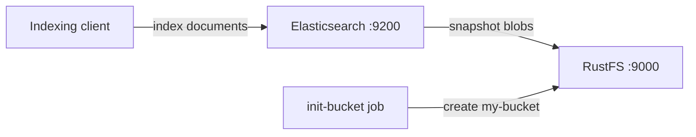
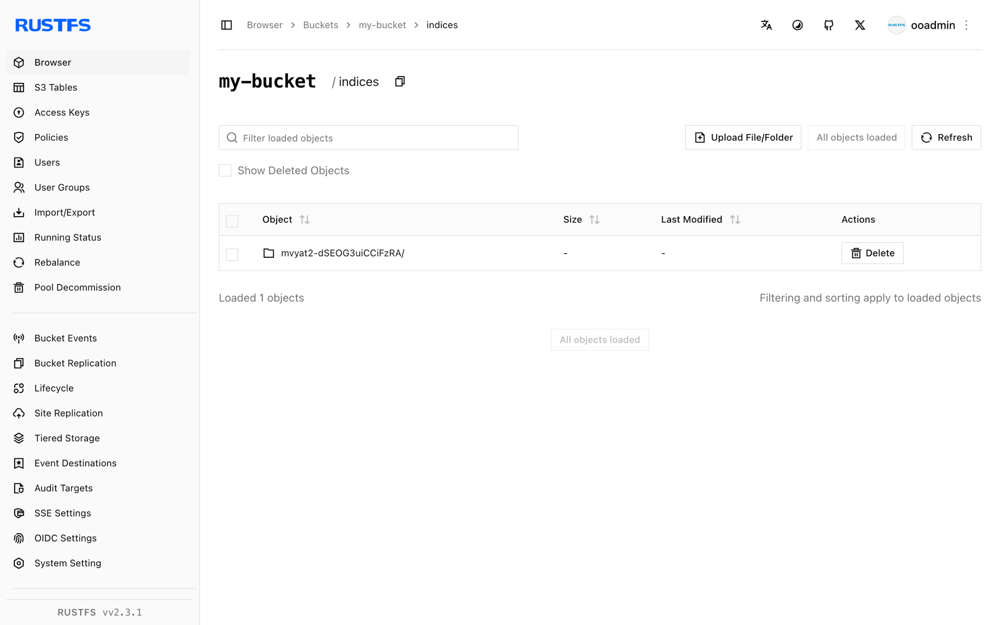

This guide connects [Elasticsearch](https://github.com/elastic/elasticsearch) — the distributed search and analytics engine — to **RustFS** as the S3 snapshot repository for its indices. You will start Elasticsearch with the `repository-s3` plugin, register a snapshot repository backed by RustFS, index documents, take a snapshot, and prove the full cycle by deleting the index and restoring it from RustFS. The workflow was verified with `docker.elastic.co/elasticsearch/elasticsearch:8.18.0` and `rustfs/rustfs-x86-musl:v2.3.1`.

You need Docker with the Compose plugin. This deployment is intended for local integration testing, not production.

## Architecture



Elasticsearch stores its primary data on local disks and offloads index backups to a snapshot repository. The `repository-s3` plugin writes snapshot metadata and shard data blobs to RustFS through the S3 API with path-style addressing over plain HTTP.

## 1. Create the project files

Create a working directory:

```bash
mkdir rustfs-elasticsearch
cd rustfs-elasticsearch
```

Create an environment file and replace both credential placeholders:

```ini title=".env"
RUSTFS_ACCESS_KEY=<your-access-key>
RUSTFS_SECRET_KEY=<your-secret-key>
```

Use dedicated credentials for the bucket. Do not commit `.env` to source control.

Elasticsearch splits its S3 settings between `elasticsearch.yml` (non-secret values) and the keystore (credentials). Create the configuration file:

```yaml title="elasticsearch.yml"
discovery.type: single-node
xpack.security.enabled: false
s3.client.default.endpoint: "rustfs:9000"
s3.client.default.protocol: "http"
s3.client.default.path_style_access: "true"
s3.client.default.region: "us-east-1"
```

Create the Compose file:

```yaml title="compose.yaml"
services:
  rustfs:
    image: rustfs/rustfs-x86-musl:v2.3.1
    environment:
      RUSTFS_ACCESS_KEY: ${RUSTFS_ACCESS_KEY}
      RUSTFS_SECRET_KEY: ${RUSTFS_SECRET_KEY}
      RUSTFS_VOLUMES: /data
      RUSTFS_ADDRESS: ":9000"
      RUSTFS_CONSOLE_ADDRESS: ":9001"
      RUSTFS_CONSOLE_ENABLE: "true"
    volumes:
      - rustfs-data:/data
    ports:
      - "9000:9000"
      - "9001:9001"
    healthcheck:
      test: ["CMD", "curl", "-sf", "http://127.0.0.1:9000/health"]
      interval: 10s
      timeout: 5s
      retries: 6
      start_period: 10s
    networks:
      - es

  create-bucket:
    image: rustfs/rc:latest
    depends_on:
      rustfs:
        condition: service_healthy
    environment:
      RUSTFS_ACCESS_KEY: ${RUSTFS_ACCESS_KEY}
      RUSTFS_SECRET_KEY: ${RUSTFS_SECRET_KEY}
    entrypoint:
      - /bin/sh
      - -c
      - |
        until /usr/bin/rc alias set rustfs http://rustfs:9000 "$${RUSTFS_ACCESS_KEY}" "$${RUSTFS_SECRET_KEY}"; do
          echo "Waiting for RustFS..."
          sleep 2
        done
        /usr/bin/rc ls rustfs/my-bucket >/dev/null 2>&1 || /usr/bin/rc mb rustfs/my-bucket
    networks:
      - es

  elasticsearch:
    image: docker.elastic.co/elasticsearch/elasticsearch:8.18.0
    environment:
      ES_JAVA_OPTS: "-Xms512m -Xmx512m"
    volumes:
      - ./elasticsearch.yml:/usr/share/elasticsearch/config/elasticsearch.yml:ro
    entrypoint: >
      bash -c '
        bin/elasticsearch-plugin install --batch repository-s3 &&
        echo "$${RUSTFS_ACCESS_KEY}" | bin/elasticsearch-keystore add -f -x s3.client.default.access_key &&
        echo "$${RUSTFS_SECRET_KEY}" | bin/elasticsearch-keystore add -f -x s3.client.default.secret_key &&
        exec bin/elasticsearch'
    ports:
      - "9200:9200"
    depends_on:
      create-bucket:
        condition: service_completed_successfully
    networks:
      - es

networks:
  es:

volumes:
  rustfs-data:
```

`repository-s3` is a bundled plugin and installs without network access. Only the access key and secret key belong in the keystore — non-secure settings such as the endpoint must live in `elasticsearch.yml`, otherwise the node refuses to start.

## 2. Start the deployment

Resolve the Compose file before starting containers:

```bash
docker compose config
```

Start the services and wait for Elasticsearch to finish booting (the first start installs the plugin and creates the keystore entries, which takes a minute or two):

```bash
docker compose up -d
curl -s http://localhost:9200
```

## 3. Register the snapshot repository and index documents

Register RustFS as the snapshot repository, create an index, and index five documents:

```bash
curl -s -X PUT "http://localhost:9200/_snapshot/rustfs_repo" \
  -H "Content-Type: application/json" \
  -d '{"type":"s3","settings":{"bucket":"my-bucket"}}'

curl -s -X PUT "http://localhost:9200/rustfs_index" \
  -H "Content-Type: application/json" \
  -d '{"mappings":{"properties":{"label":{"type":"keyword"}}}}'

for v in 1 2 3 4 5; do
  curl -s -X POST "http://localhost:9200/rustfs_index/_doc" \
    -H "Content-Type: application/json" \
    -d "{\"label\":\"rustfs-es-doc-$v\",\"value\":$v}" > /dev/null
done
curl -s -X POST "http://localhost:9200/rustfs_index/_refresh" > /dev/null
curl -s "http://localhost:9200/rustfs_index/_count"
```

```text
{"count":5,...}
```

## 4. Take a snapshot

Create a snapshot with `wait_for_completion` so the result is known immediately:

```bash
curl -s -X PUT "http://localhost:9200/_snapshot/rustfs_repo/snap1?wait_for_completion=true"
```

```text
{"snapshot":{"snapshot":"snap1",...,"indices":["rustfs_index"],"shards":{"total":1,"failed":0,"successful":1}}}
```

## 5. Verify objects in RustFS

List the snapshot objects through the bucket-initializer image:

```bash
docker compose run --rm --entrypoint /bin/sh create-bucket -c \
  '/usr/bin/rc alias set rustfs http://rustfs:9000 "$RUSTFS_ACCESS_KEY" "$RUSTFS_SECRET_KEY" >/dev/null && /usr/bin/rc ls rustfs/my-bucket/indices --recursive'
```

Snapshot metadata and shard data blobs live under `indices/` in the bucket:

```text
[2026-09-21 02:58:01]   3.56 KiB indices/mvyat2-dSEOG3uiCCiFzRA/0/__LbLsSgUUTpqji_EXvqHYCg
[2026-09-21 02:58:01]   3.21 KiB indices/mvyat2-dSEOG3uiCCiFzRA/0/__VIuGNJn3RB-RBWvr4tMn7Q
[2026-09-21 02:58:01]   1.00 KiB indices/mvyat2-dSEOG3uiCCiFzRA/0/index-e9P8q6E9QhitpkiOdgjVDQ
```

You can also browse the prefix in the RustFS Console:



## 6. Restore the index from RustFS

Delete the index, then restore it from the snapshot:

```bash
curl -s -X DELETE "http://localhost:9200/rustfs_index" > /dev/null
curl -s -X POST "http://localhost:9200/_snapshot/rustfs_repo/snap1/_restore?wait_for_completion=true" > /dev/null
curl -s "http://localhost:9200/rustfs_index/_count"
```

```text
{"count":5,...}
```

The documents come back because the snapshot blobs were read from RustFS.

## 7. Stop or reset the stack

Stop the containers while keeping the RustFS data volume:

```bash
docker compose down
```

To delete the snapshots and start from an empty RustFS volume, explicitly include `--volumes`:

```bash
docker compose down --volumes
```

## Troubleshooting

### The node refuses to start with "non-secure setting ... must be stored inside elasticsearch.yml"

Only `s3.client.default.access_key` and `s3.client.default.secret_key` belong in the keystore. Endpoint, protocol, path-style access, and region are non-secure settings and must be defined in `elasticsearch.yml`.

### Restored or new shards stay unassigned

Elasticsearch stops allocating shards when disk usage passes the low watermark (85 percent by default). Free disk space, or disable the check for a local test:

```bash
curl -s -X PUT "http://localhost:9200/_cluster/settings" \
  -H "Content-Type: application/json" \
  -d '{"transient":{"cluster.routing.allocation.disk.threshold_enabled":false}}'
```

### Restore fails because the index already exists

A previous failed restore leaves the index behind. Delete it with `DELETE /rustfs_index` and run the restore again.

### AccessDenied or 403 responses

Confirm that the credentials in the keystore match the RustFS credentials and that the `create-bucket` service completed successfully:

```bash
docker compose logs create-bucket
```

## Next steps

- Review [S3 compatibility notes](/administration/protocols/s3) before adopting additional S3 operations.
- Create dedicated production credentials with [Access Key Management](/security-compliance/iam/access-token).
- Follow the [Elasticsearch snapshot documentation](https://www.elastic.co/guide/en/elasticsearch/reference/current/snapshot-restore.html) for snapshot lifecycle management (SLM).
