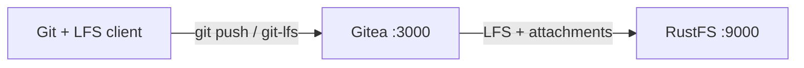
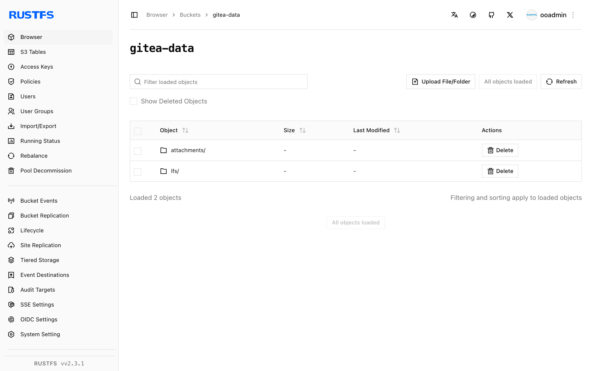

This guide connects [Gitea](https://github.com/go-gitea/gitea) — the self-hosted Git service — to **RustFS** through Gitea's `minio` storage type. You will start Gitea with Docker Compose, create a repository, push a Git LFS object, attach a file to an issue, and verify that both the LFS object and the attachment are stored in RustFS. The workflow was verified with `gitea/gitea:1.24.4` and `rustfs/rustfs-x86-musl:v2.3.1`.

You need Docker with the Compose plugin and the `git` and `git-lfs` clients on your workstation. This deployment is intended for local integration testing, not production.

## Architecture



Gitea stores the Git repository itself on its local disk, while the `minio` storage type routes large files — LFS objects, issue attachments, avatars, repository archives, packages, and Actions artifacts — to the `gitea-data` bucket in RustFS. Gitea creates the bucket on startup if it does not exist.

## 1. Create the project files

Create a working directory:

```bash
mkdir rustfs-gitea
cd rustfs-gitea
```

Create an environment file and replace both credential placeholders:

```ini title=".env"
RUSTFS_ACCESS_KEY=<your-access-key>
RUSTFS_SECRET_KEY=<your-secret-key>
```

Use dedicated credentials for the `gitea-data` bucket. Do not commit `.env` to source control.

Create the Gitea configuration and replace both credential placeholders with the same values you set in `.env` — the global `minio` storage type applies to LFS, attachments, avatars, repository archives, packages, and Actions artifacts:

```ini title="app.ini"
APP_NAME = RustFS Gitea
RUN_MODE = prod
WORK_PATH = /data/gitea

[server]
DOMAIN = localhost
ROOT_URL = http://localhost:3000/
HTTP_PORT = 3000
LFS_START_SERVER = true

[database]
DB_TYPE = sqlite3
PATH = /data/gitea/gitea.db

[storage]
STORAGE_TYPE = minio
MINIO_ENDPOINT = rustfs:9000
MINIO_ACCESS_KEY_ID = <your-access-key>
MINIO_SECRET_ACCESS_KEY = <your-secret-key>
MINIO_BUCKET = gitea-data
MINIO_LOCATION = us-east-1
MINIO_USE_SSL = false

[log]
MODE = console
LEVEL = info

[security]
INSTALL_LOCK = true
SECRET_KEY = change-me-to-a-random-string
```

`LFS_START_SERVER` enables the Git LFS HTTP API. `MINIO_ENDPOINT` uses the Compose-internal hostname `rustfs`; the endpoint is reached with path-style requests by default.

Create the Compose file:

```yaml title="compose.yaml"
services:
  rustfs:
    image: rustfs/rustfs-x86-musl:v2.3.1
    environment:
      RUSTFS_ACCESS_KEY: ${RUSTFS_ACCESS_KEY}
      RUSTFS_SECRET_KEY: ${RUSTFS_SECRET_KEY}
      RUSTFS_VOLUMES: /data
      RUSTFS_ADDRESS: ":9000"
      RUSTFS_CONSOLE_ADDRESS: ":9001"
      RUSTFS_CONSOLE_ENABLE: "true"
    volumes:
      - rustfs-data:/data
    ports:
      - "9000:9000"
      - "9001:9001"
    healthcheck:
      test: ["CMD", "curl", "-sf", "http://127.0.0.1:9000/health"]
      interval: 10s
      timeout: 5s
      retries: 6
      start_period: 10s
    networks:
      - gitea

  gitea:
    image: gitea/gitea:1.24.4
    depends_on:
      rustfs:
        condition: service_healthy
    environment:
      USER_UID: "1000"
      USER_GID: "1000"
    volumes:
      - gitea-data:/data
      - ./app.ini:/data/gitea/conf/app.ini:ro
    ports:
      - "3000:3000"
    networks:
      - gitea

networks:
  gitea:

volumes:
  rustfs-data:
  gitea-data:
```

The volume-backed `/data` directory keeps the SQLite database and the Git repositories across container restarts, while LFS objects and attachments live in RustFS.

## 2. Validate and start the deployment

Resolve the Compose file before starting containers:

```bash
docker compose config
```

Start the services:

```bash
docker compose up -d
docker compose ps
```

Watch the Gitea log until every storage backend reports the Minio type:

```bash
docker compose logs gitea | grep "Initialising"
```

The output should list `Attachment`, `Avatar`, `LFS`, and the remaining storage sections, each followed by a `Creating Minio storage at rustfs:9000:gitea-data` line.

Open `http://localhost:3000` and create the administrator account, then open the RustFS Console at `http://localhost:9001` — the `gitea-data` bucket appears after the first storage operation.

## 3. Push a Git LFS object

Create a repository named `rustfs-demo` in the Gitea web UI, then push an LFS-tracked file from your workstation:

```bash
mkdir lfs-demo && cd lfs-demo
git init
git config user.email you@example.com
git config user.name you
git lfs install
git lfs track "*.bin"
git add .gitattributes
dd if=/dev/urandom of=dataset.bin bs=1M count=8
git add dataset.bin
git commit -m "add LFS dataset"
git remote add origin http://localhost:3000/<your-username>/rustfs-demo.git
git push origin main
```

`git push` uploads the LFS object through the Gitea LFS API, which writes it to RustFS. Clone the repository into a second directory and run `git lfs pull` — the downloaded `dataset.bin` must be byte-identical to the original:

```bash
sha256sum dataset.bin
cd ../lfs-demo-clone && git lfs pull && sha256sum dataset.bin
```

Both checksums match because both clients read the object from RustFS.

## 4. Attach a file to an issue

Open the `rustfs-demo` repository, create an issue, and attach a small text file through the issue form. Gitea stores the upload as `attachments/<prefix>/<uuid>` in the `gitea-data` bucket and serves downloads through `/attachments/<uuid>`.

## 5. Verify objects in RustFS

List the bucket with the [`rc` client](https://github.com/rustfs/cli):

```bash
docker compose exec rustfs /usr/bin/rc ls local/gitea-data/ -r
```

The output should include the LFS object under `lfs/` and the attachment under `attachments/`:

```text
attachments/9/2/92fdd48d-531c-4cba-8b3f-4e2004a10fc7
lfs/37/76/6ddfc07e803de58a69328db9a58a07cf7080ddde55c155a7531bc650a000
```

The LFS object key is the SHA-256 content hash used by the Git LFS protocol.



## 6. Stop or reset the deployment

Stop the containers while keeping all data:

```bash
docker compose down
```

The RustFS volume keeps the `gitea-data` bucket, so LFS objects and attachments survive a restart. To delete everything, including the objects in RustFS, add `--volumes`.

## Troubleshooting

### The Gitea install page appears instead of the login page

The configuration file must exist at `/data/gitea/conf/app.ini` inside the container. If the mount path is wrong, Gitea starts with defaults and shows the installation wizard. Mount the file as shown in the Compose example and restart.

### Push fails with an LFS or 403 error

Confirm the credentials in `app.ini` match the RustFS credentials and that the `rustfs` hostname resolves inside the Compose network:

```bash
docker compose logs gitea | grep -i minio
```

### Objects land in local storage instead of RustFS

The `GITEA__storage__STORAGE_TYPE: minio` environment variable and the `[storage]` section of `app.ini` must agree. After changing either, restart Gitea and check the `Initialising` log lines again.

## Next steps

- Review [S3 compatibility notes](/administration/protocols/s3) before adopting additional Gitea storage targets.
- Create dedicated production credentials with [Access Key Management](/security-compliance/iam/access-token).
- Follow the [Gitea storage documentation](https://docs.gitea.com/administration/storage-configurations) to move packages, Actions artifacts, or individual storage sections to separate buckets.
