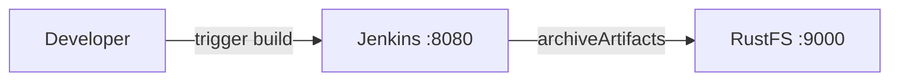
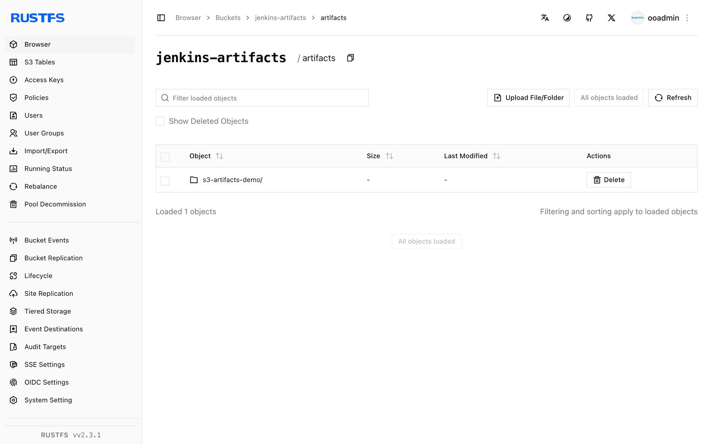

This guide connects [Jenkins](https://github.com/jenkinsci/jenkins) — the automation server — to **RustFS** through the Artifact Manager on S3 plugin. You will start Jenkins with the plugin, point its artifact manager at a RustFS bucket, run a job that archives an artifact, and verify that the artifact is stored in RustFS. The workflow was verified with `jenkins/jenkins:lts-jdk17` (Jenkins 2.5xx LTS) and `rustfs/rustfs-x86-musl:v2.3.1`.

You need Docker. This deployment is intended for local integration testing, not production.

## Architecture



With the plugin active, every job that publishes artifacts through the standard `archiveArtifacts` step (or `stash`/`unstash`) uploads them to the `jenkins-artifacts` bucket under the configured prefix instead of storing them on the controller disk.

## 1. Create the project files

Create the bucket first — the plugin validates the bucket but does not create it:

```bash
rc alias set rustfs http://<your-rustfs-endpoint>:9000 <your-access-key> <your-secret-key>
rc mb rustfs/jenkins-artifacts
```

Create a Dockerfile that installs the plugin into the Jenkins LTS image:

```dockerfile title="Dockerfile"
FROM jenkins/jenkins:lts-jdk17
USER root
RUN jenkins-plugin-cli --plugins artifact-manager-s3 aws-credentials
USER jenkins
```

The `artifact-manager-s3` plugin brings in the AWS credentials support it needs; listing `aws-credentials` explicitly keeps the credential type available.

Build and start Jenkins on the same Docker network as RustFS:

```bash
docker build -t jenkins-rustfs .
docker run -d --name jenkins --network oo-rustfs_default \
  -p 8080:8080 -v jenkins-home:/var/jenkins_home jenkins-rustfs
```

Complete the setup wizard, then create an AWS credential: **Manage Jenkins → Credentials → global → Add Credentials**, kind **AWS Credential**, ID `rustfs-creds`, with your RustFS access key and secret key.

## 2. Configure the artifact manager

Open **Manage Jenkins → AWS Configuration** (from the `aws-global-configuration` plugin) and set:

- **Region name**: `us-east-1`
- **Credentials**: `rustfs-creds`

Open **Manage Jenkins → System** and locate the **Artifact Management for Builds** section. Select **Cloud Provider Amazon S3**, and fill in the S3 configuration:

- **S3 Bucket Name**: `jenkins-artifacts`
- **S3 Bucket Region**: `us-east-1`
- **Base Prefix**: `artifacts/`
- **Custom Endpoint**: `<your-rustfs-endpoint>:9000` (for example `rustfs:9000` inside the Compose network)
- **Custom Signing Region**: `us-east-1`
- **Use Path Style URL**: enabled
- **Use Insecure HTTP**: enabled
- **Disable Session Token**: enabled

Path-style addressing and plain HTTP are required for a non-AWS endpoint without TLS. Disabling the session token stops the plugin from calling AWS STS, which a plain access key pair cannot answer. Click **Validate S3 Bucket configuration** to confirm the settings, then save.

## 3. Run a job that archives an artifact

Create a freestyle job (or pipeline) that produces a file and archives it:

```groovy
pipeline {
    agent any
    stages {
        stage('Build') {
            steps {
                sh 'echo "jenkins artifact stored on rustfs" > report.txt'
            }
        }
    }
    post {
        always {
            archiveArtifacts 'report.txt'
        }
    }
}
```

Run the build and wait for it to finish. The artifact upload goes to RustFS transparently — the job configuration does not mention S3 at all.

## 4. Verify objects in RustFS

List the bucket:

```bash
rc ls rustfs/jenkins-artifacts/ -r
```

The artifact is stored under the prefix, organized by job and build number:

```text
artifacts/s3-artifacts-demo/3/artifacts/report.txt
```



Downloading the artifact from the build page reads it back from RustFS.

## 5. Stop or reset the deployment

Stop Jenkins while keeping the data:

```bash
docker rm -f jenkins
```

The artifacts stay in the `jenkins-artifacts` bucket. To delete them, remove the bucket:

```bash
rc rb rustfs/jenkins-artifacts --force
```

## Troubleshooting

### `StsException: The security token included in the request is invalid`

The plugin is calling AWS STS to obtain session credentials. Enable **Disable Session Token** in the S3 configuration — a static access key pair cannot answer an STS call.

### `UnknownHostException: jenkins-artifacts.rustfs`

The plugin is using virtual-hosted addressing. Enable **Use Path Style URL** — RustFS resolves buckets from the URL path, not the hostname.

### `No valid session credentials` or empty credential errors

Confirm the AWS Configuration page has the credential selected and saved **before** the S3 bucket settings are used, and that the credential ID matches the one you created.

## Next steps

- Review [S3 compatibility notes](/administration/protocols/s3) before adopting additional Jenkins integrations.
- Create dedicated production credentials with [Access Key Management](/security-compliance/iam/access-token).
- Follow the [Artifact Manager on S3 plugin documentation](https://plugins.jenkins.io/artifact-manager-s3/) for stash support and cleanup options.
