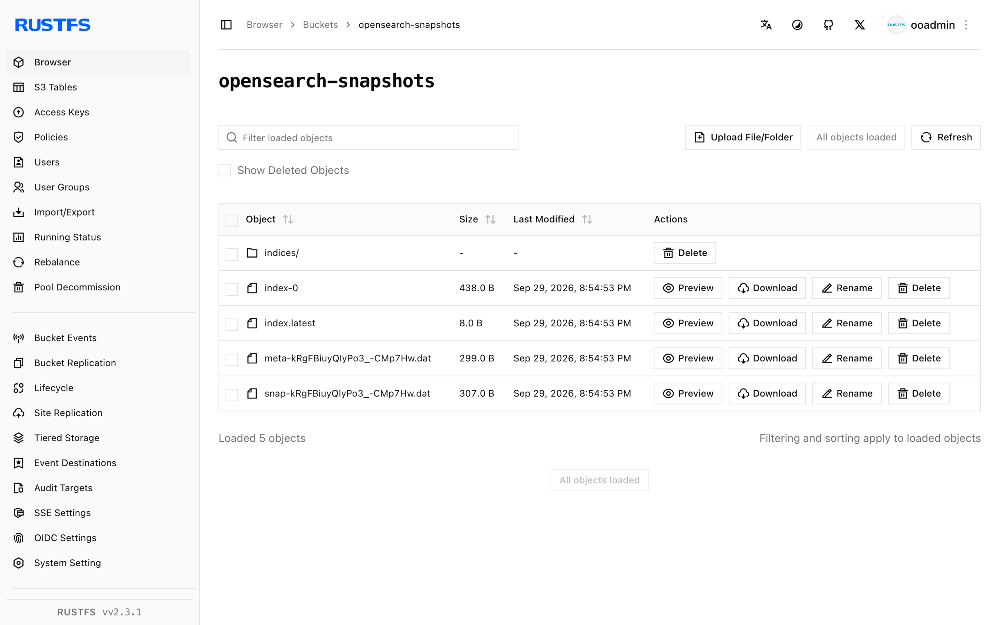

This guide connects [OpenSearch](https://github.com/opensearch-project/OpenSearch) — the open-source search and analytics suite derived from Elasticsearch — to **RustFS** through the `repository-s3` plugin. You will register an S3 snapshot repository backed by a RustFS bucket, take a snapshot of an index, and restore it. The workflow was verified with `opensearchproject/opensearch:3.8.0` and the bundled `repository-s3` plugin against `rustfs/rustfs-x86-musl:v2.3.1`.

You need Docker, or an OpenSearch node where you can install plugins and edit configuration. This deployment is intended for local integration testing, not production.

## Architecture


The `repository-s3` plugin writes snapshots as shard archives plus metadata blobs in the bucket. Registration is cluster-wide, so every node needs the plugin and the same client configuration.

## 1. Run OpenSearch

Start a single node with security disabled and a small heap:

```bash
docker run -d --name opensearch --network oo-rustfs_default -p 9200:9200 \
  -e discovery.type=single-node \
  -e OPENSEARCH_JAVA_OPTS="-Xms512m -Xmx512m" \
  -e DISABLE_SECURITY_PLUGIN=true \
  opensearchproject/opensearch:3.8.0
```

The node is ready when `curl http://localhost:9200` returns the cluster header (allow one to two minutes).

## 2. Install the repository-s3 plugin

The S3 repository plugin is not preloaded. Install it and restart the node:

```bash
docker exec opensearch bin/opensearch-plugin install --batch repository-s3
docker restart opensearch
```

## 3. Configure the S3 client

Credentials are secure settings: they belong in the OpenSearch keystore, not in the repository request or `opensearch.yml`. Create the keystore entries, replacing all connection placeholders:

```bash
docker exec opensearch sh -c \
  "printf '<your-access-key>' | bin/opensearch-keystore create 2>/dev/null; \
   printf '<your-access-key>' | bin/opensearch-keystore add -f -x s3.client.default.access_key; \
   printf '<your-secret-key>' | bin/opensearch-keystore add -f -x s3.client.default.secret_key"
```

Add the non-secure client settings to `config/opensearch.yml`:

```yaml title="opensearch.yml"
network.host: 0.0.0.0
plugins.security.disabled: true
s3.client.default.endpoint: http://<your-rustfs-endpoint>:9000
s3.client.default.protocol: http
s3.client.default.path_style_access: "true"
```

Restart the node once more so it reads both the keystore and the new settings:

```bash
docker restart opensearch
```

Create the bucket while the node boots:

```bash
rc mb rustfs/opensearch-snapshots
```

## 4. Register the repository and snapshot

Create a test index with a document, then register the repository:

```bash
curl -sX PUT http://localhost:9200/rustfs-demo -H "Content-Type: application/json" \
  -d '{"settings":{"number_of_shards":1}}'

curl -sX PUT http://localhost:9200/rustfs-demo/_doc/1 -H "Content-Type: application/json" \
  -d '{"product":"rustfs","via":"opensearch-snapshot"}'

curl -sX PUT "http://localhost:9200/_snapshot/rustfs-repo" -H "Content-Type: application/json" \
  -d '{"type":"s3","settings":{"bucket":"opensearch-snapshots","region":"us-east-1","server_side_encryption_type":"bucket_default"}}'
```

The `server_side_encryption_type: bucket_default` setting matters: without it the plugin requests SSE-S3, which a self-hosted RustFS without a server-side encryption master key rejects.

Take a snapshot and wait for completion:

```bash
curl -sX PUT "http://localhost:9200/_snapshot/rustfs-repo/snapshot-1?wait_for_completion=true" \
  -H "Content-Type: application/json" -d '{"indices":"rustfs-demo"}'
```

```text
{"snapshot":{"snapshot":"snapshot-1","state":"SUCCESS","indices":["rustfs-demo"],...}}
```

## 5. Verify objects and restore

List the bucket:

```bash
rc ls rustfs/opensearch-snapshots/ -r
```

```text
index-0
index.latest
indices/5x1bwsWaSv2XINIbeoe-RQ/0/__GgxvoCw-TKuMMAYBq5Khag
indices/5x1bwsWaSv2XINIbeoe-RQ/0/snap-kRgFBiuyQIyPo3_-CMp7Hw.dat
meta-kRgFBiuyQIyPo3_-CMp7Hw.dat
snap-kRgFBiuyQIyPo3_-CMp7Hw.dat
```

Delete the index and restore it from the snapshot:

```bash
curl -sX DELETE http://localhost:9200/rustfs-demo
curl -sX POST "http://localhost:9200/_snapshot/rustfs-repo/snapshot-1/_restore?wait_for_completion=true"
curl -s http://localhost:9200/rustfs-demo/_doc/1
```

```text
{"_index":"rustfs-demo","_id":"1","found":true,"_source":{"product":"rustfs","via":"opensearch-snapshot"}}
```



## 6. Stop or reset

To tear down the demo while keeping the bucket objects:

```bash
docker rm -f opensearch
```

To delete the stored snapshots:

```bash
rc rm rustfs/opensearch-snapshots/ --recursive --force
```

## Troubleshooting

### `Setting [access_key] is insecure, but property [allow_insecure_settings] is not set`

Inline credentials in the repository request are rejected. Store them in the keystore as shown in step 3 — `access_key` and `secret_key` are secure settings in OpenSearch.

### `SSE-S3 requires RUSTFS_SSE_S3_MASTER_KEY ... (Status Code: 400)`

The plugin encrypts uploads with SSE-S3 by default. Register the repository with `"server_side_encryption_type": "bucket_default"` so no encryption header is sent, as in step 4.

### `unknown setting [s3.client.default.access_key]` at startup

The settings reference the repository-s3 plugin. If the node fails to start with them present, the plugin is not installed in that container — repeat step 2 (a fresh container loses plugins installed with `docker exec`).

### Repository verification fails with `path is not accessible`

The node cannot reach the bucket: check that `s3.client.default.endpoint` is reachable from the container, `path_style_access` is `"true"`, and the keystore credentials were loaded (they are read at startup — restart after adding them).

## Next steps

- Review [S3 compatibility notes](/administration/protocols/s3) before adopting additional OpenSearch repositories.
- Create dedicated production credentials with [Access Key Management](/security-compliance/iam/access-token).
- Follow the [OpenSearch snapshots documentation](https://docs.opensearch.org/docs/latest/tuning-your-cluster/availability-and-recovery/snapshots/index/) to automate snapshots with Snapshot Management (SM) policies.
