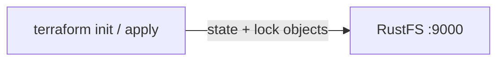
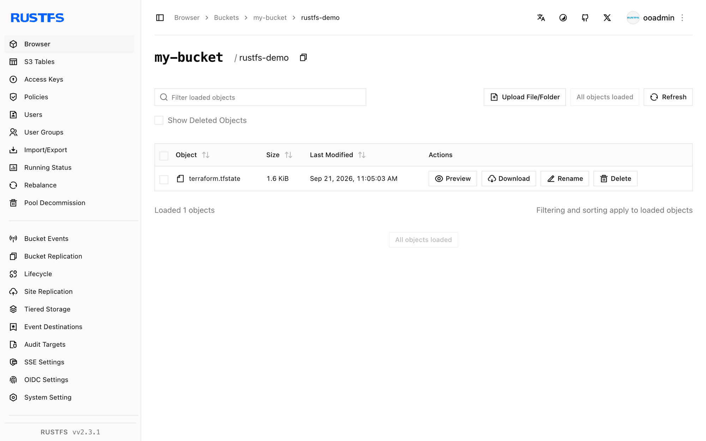

This guide connects [Terraform](https://github.com/hashicorp/terraform) — the infrastructure as code tool from HashiCorp — to **RustFS** through the S3 backend: the state file, and the lock file that prevents concurrent runs, are stored as objects in RustFS. You will initialize the backend, apply a small configuration, and verify the state object in RustFS. The workflow was verified with `terraform 1.12.2` and `rustfs/rustfs-x86-musl:v2.3.1`.

You need a RustFS deployment reachable from your workstation (see the guides under [Installation](/installation)) and Terraform 1.10 or later, which supports S3-native locking via `use_lockfile`.

## Architecture



The S3 backend stores the state file under the `key` prefix in the bucket. With `use_lockfile = true`, Terraform writes a `<key>.tflock` object while a run holds the lock, replacing the former DynamoDB-based locking for this setup.

## 1. Create the project files

Create a working directory:

```bash
mkdir rustfs-terraform
cd rustfs-terraform
```

Create the configuration. Replace the credential placeholders and point the endpoint at your RustFS server — `localhost:9000` when Terraform runs on the same host:

```hcl title="main.tf"
terraform {
  backend "s3" {
    bucket                      = "my-bucket"
    key                         = "rustfs-demo/terraform.tfstate"
    region                      = "us-east-1"
    endpoint                    = "http://localhost:9000"
    access_key                  = "<your-access-key>"
    secret_key                  = "<your-secret-key>"
    skip_credentials_validation = true
    skip_region_validation      = true
    skip_metadata_api_check     = true
    skip_requesting_account_id  = true
    force_path_style            = true
    insecure                    = true
    use_lockfile                = true
  }
}

provider "local" {}

resource "local_file" "demo" {
  content  = "provisioned with terraform, state stored in RustFS"
  filename = "${path.module}/demo.txt"
}
```

`force_path_style` and `insecure` select path-style addressing over plain HTTP, which is what RustFS expects for the local endpoint. `use_lockfile` enables S3-native state locking so concurrent runs cannot corrupt the state.

## 2. Initialize the backend

Download the provider and configure the S3 backend:

```bash
terraform init -input=false
```

```text
Successfully configured the backend "s3"! Terraform will automatically
use this backend unless the backend configuration changes.
```

## 3. Apply the configuration

Create the resource and write the state to RustFS:

```bash
terraform apply -auto-approve -input=false
```

```text
Apply complete! Resources: 1 added, 0 changed, 0 destroyed.
```

## 4. Verify the state in RustFS

List the state objects through the `rc` CLI:

```bash
docker run --rm --network <rustfs-network> -v "$PWD:/m" \
  --entrypoint /bin/sh rustfs/rc:latest \
  -c 'rc alias set rustfs http://rustfs:9000 <your-access-key> <your-secret-key> >/dev/null && rc ls rustfs/my-bucket/rustfs-demo --recursive'
```

```text
[2026-09-21 03:05:03]   1.62 KiB rustfs-demo/terraform.tfstate
```

You can also browse the prefix in the RustFS Console:



## 5. Confirm the state is reloaded from RustFS

Run a plan — Terraform reads the state from RustFS and compares it against the configuration:

```bash
terraform plan -input=false
```

```text
No changes. Your infrastructure matches the configuration.
```

The plan is clean because the state was read back from RustFS, not from any local file.

## 6. Destroy and reset

Tear the resource down; the state update is written to RustFS the same way:

```bash
terraform destroy -auto-approve -input=false
```

Delete the state objects in the RustFS Console (or with `rc rm`) to start from scratch.

## Troubleshooting

### "dial tcp: lookup rustfs ... server misbehaving" or connection failures

The `endpoint` must be reachable from the machine where Terraform runs. Inside a Compose network use `http://rustfs:9000`; from the host use `http://localhost:9000`.

### "Bucket cannot have ACLs set" or signature errors

`skip_credentials_validation`, `skip_region_validation`, `skip_metadata_api_check`, `skip_requesting_account_id`, `force_path_style`, and `insecure` are all required for a non-AWS endpoint; missing any of them makes the backend talk to AWS defaults instead of RustFS.

### The state does not appear in the bucket

Confirm that the bucket exists and that the credentials match the RustFS credentials. The state object appears under the `key` path (`rustfs-demo/terraform.tfstate` in this guide) after the first `init` or `apply`.

## Next steps

- Review [S3 compatibility notes](/administration/protocols/s3) before adopting additional S3 operations.
- Create dedicated production credentials with [Access Key Management](/security-compliance/iam/access-token).
- Follow the [Terraform S3 backend documentation](https://developer.hashicorp.com/terraform/language/backend/s3) for options such as workspace prefixes and role assumption.
