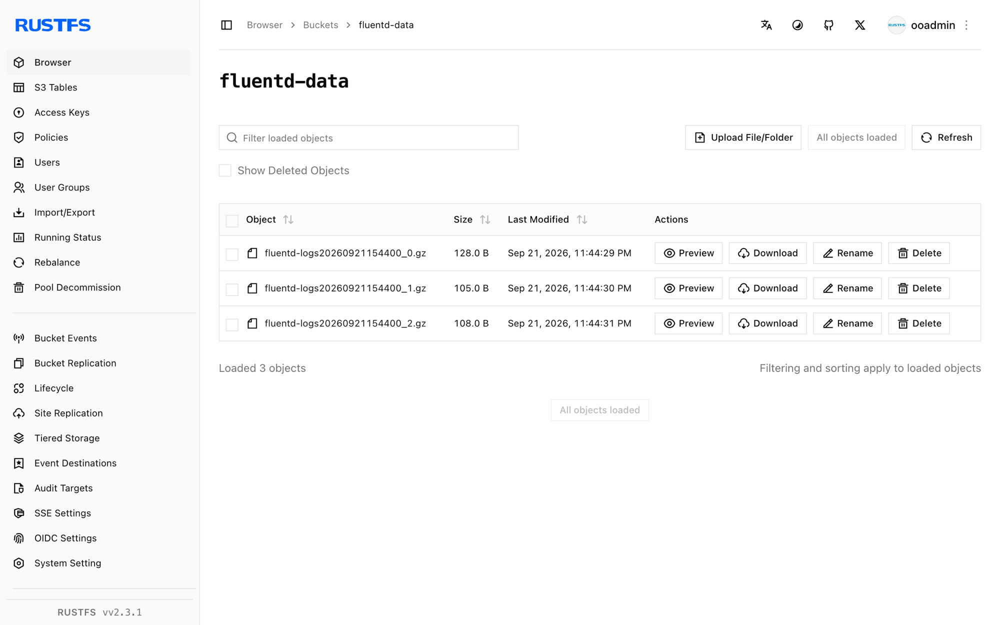

This guide connects [Fluentd](https://github.com/fluent/fluentd) — the open-source data collector — to **RustFS** through the `out_s3` output plugin. You will run Fluentd with a tail source, buffer log events, and verify that the flushed objects are stored in RustFS. The workflow was verified with `fluent/fluentd:v1.17-1`, `fluent-plugin-s3` 1.8.6, and `rustfs/rustfs-x86-musl:v2.3.1`.

You need Docker. This deployment is intended for local integration testing, not production.

## Architecture


The tail source reads new lines from `app.log` and hands them to the S3 output, which buffers events on a time key and uploads a gzip object per flush window.

## 1. Create the project files

Create the bucket first — Fluentd does not create buckets:

```bash
rc alias set rustfs http://<your-rustfs-endpoint>:9000 <your-access-key> <your-secret-key>
rc mb rustfs/fluentd-data
```

The official Fluentd image runs as a non-root user and cannot install gems at startup, so build a small image with the S3 plugin:

```dockerfile title="Dockerfile"
FROM fluent/fluentd:v1.17-1
USER root
RUN gem install fluent-plugin-s3 --no-document
USER fluent
```

Create the Fluentd configuration, replacing both credential placeholders:

```nginx title="fluent.conf"
<source>
  @type tail
  path /var/log/app.log
  pos_file /var/log/app.log.pos
  tag rustfs.demo
  <parse>
    @type none
  </parse>
</source>

<match **>
  @type s3
  aws_key_id <your-access-key>
  aws_sec_key <your-secret-key>
  s3_bucket fluentd-data
  s3_endpoint http://rustfs:9000/
  s3_region us-east-1
  force_path_style true
  path fluentd-logs
  <buffer>
    @type memory
    timekey 30s
    timekey_wait 0s
    flush_mode immediate
  </buffer>
</match>
```

`force_path_style true` is required — without it the plugin constructs `fluentd-data.rustfs` as a hostname and every request fails with a DNS error. Inside the Compose network the hostname is `rustfs`; from the host use `http://localhost:9000/`.

Build the image and start Fluentd on the same Docker network as RustFS:

```bash
docker build -t fluentd-rustfs .
mkdir -p logs
docker run -d --name fluentd --network oo-rustfs_default \
  -v "$PWD/fluent.conf":/fluentd/etc/fluent.conf:ro \
  -v "$PWD/logs":/var/log fluentd-rustfs
```

## 2. Produce log events

Append lines to the watched file:

```bash
echo "rustfs fluentd demo line 1" >> logs/app.log
echo "rustfs fluentd demo line 2" >> logs/app.log
```

With a 30-second time key and immediate flush mode, each window uploads one gzip object shortly after it closes. Wait about a minute.

## 3. Verify objects in RustFS

List the bucket:

```bash
rc ls rustfs/fluentd-data/ -r
```

Each flush window produces one gzipped object:

```text
fluentd-logs20260921154400_0.gz
fluentd-logs20260921154400_1.gz
```

Read one object back to confirm the events are intact:

```bash
rc cat rustfs/fluentd-data/fluentd-logs20260921154400_0.gz | gunzip
```



## 4. Stop or reset the deployment

Stop Fluentd while keeping the data:

```bash
docker rm -f fluentd
```

The objects stay in the `fluentd-data` bucket. To delete them, remove the bucket:

```bash
rc rb rustfs/fluentd-data --force
```

## Troubleshooting

### `Unknown output plugin 's3'`

The plugin is not installed. Confirm the Dockerfile installs `fluent-plugin-s3` as `root` before switching back to the `fluent` user — installing at container start as the default user fails with permission errors.

### `Failed to open TCP connection to fluentd-data.rustfs`

Virtual-hosted addressing is in use. Add `force_path_style true` to the `s3` output so the bucket stays in the URL path.

### The worker crashes in a restart loop

The output fails hard when the bucket does not exist. Create `fluentd-data` before starting Fluentd and check the startup log:

```bash
docker logs fluentd | grep -iE "error|bucket" | tail
```

## Next steps

- Review [S3 compatibility notes](/administration/protocols/s3) before adopting additional Fluentd outputs.
- Create dedicated production credentials with [Access Key Management](/security-compliance/iam/access-token).
- Follow the [fluent-plugin-s3 documentation](https://github.com/fluent/fluent-plugin-s3) for object key formats and compression options.
