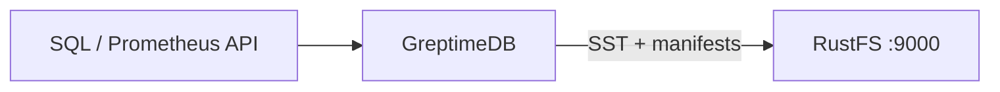
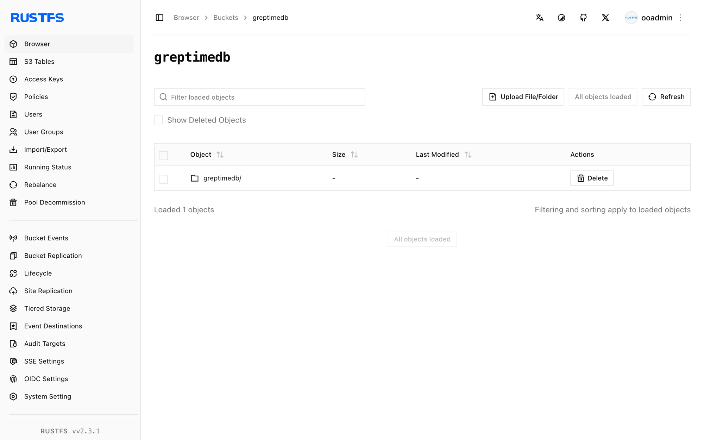

This guide connects [GreptimeDB](https://github.com/GreptimeTeam/greptimedb) — the open-source, cloud-native time-series database — to **RustFS** as its object storage backend. You will start a standalone instance with its `[storage]` section pointed at a RustFS bucket, write time-series rows through the SQL API, and confirm the Parquet files and manifests in the bucket. The workflow was verified with `greptime/greptimedb` (main, commit `179ff8e5`) against `rustfs/rustfs-x86-musl:v2.3.1`.

You need Docker, or a local GreptimeDB binary. This deployment is intended for local integration testing, not production.

## Architecture



GreptimeDB keeps its write-ahead log and recent data locally, then persists SSTables (Parquet) and table manifests to object storage. Pointing the storage backend at RustFS makes the bucket the durable home of all table data.

## 1. Configure the storage backend

Create the bucket and a config file with an S3 storage section, replacing all connection placeholders:

```toml title="greptimedb.toml"
[storage]
type = "S3"
bucket = "<your-bucket>"
root = "greptimedb"
access_key_id = "<your-access-key>"
secret_access_key = "<your-secret-key>"
endpoint = "http://<your-rustfs-endpoint>:9000"
region = "us-east-1"
```

GreptimeDB uses path-style requests for custom endpoints by default; virtual-hosted style must be opted into explicitly with `enable_virtual_host_style`, so no extra flag is needed for RustFS.

## 2. Run GreptimeDB

Start a standalone instance with the config file:

```bash
docker run -d --name greptimedb --network oo-rustfs_default -p 4000:4000 -p 4002:4002 \
  -v "$PWD/greptimedb.toml":/etc/greptimedb/greptimedb.toml:ro \
  greptime/greptimedb:latest standalone start \
  --http-addr 0.0.0.0:4000 \
  --mysql-addr 0.0.0.0:4002 \
  --config-file /etc/greptimedb/greptimedb.toml
```

Port `4000` serves the HTTP SQL endpoint and `4002` the MySQL protocol.

## 3. Write and query time series

Create a table, insert rows, and read them back. The HTTP SQL endpoint takes form-encoded requests:

```bash
curl -s -X POST "http://localhost:4000/v1/sql" \
  --data-urlencode "sql=CREATE TABLE rustfs_demo (host STRING, cpu DOUBLE, mem DOUBLE, ts TIMESTAMP TIME INDEX)"

curl -s -X POST "http://localhost:4000/v1/sql" \
  --data-urlencode "sql=INSERT INTO rustfs_demo VALUES (\"node-1\", 0.31, 0.62, 1790681000000), (\"node-1\", 0.35, 0.63, 1790681060000), (\"node-2\", 0.51, 0.71, 1790681000000)"
```

```text
{"output":[{"affectedrows":3}],"execution_time_ms":2}
```

Query the rows back:

```bash
curl -s -X POST "http://localhost:4000/v1/sql" \
  --data-urlencode "sql=SELECT * FROM rustfs_demo ORDER BY ts"
```

```text
{"output":[{"records":{"rows":[["node-2",0.51,0.71,1790681000000],["node-1",0.35,0.63,1790681060000]],"total_rows":2}}]}
```

## 4. Verify objects in RustFS

List the bucket — after the memtable flushes, the bucket holds Parquet SSTables and JSON manifests:

```bash
rc ls rustfs/<your-bucket>/ -r
```

```text
greptimedb/data/greptime/public/1024/1024_0000000000/manifest/00000000000000000000.json
greptimedb/data/greptime/greptime_private/1025/1025_0000000000/b11e8b25-5763-4f05-bcab-b6ee0a756a69.parquet
greptimedb/data/greptime/greptime_private/1025/1025_0000000000/manifest/00000000000000000001.json
```

Each database gets a directory under `data/`, and per-region `manifest/*.json` files describe the SSTables GreptimeDB reads back during queries.



## 5. Stop or reset

To tear down the demo while keeping the bucket objects:

```bash
docker rm -f greptimedb
```

To delete the stored data:

```bash
rc rm rustfs/<your-bucket>/ --recursive --force
```

## Troubleshooting

### `Form requests must have Content-Type: application/x-www-form-urlencoded`

The `/v1/sql` HTTP endpoint only accepts form-encoded bodies. Pass SQL with `curl --data-urlencode "sql=..."` (or `application/x-www-form-urlencoded`), not as a JSON body.

### Bucket stays empty

GreptimeDB flushes memtables to object storage asynchronously. Run a few more inserts and wait a few seconds, or trigger a manual flush, then list the bucket again.

### Startup fails with an S3 error

Confirm `endpoint` includes the scheme, the bucket exists, and `access_key_id`/`secret_access_key` match a RustFS access key. The `root` value is optional but keeps the table tree under a known prefix.

## Next steps

- Review [S3 compatibility notes](/administration/protocols/s3) before adopting additional GreptimeDB storage options.
- Create dedicated production credentials with [Access Key Management](/security-compliance/iam/access-token).
- Follow the [GreptimeDB configuration reference](https://docs.greptime.com/operational-guide/configure/configure-datanode/) to tune flush intervals and cache layers for production workloads.
