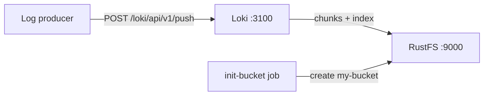

Diese Anleitung betreibt [Grafana Loki](https://github.com/grafana/loki) — das Log-Aggregationssystem von Grafana Labs — mit **RustFS** als Objektspeicher-Backend. Sie starten einen Single-Binary-Loki mit Docker Compose, pushen Log-Streams über die HTTP-API, fragen sie ab und prüfen, dass die Log-Chunks als Objekte in RustFS gespeichert werden. Der Ablauf wurde mit `grafana/loki:latest` (v3.7.8) und `rustfs/rustfs-x86-musl:v2.3.1` verifiziert.

Sie benötigen Docker mit dem Compose-Plugin. Dieses Setup ist für lokale Integrationstests gedacht, nicht für den Produktivbetrieb.

## Architektur



Loki nimmt Log-Streams in einen In-Memory-Chunk und ein Write-Ahead-Log auf, überträgt komprimierte Chunks in den Objektspeicher, sobald ein Stream inaktiv wird, und lädt TSDB-Indexdateien in denselben Bucket. Abfragen lösen Chunks über den Index auf und lesen sie aus dem Objektspeicher.

## 1. Projektdateien anlegen

Erstellen Sie ein Arbeitsverzeichnis:

```bash
mkdir rustfs-loki
cd rustfs-loki
```

Erstellen Sie eine Umgebungsdatei und ersetzen Sie beide Platzhalter für die Anmeldeinformationen:

```ini title=".env"
RUSTFS_ACCESS_KEY=<your-access-key>
RUSTFS_SECRET_KEY=<your-secret-key>
```

Verwenden Sie dedizierte Anmeldeinformationen für den Bucket. Committen Sie `.env` nicht in die Versionsverwaltung.

Erstellen Sie die Loki-Konfiguration — ein Single-Binary-Setup mit dem TSDB-Schema und dem S3-Backend, das auf RustFS zeigt:

```yaml title="loki.yml"
auth_enabled: false

server:
  http_listen_port: 3100

common:
  instance_addr: 127.0.0.1
  path_prefix: /loki
  storage:
    s3:
      endpoint: rustfs:9000
      insecure: true
      bucketnames: my-bucket
      access_key_id: ${RUSTFS_ACCESS_KEY}
      secret_access_key: ${RUSTFS_SECRET_KEY}
      s3forcepathstyle: true
  replication_factor: 1
  ring:
    kvstore:
      store: inmemory

schema_config:
  configs:
    - from: 2020-10-24
      store: tsdb
      object_store: s3
      schema: v13
      index:
        prefix: index_
        period: 24h

ingester:
  chunk_idle_period: 30s
  max_chunk_age: 1m

ruler:
  alertmanager_url: http://localhost:9093
```

`s3forcepathstyle: true` und `insecure: true` wählen Path-Style-Adressierung über Plain HTTP, was der Container-Netzwerk-Endpunkt von RustFS erwartet. `chunk_idle_period` und `max_chunk_age` sind verkürzt, damit ein Verifikationslauf nicht die standardmäßigen 30 Minuten auf den Chunk-Flush warten muss.

Erstellen Sie die Compose-Datei:

```yaml title="compose.yaml"
services:
  rustfs:
    image: rustfs/rustfs-x86-musl:v2.3.1
    environment:
      RUSTFS_ACCESS_KEY: ${RUSTFS_ACCESS_KEY}
      RUSTFS_SECRET_KEY: ${RUSTFS_SECRET_KEY}
      RUSTFS_VOLUMES: /data
      RUSTFS_ADDRESS: ":9000"
      RUSTFS_CONSOLE_ADDRESS: ":9001"
      RUSTFS_CONSOLE_ENABLE: "true"
    volumes:
      - rustfs-data:/data
    ports:
      - "9000:9000"
      - "9001:9001"
    healthcheck:
      test: ["CMD", "curl", "-sf", "http://127.0.0.1:9000/health"]
      interval: 10s
      timeout: 5s
      retries: 6
      start_period: 10s
    networks:
      - loki

  create-bucket:
    image: rustfs/rc:latest
    depends_on:
      rustfs:
        condition: service_healthy
    environment:
      RUSTFS_ACCESS_KEY: ${RUSTFS_ACCESS_KEY}
      RUSTFS_SECRET_KEY: ${RUSTFS_SECRET_KEY}
    entrypoint:
      - /bin/sh
      - -c
      - |
        until /usr/bin/rc alias set rustfs http://rustfs:9000 "$${RUSTFS_ACCESS_KEY}" "$${RUSTFS_SECRET_KEY}"; do
          echo "Waiting for RustFS..."
          sleep 2
        done
        /usr/bin/rc ls rustfs/my-bucket >/dev/null 2>&1 || /usr/bin/rc mb rustfs/my-bucket
    networks:
      - loki

  loki:
    image: grafana/loki:latest
    command: -config.file=/etc/loki/loki-config.yml
    volumes:
      - ./loki.yml:/etc/loki/loki-config.yml:ro
    ports:
      - "3100:3100"
    depends_on:
      create-bucket:
        condition: service_completed_successfully
    networks:
      - loki

networks:
  loki:

volumes:
  rustfs-data:
```

## 2. Bereitstellung starten

Prüfen Sie die Compose-Datei, bevor Sie Container starten:

```bash
docker compose config
```

Starten Sie die Dienste und warten Sie, bis die Bucket-Initialisierung abgeschlossen ist:

```bash
docker compose up -d
docker compose ps -a
```

Loki ist bereit, wenn der Readiness-Endpunkt Erfolg meldet:

```bash
curl -s http://localhost:3100/ready
```

```text
ready
```

## 3. Log-Streams pushen

Senden Sie einen Batch von Log-Einträgen über die Push-API:

```bash
python3 - <<'PY'
import json, time, urllib.request

values = []
base_ns = int(time.time() * 1e9)
for i in range(20):
    values.append([
        str(base_ns - i * 1_000_000_000),
        f"[rustfs-loki-integration] log line {i} stored in RustFS object storage",
    ])

payload = {
    "streams": [{
        "stream": {"job": "rustfs-demo", "service": "loki-integration"},
        "values": values,
    }]
}

req = urllib.request.Request(
    "http://localhost:3100/loki/api/v1/push",
    data=json.dumps(payload).encode(),
    headers={"Content-Type": "application/json"},
    method="POST",
)
with urllib.request.urlopen(req, timeout=30) as r:
    print("push:", r.status)
PY
```

```text
push: 204
```

## 4. Logs abfragen

Fragen Sie den Stream über die Range-Query-API ab:

```bash
curl -sG "http://localhost:3100/loki/api/v1/query_range" \
  --data-urlencode 'query={job="rustfs-demo"}' \
  --data-urlencode "start=$(($(date +%s) - 3600))000000000" \
  --data-urlencode "end=$(($(date +%s) + 60))000000000" \
  | python3 -m json.tool | head -20
```

Die Antwort enthält die gepushten Zeilen:

```text
"values": [
    [
      "1789916564000000000",
      "[rustfs-loki-integration] log line 0 stored in RustFS object storage"
    ],
```

## 5. Chunks in RustFS prüfen

Mit `chunk_idle_period: 30s` überträgt der Ingester den Stream etwa eine Minute nach der letzten Zeile in den Objektspeicher. Listen Sie das Tenant-Präfix über das Bucket-Initialisierungs-Image auf:

```bash
docker compose run --rm --entrypoint /bin/sh create-bucket -c \
  '/usr/bin/rc alias set rustfs http://rustfs:9000 "$RUSTFS_ACCESS_KEY" "$RUSTFS_SECRET_KEY" >/dev/null && /usr/bin/rc ls rustfs/my-bucket/fake --recursive'
```

`fake` ist der Tenant, den Loki verwendet, wenn `auth_enabled` auf `false` steht; jedes Objekt ist ein komprimierter Log-Chunk:

```text
[2026-09-20 14:48:57]      398 B fake/51610c9b43452db8/1a0bf49f028:1a0bf49f028:f0ed52f7
[2026-09-20 14:49:33]      670 B fake/cd916b27d004a688/1a0bf4a03ca:1a0bf4a4e03:1376b308
```

Sie können das Präfix auch in der RustFS-Konsole anzeigen:


## 6. Stack stoppen oder zurücksetzen

Stoppen Sie die Container und behalten Sie das RustFS-Datenvolumen:

```bash
docker compose down
```

Um die gespeicherten Logs zu löschen und mit einem leeren RustFS-Volumen zu beginnen, fügen Sie ausdrücklich `--volumes` hinzu:

```bash
docker compose down --volumes
```

## Fehlerbehebung

### Loki drosselt Schreibvorgänge und meldet "disk usage exceeded threshold"

Loki überwacht die Festplatte, die sein Write-Ahead-Log hält, und drosselt den Ingester, wenn die Nutzung 90 Prozent überschreitet. Stellen Sie sicher, dass das Volume hinter `path_prefix` genug freien Speicher hat, oder betreiben Sie den Container mit einem tmpfs für das WAL, wenn die Maschine selbst gesund ist.

### Der Ring meldet Verbindungsfehler zu Port 8500

Der Standard-Key-Value-Store für den Ring ist Consul. Für einen Single-Binary setzen Sie `common.ring.kvstore.store: inmemory`, wie in der obigen Konfiguration gezeigt.

### Push-Anfragen schlagen mit "Ingester is shutting down" fehl

Der Ingester hat keinen laufenden Zustand erreicht — meist ein übrig gebliebener Container aus einem früheren fehlgeschlagenen Start. Entfernen Sie den Container mit `docker compose down` und starten Sie ihn erneut, oder prüfen Sie die Logs auf den zugrunde liegenden Speicherfehler.

### AccessDenied- oder 403-Antworten

Stellen Sie sicher, dass die Anmeldeinformationen in `loki.yml` mit den RustFS-Anmeldeinformationen übereinstimmen und dass der Dienst `create-bucket` erfolgreich abgeschlossen wurde:

```bash
docker compose logs create-bucket
```

## Nächste Schritte

- Lesen Sie die [S3-Kompatibilitätshinweise](/administration/protocols/s3), bevor Sie weitere S3-Operationen verwenden.
- Erstellen Sie dedizierte Produktions-Anmeldeinformationen mit dem [Access Key Management](/security-compliance/iam/access-token).
- Folgen Sie der [Grafana-Loki-Dokumentation](https://grafana.com/docs/loki/latest/), um Promtail, Alloy oder den OpenTelemetry Collector als Log-Producer anzubinden.
