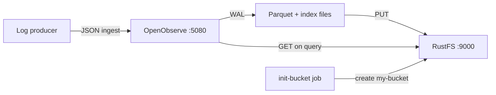
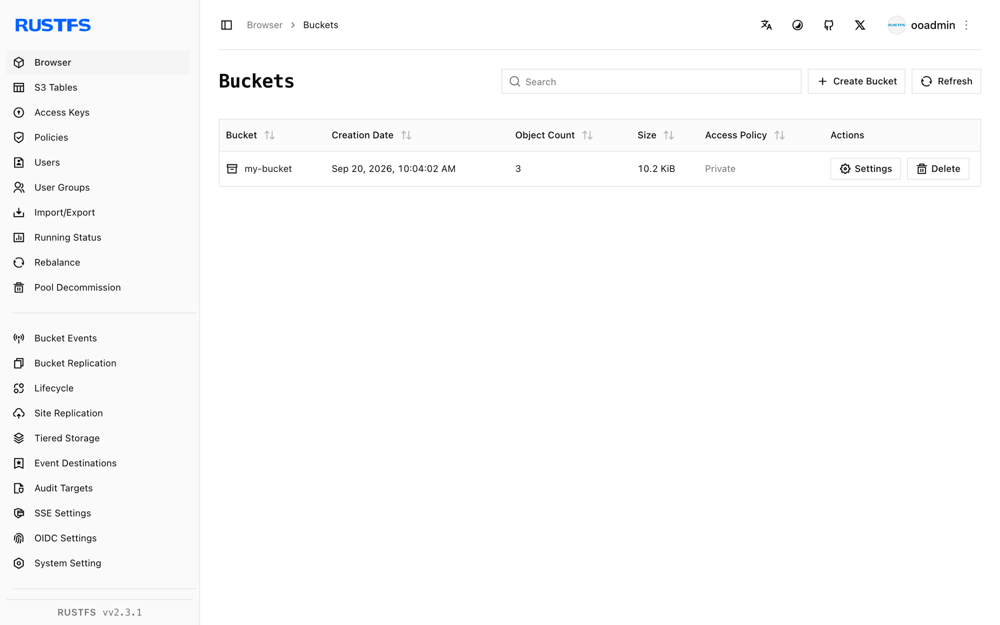
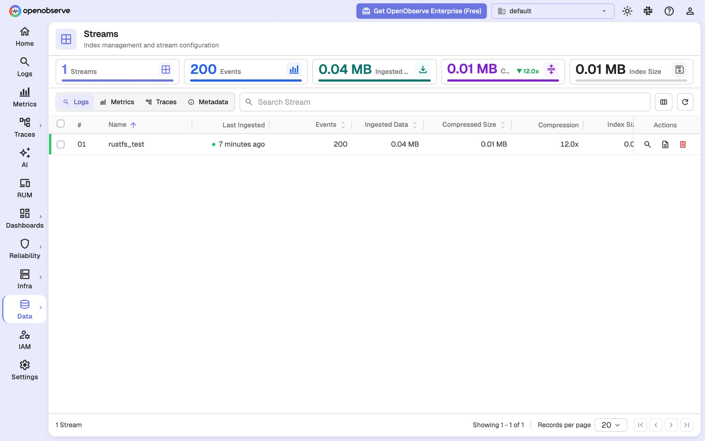

In dieser Anleitung betreiben Sie **OpenObserve** mit **RustFS** als Objektspeicher-Backend. Sie starten beide Dienste mit Docker Compose, erfassen Logdaten in OpenObserve, leeren den Schreibpuffer in den Objektspeicher, prüfen die entstandenen Parquet-Dateien in RustFS und fragen die Daten über die OpenObserve-Weboberfläche und die Such-API wieder ab.

Sie benötigen Docker mit dem Compose-Plugin und eine Maschine, die drei Container ausführen kann. Dieses Setup ist für lokale Integrationstests gedacht, nicht für den Produktivbetrieb.

## Produktvorstellung

### OpenObserve

[OpenObserve](https://openobserve.ai/) ist eine Open-Source-Observability-Plattform für Logs, Metriken, Traces und Real User Monitoring. Sie trennt Speicherung und Berechnung: erfasste Daten landen zuerst in einem lokalen Write-Ahead-Log (WAL), werden dann in Parquet-Dateien mit Volltextindizes umgewandelt und in den Objektspeicher hochgeladen, der als einzige persistente Datenschicht dient. Abfragen lokalisieren ferne Parquet-Dateien über File-List-Metadaten und laden sie bei Bedarf in einen lokalen Cache.

OpenObserve spricht über den Rust-Client `object_store` mit dem Objektspeicher. Standardmäßig verwendet er **Path-Style**-Anfragen mit SigV4-Signatur, sodass jeder S3-kompatible Endpunkt funktioniert — auch RustFS — solange Sie Endpunkt-URL, Region, Anmeldeinformationen und Bucket-Namen angeben.

### RustFS

RustFS ist ein in Rust entwickeltes verteiltes Objektspeichersystem. Es implementiert die Amazon-S3-API einschließlich SigV4-Signatur, Path-Style- und Virtual-Host-Adressierung sowie Multipart-Uploads und bietet eine Web-Konsole sowie Multi-Tenant-IAM. RustFS läuft von einem einzelnen Knoten bis zu Multi-Node-Clustern und deckt die S3-Operationen ab, die OpenObserve für seine Telemetriedaten benötigt.

### Funktionsweise der Integration



- **Schreibpfad**: Sobald die Daten eine Größenschwelle oder `ZO_MAX_FILE_RETENTION_TIME` (Standard 600 Sekunden) erreichen, führt OpenObserve die WAL-Einträge zu Parquet-Dateien zusammen, lädt sie unter dem Präfix `files/` in den Bucket hoch und trägt sie in seine File-Liste ein.
- **Abfragepfad**: Die Such-API ermittelt die Dateien für den angeforderten Zeitraum, lädt sie aus RustFS in den lokalen Cache und führt die Abfrage aus.

## Integrationsschritte

### 1. Projektdateien anlegen

Erstellen Sie ein Arbeitsverzeichnis:

```bash
mkdir rustfs-openobserve
cd rustfs-openobserve
```

Erstellen Sie eine Umgebungsdatei und ersetzen Sie die Platzhalter für die Anmeldeinformationen:

```ini title=".env"
RUSTFS_ACCESS_KEY=<your-access-key>
RUSTFS_SECRET_KEY=<your-secret-key>
RUSTFS_BUCKET_NAME=my-bucket
ZO_ROOT_USER_EMAIL=root@example.com
ZO_ROOT_USER_PASSWORD=Complexpass#123
```

:::note[Beispiel-Zugangsdaten für OpenObserve]

`root@example.com` und `Complexpass#123` sind die Beispielwerte aus der OpenObserve-Dokumentation. OpenObserve v1.0.x erzwingt eine Passwortrichtlinie von 8 bis 128 Zeichen mit Großbuchstaben, Kleinbuchstaben, Ziffern und Sonderzeichen. Ändern Sie beide Werte für jede echte Bereitstellung, und committen Sie `.env` nicht in die Versionsverwaltung.

:::

Erstellen Sie die Compose-Datei:

```yaml title="compose.yaml"
services:
  rustfs:
    image: rustfs/rustfs-x86-musl:v2.3.1
    environment:
      RUSTFS_ACCESS_KEY: ${RUSTFS_ACCESS_KEY}
      RUSTFS_SECRET_KEY: ${RUSTFS_SECRET_KEY}
      RUSTFS_VOLUMES: /data
      RUSTFS_ADDRESS: ":9000"
      RUSTFS_CONSOLE_ADDRESS: ":9001"
      RUSTFS_CONSOLE_ENABLE: "true"
    volumes:
      - rustfs-data:/data
    ports:
      - "9000:9000"
      - "9001:9001"
    healthcheck:
      test: ["CMD", "curl", "-sf", "http://127.0.0.1:9000/health"]
      interval: 10s
      timeout: 5s
      retries: 6
      start_period: 10s
    networks:
      - observability

  init-bucket:
    image: rustfs/rc:latest
    depends_on:
      rustfs:
        condition: service_healthy
    environment:
      RUSTFS_ACCESS_KEY: ${RUSTFS_ACCESS_KEY}
      RUSTFS_SECRET_KEY: ${RUSTFS_SECRET_KEY}
    entrypoint:
      - /bin/sh
      - -c
      - |
        until /usr/bin/rc alias set rustfs http://rustfs:9000 "$${RUSTFS_ACCESS_KEY}" "$${RUSTFS_SECRET_KEY}"; do
          echo "Waiting for RustFS..."
          sleep 2
        done
        /usr/bin/rc ls rustfs/my-bucket >/dev/null 2>&1 || /usr/bin/rc mb rustfs/my-bucket
    networks:
      - observability

  openobserve:
    image: openobserve/openobserve:v1.0.3
    depends_on:
      rustfs:
        condition: service_healthy
      init-bucket:
        condition: service_completed_successfully
    environment:
      ZO_ROOT_USER_EMAIL: ${ZO_ROOT_USER_EMAIL}
      ZO_ROOT_USER_PASSWORD: ${ZO_ROOT_USER_PASSWORD}
      ZO_LOCAL_MODE: "true"
      ZO_LOCAL_MODE_STORAGE: "s3"
      ZO_DATA_DIR: /data
      ZO_HTTP_PORT: "5080"
      RUST_LOG: INFO
      ZO_S3_PROVIDER: s3
      ZO_S3_SERVER_URL: http://rustfs:9000
      ZO_S3_REGION_NAME: us-east-1
      ZO_S3_ACCESS_KEY: ${RUSTFS_ACCESS_KEY}
      ZO_S3_SECRET_KEY: ${RUSTFS_SECRET_KEY}
      ZO_S3_BUCKET_NAME: ${RUSTFS_BUCKET_NAME}
      # Upload Parquet files after 60 seconds instead of the default 600.
      # Keep the default for production-like setups.
      ZO_MAX_FILE_RETENTION_TIME: "60"
    volumes:
      - oo-data:/data
    ports:
      - "5080:5080"
    networks:
      - observability

networks:
  observability:

volumes:
  rustfs-data:
  oo-data:
```

`ZO_LOCAL_MODE_STORAGE=s3` ist erforderlich: Im Ein-Knoten-Modus speichert OpenObserve Parquet-Dateien andernfalls auf der lokalen Festplatte und ignoriert die Variablen `ZO_S3_*`. Der Job `init-bucket` verwendet das [`rc`-Image](https://github.com/rustfs/cli), um `my-bucket` anzulegen, sobald RustFS den Healthcheck besteht, und überspringt die Erstellung, wenn der Bucket bereits existiert.

### 2. Bereitstellung starten

Prüfen und starten Sie den Compose-Stack:

```bash
docker compose config
docker compose up -d
docker compose ps
```

Der Dienst `init-bucket` sollte nach dem Anlegen des Buckets mit dem Exit-Code `0` enden:

```text
✓ Bucket 'rustfs/my-bucket' created successfully.
```

Öffnen Sie die OpenObserve-Oberfläche unter `http://localhost:5080` und melden Sie sich mit den Werten `ZO_ROOT_USER_EMAIL` und `ZO_ROOT_USER_PASSWORD` aus `.env` an. Die RustFS-Konsole erreichen Sie unter `http://localhost:9001/rustfs/console/`.

### 3. Verbindung zwischen OpenObserve und RustFS bestätigen

Prüfen Sie das Start-Log von OpenObserve auf die Speicherkonfiguration:

```bash
docker compose logs openobserve | grep "s3 init config"
```

```text
INFO infra::storage::remote: s3 init config: StorageConfig { name: "default", provider: "s3", server_url: "http://rustfs:9000", region_name: "us-east-1", access_key: "<your-access-key>", secret_key: "<your-secret-key>", bucket_name: "my-bucket", bucket_prefix: "" }
```

Beim Start führt OpenObserve außerdem eine Speicherprüfung durch: Es schreibt die Datei `o2_test/check.txt` in den Bucket und liest sie zurück. Wenn Sie diese Datei in RustFS sehen, funktioniert der Schreibpfad.

### 4. Logdaten erfassen

Senden Sie einen Batch von Datensätzen an die JSON-Ingest-API der Organisation `default` und des Streams `rustfs_test`:

```bash
curl -u "root@example.com:Complexpass#123" \
  -X POST "http://localhost:5080/api/default/rustfs_test/_json" \
  -H "Content-Type: application/json" \
  -d '[
    {"level":"info","service":"rustfs-openobserve-demo","host":"host-1",
     "job":"integration-test","log":"[rustfs-integration] request 1 stored via RustFS S3 API","code":200},
    {"level":"error","service":"rustfs-openobserve-demo","host":"host-1",
     "job":"integration-test","log":"[rustfs-integration] request 2 stored via RustFS S3 API","code":200}
  ]'
```

```text
{"code":200,"status":[{"name":"rustfs_test","successful":2,"failed":0}]}
```

### 5. Daten in den Objektspeicher leeren

Lösen Sie den Flush-Endpunkt auf Knotenebene aus, damit die Datensätze den WAL verlassen:

```bash
curl -s -u "root@example.com:Complexpass#123" -X PUT "http://localhost:5080/node/flush"
```

Der Ingester wandelt die WAL-Einträge in eine Parquet-Datei um und lädt sie im Hintergrund nach RustFS hoch, sobald die Datei älter als `ZO_MAX_FILE_RETENTION_TIME` ist (in dieser Compose-Datei 60 Sekunden, Standard 600 Sekunden).

## Verifikation

### Objekte in RustFS prüfen

Listen Sie den Bucket über das Bucket-Initialisierungs-Image auf:

```bash
docker compose run --rm --entrypoint /bin/sh init-bucket -c \
  '/usr/bin/rc alias set rustfs http://rustfs:9000 "$RUSTFS_ACCESS_KEY" "$RUSTFS_SECRET_KEY" >/dev/null && /usr/bin/rc ls rustfs/my-bucket --recursive'
```

Die Ausgabe sollte die Prüfdatei und die Ingester-Ausgabe unterhalb von `files/` enthalten:

```text
      19 B o2_test/check.txt
   3.7 KiB files/default/logs/rustfs_test/2026/09/20/02/75072592621841940484907.parquet
   6.5 KiB files/default/index/rustfs_test_logs/2026/09/20/02/75072592621841940484907.ttv
```

Sie können den Bucket auch in der RustFS-Konsole unter `http://localhost:9001/rustfs/console/` anzeigen:



OpenObserve speichert Parquet-Datendateien unterhalb von `files/<organization>/<stream type>/<stream>/<date partitions>` und Volltextindex-Dateien unterhalb von `files/<organization>/index/`:


### Logs in OpenObserve abfragen

Öffnen Sie in der OpenObserve-Oberfläche **Logs**, wählen Sie den Stream `rustfs_test` und führen Sie eine Abfrage aus. Die erfassten Datensätze erscheinen in der Ergebnistabelle:


Dieselbe Abfrage über die Such-API. Beachten Sie, dass `start_time` und `end_time` in **Mikrosekunden** angegeben werden:

```bash
curl -s -u "root@example.com:Complexpass#123" \
  -X POST "http://localhost:5080/api/default/_search?type=logs" \
  -H "Content-Type: application/json" \
  -d '{"query":{"sql":"SELECT count(*) AS cnt FROM \"rustfs_test\"","start_time":1789869600000000,"end_time":1789869960000000}}'
```

```text
"hits": [{"cnt": 200}]
```

### Stream-Statistiken prüfen

Die Seite **Data → Streams** zeigt die Anzahl der Ereignisse, die erfasste und komprimierte Größe sowie die Indexgröße für `rustfs_test`:



### Prüfen, dass Daten ohne lokalen Cache erhalten bleiben

Um zu bestätigen, dass RustFS die persistente Schicht ist und nicht die lokale Festplatte, löschen Sie das Cache-Verzeichnis von OpenObserve, starten den Container neu und fragen erneut ab. Das OpenObserve-Image enthält keine Shell, daher entfernen Sie die Dateien mit `busybox`:

```bash
docker compose stop openobserve
docker run --rm -v rustfs-openobserve_oo-data:/data busybox rm -rf /data/cache
docker compose start openobserve
```

Warten Sie, bis die Oberfläche wieder verfügbar ist, und wiederholen Sie die Suchabfrage von oben. Dieselben Datensätze kommen zurück, weil OpenObserve die Parquet-Dateien erneut aus RustFS herunterlädt. Der Verzeichnisname des Projekts (`rustfs-openobserve`) wird zum Präfix des Volume-Namens; führen Sie `docker volume ls` aus, falls Sie ein anderes Verzeichnis verwendet haben.

## Fehlerbehebung

### Daten werden auf die lokale Festplatte statt nach RustFS geschrieben

Im Ein-Knoten-Modus (`ZO_LOCAL_MODE=true`) ist das Storage-Backend standardmäßig `disk`. Ohne `ZO_LOCAL_MODE_STORAGE=s3` ignoriert OpenObserve die Variablen `ZO_S3_*` und behält Parquet-Dateien unter `/data/wal/files/`.

### Nach dem Flush erscheinen keine Parquet-Dateien im Bucket

Der Uploader läuft im Hintergrund und lädt eine Parquet-Datei erst hoch, wenn sie älter als `ZO_MAX_FILE_RETENTION_TIME` ist — standardmäßig 600 Sekunden. Diese Anleitung setzt den Wert auf 60 Sekunden. Wenn Dateien weiterhin fehlen, prüfen Sie die Ingester-Logs:

```bash
docker compose logs openobserve | grep "INGESTER:JOB"
```

### Die Such-API liefert keine Treffer

`start_time` und `end_time` der Such-API sind in Mikrosekunden angegeben. Ein Millisekunden-Zeitstempel wie `1789869600000` wählt einen Zeitraum im Jahr 1970; multiplizieren Sie ihn mit 1000.

### OpenObserve startet mit einem Fehler wegen schwachen Passworts neu

OpenObserve v1.0.x lehnt `ZO_ROOT_USER_PASSWORD`-Werte ab, die nicht mindestens einen Großbuchstaben, einen Kleinbuchstaben, eine Ziffer und ein Sonderzeichen enthalten.

### Die RustFS-Konsole öffnet sich nicht

In RustFS v2.x wird die Konsole unter dem Pfadpräfix `/rustfs/console/` bereitgestellt. Eine Anfrage an den Root-Pfad von Port `9001` liefert eine S3-ähnliche XML-Antwort mit Zugriffsverweigerung — das ist erwartetes Verhalten.

### RustFS startet mit einem Berechtigungsfehler nicht

Das RustFS-Image läuft mit Benutzer und Gruppe `10001`. Wenn Sie statt des Named Volumes aus dieser Anleitung ein Host-Verzeichnis einbinden, führen Sie zuerst `chown -R 10001:10001 <host-directory>` aus.

## Nächste Schritte

- Lesen Sie die [S3-Kompatibilitätshinweise](/administration/protocols/s3), bevor Sie weitere S3-Operationen verwenden.
- Erstellen Sie dedizierte Produktions-Anmeldeinformationen mit dem [Access Key Management](/security-compliance/iam/access-token).
- Folgen Sie der [OpenObserve-Dokumentation](https://openobserve.ai/docs/), um echte Log-Producer wie Fluent Bit oder den OpenTelemetry Collector anzubinden.
