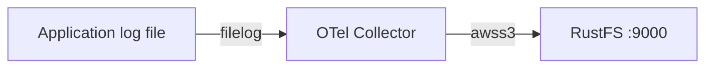
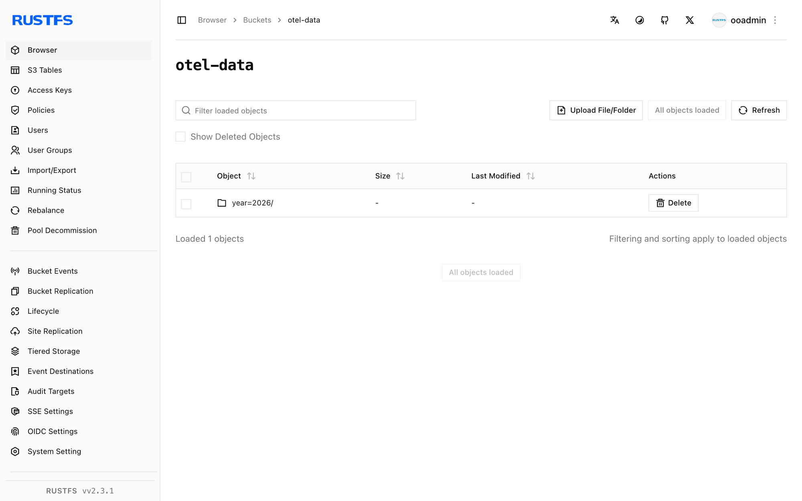

This guide connects the [OpenTelemetry Collector](https://opentelemetry.io/docs/collector/) — the CNCF telemetry pipeline — to **RustFS** through the collector's `awss3` exporter. You will run the contrib collector with a `filelog` receiver, ship the log lines of a file into the `otel-data` bucket, and verify the partitioned objects in RustFS. The workflow was verified with `otel/opentelemetry-collector-contrib:0.138.0` and `rustfs/rustfs-x86-musl:v2.3.1`.

You need Docker. This deployment is intended for local integration testing, not production.

## Architecture



The `filelog` receiver tails the log file and the `awss3` exporter uploads batches to the bucket, partitioned into time-based prefixes. Metrics and traces can be routed through the same exporter with their own pipelines.

## 1. Create the project files

Create the bucket first — the exporter does not create buckets:

```bash
rc alias set rustfs http://<your-rustfs-endpoint>:9000 <your-access-key> <your-secret-key>
rc mb rustfs/otel-data
```

Create the collector configuration, replacing both credential placeholders:

```yaml title="config.yaml"
receivers:
  filelog:
    include: [/var/log/app.log]
    start_at: beginning

exporters:
  awss3:
    s3uploader:
      region: us-east-1
      s3_bucket: otel-data
      endpoint: http://rustfs:9000
      s3_force_path_style: true
      disable_ssl: true
      file_prefix: logs/app
    marshaler: body

service:
  pipelines:
    logs:
      receivers: [filelog]
      exporters: [awss3]
```

The exporter reads credentials from the standard `AWS_ACCESS_KEY_ID`, `AWS_SECRET_ACCESS_KEY`, and `AWS_REGION` environment variables. `marshaler: body` writes each log line as plain text; omit it to store OTLP JSON instead. `s3_force_path_style` and `disable_ssl` are required for a plain-HTTP, non-AWS endpoint.

Create the Compose file:

```yaml title="compose.yaml"
services:
  collector:
    image: otel/opentelemetry-collector-contrib:0.138.0
    command: ["--config=/etc/otelcol-contrib/config.yaml"]
    environment:
      AWS_ACCESS_KEY_ID: <your-access-key>
      AWS_SECRET_ACCESS_KEY: <your-secret-key>
      AWS_REGION: us-east-1
    volumes:
      - ./config.yaml:/etc/otelcol-contrib/config.yaml:ro
      - ./app.log:/var/log/app.log
    networks:
      - otel

networks:
  otel:
```

## 2. Start the collector and produce logs

Start the stack and append lines to the watched file:

```bash
echo "otel demo log line one" > app.log
docker compose up -d
echo "second line after start" >> app.log
```

The collector tails the file from the beginning and uploads each buffer when the partition rolls over, so allow about a minute after the last line before checking.

## 3. Verify objects in RustFS

List the bucket:

```bash
rc ls rustfs/otel-data/ -r
```

Log records are uploaded under time-based partitions with the configured file prefix:

```text
year=2026/month=09/day=21/hour=15/minute=53/logs/applogs_288361608.txt
```

Read one object back to confirm the lines arrived intact:

```bash
rc cat rustfs/otel-data/year=2026/month=09/day=21/hour=15/minute=53/logs/applogs_288361608.txt
```

```text
otel demo log line one
second line after start
```



## 4. Stop or reset the deployment

Stop the collector while keeping the data:

```bash
docker compose down
```

The objects stay in the `otel-data` bucket. To delete them, remove the bucket:

```bash
rc rb rustfs/otel-data --force
```

## Troubleshooting

### `has invalid keys` when the collector starts

The `awss3` exporter schema differs between collector releases. Version 0.138 nests the upload settings under `s3uploader` as shown above; the endpoint key is `endpoint` (not `s3_endpoint`). Newer releases move these keys to the top level — check the README for your exact collector version.

### Nothing appears in the bucket

Confirm the credentials environment variables are set on the collector container, that `s3_force_path_style` is `true`, and that the exporter can reach `http://rustfs:9000` from inside the Compose network. Enable the `debug` exporter on the same pipeline to see whether records flow at all.

## Next steps

- Review [S3 compatibility notes](/administration/protocols/s3) before adopting additional collector operations.
- Create dedicated production credentials with [Access Key Management](/security-compliance/iam/access-token).
- Follow the [AWS S3 exporter documentation](https://github.com/open-telemetry/opentelemetry-collector-contrib/tree/main/exporter/awss3exporter) to add metrics and traces pipelines.
