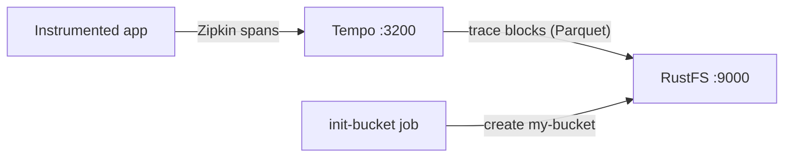
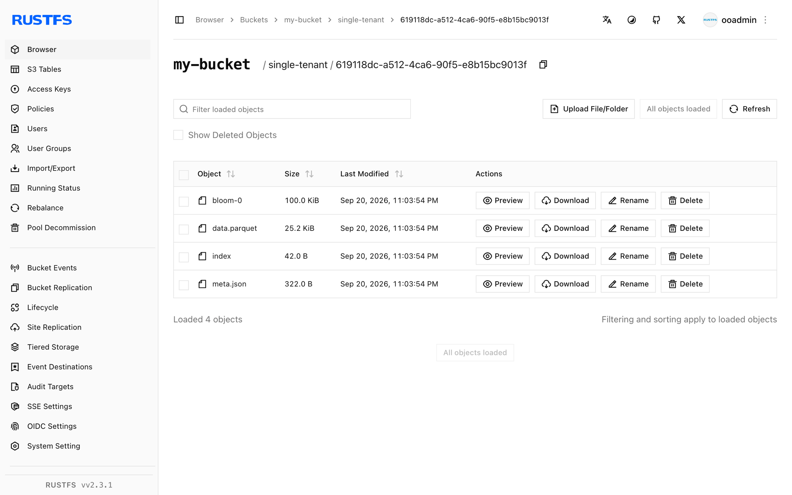

Diese Anleitung betreibt [Grafana Tempo](https://github.com/grafana/tempo) — das verteilte Tracing-Backend von Grafana Labs — mit **RustFS** als Trace-Speicher. Sie starten einen Single-Binary-Tempo mit Docker Compose, pushen einen Trace über den Zipkin-kompatiblen Empfänger, fragen ihn über die Such-API ab und prüfen, dass der Trace-Block als Parquet-Objekt in RustFS gespeichert wird. Der Ablauf wurde mit `grafana/tempo:2.9.5` und `rustfs/rustfs-x86-musl:v2.3.1` verifiziert.

Sie benötigen Docker mit dem Compose-Plugin. Dieses Setup ist für lokale Integrationstests gedacht, nicht für den Produktivbetrieb.

## Architektur



Tempo nimmt Spans über einen Zipkin-kompatiblen Endpunkt entgegen, puffert sie in einem In-Memory-Block und überträgt abgeschlossene Blöcke als Parquet-Dateien in den Objektspeicher. Suchvorgänge durchsuchen den Block-Index und lesen die Blockdaten aus dem Objektspeicher, sodass jeder Trace einen Tempo-Neustart überlebt.

## 1. Projektdateien anlegen

Erstellen Sie ein Arbeitsverzeichnis:

```bash
mkdir rustfs-tempo
cd rustfs-tempo
```

Erstellen Sie eine Umgebungsdatei und ersetzen Sie beide Platzhalter für die Anmeldeinformationen:

```ini title=".env"
RUSTFS_ACCESS_KEY=<your-access-key>
RUSTFS_SECRET_KEY=<your-secret-key>
```

Verwenden Sie dedizierte Anmeldeinformationen für den Bucket. Committen Sie `.env` nicht in die Versionsverwaltung.

Erstellen Sie die Tempo-Konfiguration — ein Single-Binary-Setup mit dem S3-Backend, das auf RustFS zeigt, und einer kurzen Blockdauer, damit ein Verifikationslauf nicht die standardmäßigen 30 Minuten warten muss:

```yaml title="tempo.yml"
server:
  http_listen_port: 3200

distributor:
  receivers:
    zipkin:
      endpoint: 0.0.0.0:9411

ingester:
  max_block_duration: 1m

compactor:
  compaction:
    block_retention: 24h

storage:
  trace:
    backend: s3
    s3:
      endpoint: rustfs:9000
      bucket: my-bucket
      access_key: <your-access-key>
      secret_key: <your-secret-key>
      insecure: true
      forcepathstyle: true
    wal:
      path: /var/tempo/wal
    blocklist_poll: 30s
```

`forcepathstyle: true` und `insecure: true` wählen Path-Style-Adressierung über Plain HTTP, was der Container-Netzwerk-Endpunkt von RustFS erwartet. `max_block_duration: 1m` und `blocklist_poll: 30s` beschleunigen den Flush- und Entdeckungszyklus für Tests.

Erstellen Sie die Compose-Datei:

```yaml title="compose.yaml"
services:
  rustfs:
    image: rustfs/rustfs-x86-musl:v2.3.1
    environment:
      RUSTFS_ACCESS_KEY: ${RUSTFS_ACCESS_KEY}
      RUSTFS_SECRET_KEY: ${RUSTFS_SECRET_KEY}
      RUSTFS_VOLUMES: /data
      RUSTFS_ADDRESS: ":9000"
      RUSTFS_CONSOLE_ADDRESS: ":9001"
      RUSTFS_CONSOLE_ENABLE: "true"
    volumes:
      - rustfs-data:/data
    ports:
      - "9000:9000"
      - "9001:9001"
    healthcheck:
      test: ["CMD", "curl", "-sf", "http://127.0.0.1:9000/health"]
      interval: 10s
      timeout: 5s
      retries: 6
      start_period: 10s
    networks:
      - tempo

  create-bucket:
    image: rustfs/rc:latest
    depends_on:
      rustfs:
        condition: service_healthy
    environment:
      RUSTFS_ACCESS_KEY: ${RUSTFS_ACCESS_KEY}
      RUSTFS_SECRET_KEY: ${RUSTFS_SECRET_KEY}
    entrypoint:
      - /bin/sh
      - -c
      - |
        until /usr/bin/rc alias set rustfs http://rustfs:9000 "$${RUSTFS_ACCESS_KEY}" "$${RUSTFS_SECRET_KEY}"; do
          echo "Waiting for RustFS..."
          sleep 2
        done
        /usr/bin/rc ls rustfs/my-bucket >/dev/null 2>&1 || /usr/bin/rc mb rustfs/my-bucket
    networks:
      - tempo

  tempo:
    image: grafana/tempo:2.9.5
    command: -config.file=/tempo-local.yaml
    volumes:
      - ./tempo.yml:/tempo-local.yaml:ro
    ports:
      - "3200:3200"
      - "9411:9411"
    depends_on:
      create-bucket:
        condition: service_completed_successfully
    networks:
      - tempo

networks:
  tempo:

volumes:
  rustfs-data:
```

## 2. Bereitstellung starten

Prüfen Sie die Compose-Datei, bevor Sie Container starten:

```bash
docker compose config
```

Starten Sie die Dienste und warten Sie, bis die Bucket-Initialisierung abgeschlossen ist:

```bash
docker compose up -d
docker compose ps -a
```

Tempo läuft, wenn der Status-Endpunkt antwortet:

```bash
curl -s http://localhost:3200/status | head -c 120
```

## 3. Einen Trace pushen

Posten Sie einen kleinen Zipkin-Trace mit fünf Spans an den Zipkin-kompatiblen Empfänger:

```bash
python3 - <<'PY'
import json, time, urllib.request, random

now_us = int(time.time() * 1e6)
trace_id = "".join(random.choice("0123456789abcdef") for _ in range(32))
span_id = "".join(random.choice("0123456789abcdef") for _ in range(16))

spans = []
for i in range(5):
    spans.append({
        "traceId": trace_id,
        "id": "".join(random.choice("0123456789abcdef") for _ in range(16)),
        "name": f"rustfs-tempo-span-{i}",
        "timestamp": now_us - i * 1000,
        "duration": 1000 + i * 500,
        "localEndpoint": {"serviceName": "rustfs-tempo-demo"},
        "tags": {"job": "rustfs-integration"},
    })
spans[0]["parent_id"] = ""
for s in spans[1:]:
    s["parent_id"] = span_id

req = urllib.request.Request(
    "http://localhost:9411/api/v2/spans",
    data=json.dumps(spans).encode(),
    headers={"Content-Type": "application/json"},
    method="POST",
)
with urllib.request.urlopen(req, timeout=30) as r:
    print("push:", r.status)
print("trace_id:", trace_id)
PY
```

```text
push: 202
```

## 4. Den Trace suchen und lesen

Nach etwa einer Minute überträgt der Ingester den abgeschlossenen Block nach RustFS, und der Compactor entdeckt ihn. Suchen Sie nach einem Tag:

```bash
curl -s "http://localhost:3200/api/search?tags=job=rustfs-integration"
```

```text
{"traces":[{"traceID":"5354809288c0d1a3de0e09ce74d06987","rootServiceName":"rustfs-tempo-demo","rootTraceName":"rustfs-tempo-span-0",...}]}
```

Rufen Sie den Trace über seine ID ab — verwenden Sie die Trace-ID aus dem Push-Skript:

```bash
curl -s "http://localhost:3200/api/traces/<your-trace-id>" -o /dev/null -w "%{http_code}\n"
```

```text
200
```

## 5. Den Trace-Block in RustFS prüfen

Listen Sie das Tenant-Präfix über das Bucket-Initialisierungs-Image auf:

```bash
docker compose run --rm --entrypoint /bin/sh create-bucket -c \
  '/usr/bin/rc alias set rustfs http://rustfs:9000 "$RUSTFS_ACCESS_KEY" "$RUSTFS_SECRET_KEY" >/dev/null && /usr/bin/rc ls rustfs/my-bucket/single-tenant --recursive'
```

`single-tenant` ist der Tenant, den Tempo verwendet, wenn `multitenancy_enabled` auf `false` steht. Jeder abgeschlossene Trace-Block ist ein Parquet-Objekt:

```text
[2026-09-20 15:03:54]  25.16 KiB single-tenant/619118dc-a512-4ca6-90f5-e8b15bc9013f/data.parquet
```

Sie können das Präfix auch in der RustFS-Konsole anzeigen:



Da der Block in RustFS liegt, bleibt der Trace über Tempo-Neustarts hinweg abfragbar — starten Sie den Container neu und wiederholen Sie die Suche zur Bestätigung.

## 6. Stack stoppen oder zurücksetzen

Stoppen Sie die Container und behalten Sie das RustFS-Datenvolumen:

```bash
docker compose down
```

Um die gespeicherten Traces zu löschen und mit einem leeren RustFS-Volumen zu beginnen, fügen Sie ausdrücklich `--volumes` hinzu:

```bash
docker compose down --volumes
```

## Fehlerbehebung

### Die Konfigurationsdatei wird mit "field ingester not found" abgelehnt

Tempo 3.x hat das Konfigurationslayout geändert. Diese Anleitung pinnt `grafana/tempo:2.9.5`, dessen Konfiguration den oben gezeigten klassischen `ingester`-/`compactor`-Blöcken entspricht.

### Die Suche liefert direkt nach dem Push keine Traces

Der Ingester überträgt einen abgeschlossenen Block nach `max_block_duration` (in dieser Anleitung eine Minute), und der Querier entdeckt neue Blöcke bei jedem `blocklist_poll` (30 Sekunden). Warten Sie auf den Flush und suchen Sie erneut, danach prüfen Sie die Tempo-Logs:

```bash
docker compose logs tempo
```

### AccessDenied- oder 403-Antworten

Stellen Sie sicher, dass die Anmeldeinformationen in `tempo.yml` mit den RustFS-Anmeldeinformationen übereinstimmen und dass der Dienst `create-bucket` erfolgreich abgeschlossen wurde:

```bash
docker compose logs create-bucket
```

### Verbindungs- oder Zertifikatsfehler

`endpoint` nimmt kein Schema an; `insecure: true` wählt Plain HTTP und `forcepathstyle: true` Path-Style-Adressierung für den Container-Netzwerk-Endpunkt. Verwenden Sie innerhalb des Compose-Netzwerks `rustfs:9000` und auf dem Host `localhost:9000`.

## Nächste Schritte

- Lesen Sie die [S3-Kompatibilitätshinweise](/administration/protocols/s3), bevor Sie weitere S3-Operationen verwenden.
- Erstellen Sie dedizierte Produktions-Anmeldeinformationen mit dem [Access Key Management](/security-compliance/iam/access-token).
- Folgen Sie der [Grafana-Tempo-Dokumentation](https://grafana.com/docs/tempo/latest/), um den OpenTelemetry Collector oder instrumentierte Anwendungen als Trace-Producer anzubinden.
