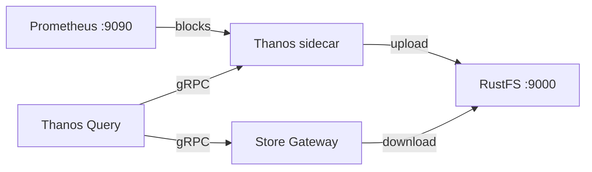
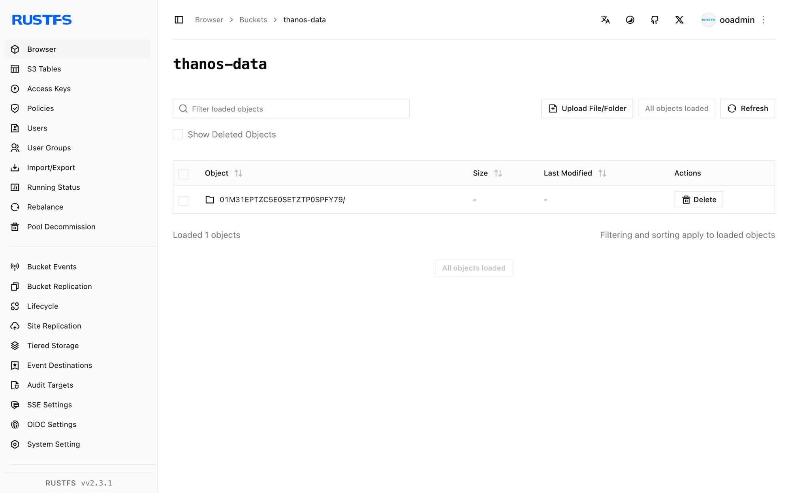

This guide connects [Thanos](https://github.com/thanos-io/thanos) — the highly available Prometheus setup with long-term storage — to **RustFS** as its object store. You will run Prometheus with a Thanos sidecar that uploads TSDB blocks to RustFS, then query the historical data back through a Store Gateway and a Query frontend. The workflow was verified with `thanosio/thanos:v0.37.2`, `prom/prometheus:v2.53.1`, and `rustfs/rustfs-x86-musl:v2.3.1`.

You need Docker with the Compose plugin. This deployment is intended for local integration testing, not production.

## Architecture



The sidecar watches the Prometheus TSDB directory and uploads every two-hour block to the `thanos-data` bucket in RustFS. The Store Gateway reads the same bucket and answers queries about historical blocks, so Query resolves both live data through the sidecar and old data through the Store Gateway.

## 1. Create the project files

Create a working directory:

```bash
mkdir rustfs-thanos
cd rustfs-thanos
```

Create an environment file and replace both credential placeholders:

```ini title=".env"
RUSTFS_ACCESS_KEY=<your-access-key>
RUSTFS_SECRET_KEY=<your-secret-key>
```

Use dedicated credentials for the `thanos-data` bucket. Do not commit `.env` to source control.

Create the Prometheus configuration with an external label — Thanos requires it to deduplicate blocks:

```yaml title="prometheus.yml"
global:
  scrape_interval: 5s
  external_labels:
    monitor: rustfs-demo

scrape_configs:
  - job_name: prometheus
    static_configs:
      - targets: ["localhost:9090"]
  - job_name: rustfs
    metrics_path: /metrics
    static_configs:
      - targets: ["rustfs:9000"]
```

Create the Thanos object store configuration:

```yaml title="bucket.yml"
type: S3
config:
  bucket: thanos-data
  endpoint: rustfs:9000
  access_key: ${RUSTFS_ACCESS_KEY}
  secret_key: ${RUSTFS_SECRET_KEY}
  insecure: true
```

Thanos does not interpolate `.env` files itself. Before starting the stack, replace the placeholders with the same values you set in `.env`:

```bash
sed -i.bak "s|\${RUSTFS_ACCESS_KEY}|$(grep RUSTFS_ACCESS_KEY .env | cut -d= -f2)|;s|\${RUSTFS_SECRET_KEY}|$(grep RUSTFS_SECRET_KEY .env | cut -d= -f2)|" bucket.yml
```

Create the Compose file:

```yaml title="compose.yaml"
services:
  rustfs:
    image: rustfs/rustfs-x86-musl:v2.3.1
    environment:
      RUSTFS_ACCESS_KEY: ${RUSTFS_ACCESS_KEY}
      RUSTFS_SECRET_KEY: ${RUSTFS_SECRET_KEY}
      RUSTFS_VOLUMES: /data
      RUSTFS_ADDRESS: ":9000"
      RUSTFS_CONSOLE_ADDRESS: ":9001"
      RUSTFS_CONSOLE_ENABLE: "true"
    volumes:
      - rustfs-data:/data
    ports:
      - "9000:9000"
      - "9001:9001"
    healthcheck:
      test: ["CMD", "curl", "-sf", "http://127.0.0.1:9000/health"]
      interval: 10s
      timeout: 5s
      retries: 6
      start_period: 10s
    networks:
      - thanos

  create-bucket:
    image: rustfs/rc:latest
    depends_on:
      rustfs:
        condition: service_healthy
    environment:
      RUSTFS_ACCESS_KEY: ${RUSTFS_ACCESS_KEY}
      RUSTFS_SECRET_KEY: ${RUSTFS_SECRET_KEY}
    entrypoint:
      - /bin/sh
      - -c
      - |
        /usr/bin/rc alias set rustfs http://rustfs:9000 "$${RUSTFS_ACCESS_KEY}" "$${RUSTFS_SECRET_KEY}"
        /usr/bin/rc mb --ignore-existing rustfs/thanos-data
    networks:
      - thanos

  prometheus:
    image: prom/prometheus:v2.53.1
    command:
      - --config.file=/etc/prometheus/prometheus.yml
      - --storage.tsdb.path=/prometheus
      - --storage.tsdb.min-block-duration=2h
      - --storage.tsdb.max-block-duration=2h
      - --web.enable-lifecycle
    volumes:
      - ./prometheus.yml:/etc/prometheus/prometheus.yml:ro
      - prom-data:/prometheus
    ports:
      - "9090:9090"
    networks:
      - thanos

  sidecar:
    image: thanosio/thanos:v0.37.2
    command:
      - sidecar
      - --tsdb.path=/prometheus
      - --prometheus.url=http://prometheus:9090
      - --objstore.config-file=/etc/thanos/bucket.yml
    volumes:
      - ./bucket.yml:/etc/thanos/bucket.yml:ro
      - prom-data:/prometheus
    depends_on:
      create-bucket:
        condition: service_completed_successfully
    networks:
      - thanos

  store:
    image: thanosio/thanos:v0.37.2
    command:
      - store
      - --objstore.config-file=/etc/thanos/bucket.yml
      - --data-dir=/data
    volumes:
      - ./bucket.yml:/etc/thanos/bucket.yml:ro
      - store-data:/data
    depends_on:
      create-bucket:
        condition: service_completed_successfully
    networks:
      - thanos

  query:
    image: thanosio/thanos:v0.37.2
    command:
      - query
      - --http-address=0.0.0.0:9090
      - --store=sidecar:10901
      - --store=store:10901
    ports:
      - "9091:9090"
    depends_on:
      - sidecar
      - store
    networks:
      - thanos

networks:
  thanos:

volumes:
  rustfs-data:
  prom-data:
  store-data:
```

The `--storage.tsdb.min-block-duration` and `--storage.tsdb.max-block-duration` flags disable Prometheus compaction. The sidecar refuses to ship blocks from a compacting TSDB because the local blocks would no longer match the uploaded ones.

## 2. Validate and start the deployment

Resolve the Compose file before starting containers:

```bash
docker compose config
```

Start the stack and wait until the sidecar reports itself ready:

```bash
docker compose up -d
docker compose logs sidecar | grep -m1 "status=ready"
```

Check that the sidecar picked up the Prometheus external labels:

```bash
docker compose logs sidecar | grep "external labels"
```

The Thanos Query UI answers on `http://localhost:9091`, and the RustFS Console runs at `http://localhost:9001`.

## 3. Upload a block to RustFS

The sidecar uploads a block when Prometheus compacts one, which happens at a two-hour block boundary. To produce a block immediately, snapshot the TSDB through the admin API — with compaction disabled, the sidecar ships the head-block snapshot directly:

```bash
curl -s -XPOST http://localhost:9090/api/v1/admin/tsdb/snapshot | head -c 200
```

Wait for the upload, then check the shipper state inside Prometheus:

```bash
sleep 60
docker compose exec prometheus cat /prometheus/thanos.shipper.json
```

The `uploaded` list should contain a block ID:

```json
{
	"version": 1,
	"uploaded": [
		"01M31EPTZC5E0SETZTP0SPFY79"
	]
}
```

## 4. Query historical data from RustFS

The Store Gateway periodically syncs the bucket. Confirm it downloaded the uploaded block:

```bash
docker compose logs store | grep "loaded new block"
```

Query a series through the Query frontend over the block's time range:

```bash
START=$(date -u -d '2 hours ago' +%s)
END=$(date -u +%s)
curl -s "http://localhost:9091/api/v1/query_range?query=up%7Bjob%3D%22prometheus%22%7D&start=$START&end=$END&step=30" | head -c 300
```

The Store Gateway serves the response from the blocks it downloaded from RustFS, while the sidecar answers for the live head — both paths resolve through the same Query endpoint.

## 5. Verify objects in RustFS

List the bucket:

```bash
docker compose exec rustfs /usr/bin/rc ls local/thanos-data/ -r
```

Each block is stored as three objects — the chunk files, the index, and `meta.json`:

```text
01M31EPTZC5E0SETZTP0SPFY79/chunks/000001
01M31EPTZC5E0SETZTP0SPFY79/index
01M31EPTZC5E0SETZTP0SPFY79/meta.json
```



## 6. Stop or reset the deployment

Stop the containers while keeping all data:

```bash
docker compose down
```

The RustFS volume keeps the uploaded blocks, so the Store Gateway serves historical queries again after a restart. To delete everything, including the blocks in RustFS, add `--volumes`.

## Troubleshooting

### The sidecar logs `Compaction needs to be disabled`

Prometheus must run with `--storage.tsdb.min-block-duration` equal to `--storage.tsdb.max-block-duration` — set both to `2h` as shown in the Compose file. Otherwise the sidecar cannot guarantee that local blocks stay unchanged and refuses to upload.

### `The specified bucket does not exist`

Thanos does not create buckets. Check that the `create-bucket` service completed successfully:

```bash
docker compose logs create-bucket
```

### Queries return no historical data

Confirm that the Store Gateway has loaded at least one block (`docker compose logs store | grep "loaded new block"`) and that your query time range falls inside the uploaded block's window — check the block's `meta.json` in the RustFS Console for `minTime` and `maxTime`.

## Next steps

- Review [S3 compatibility notes](/administration/protocols/s3) before adopting additional Thanos components.
- Create dedicated production credentials with [Access Key Management](/security-compliance/iam/access-token).
- Follow the [Thanos documentation](https://thanos.io/tip/thanos/getting-started.md) to add Compactor, Ruler, or Receive for a production topology.
